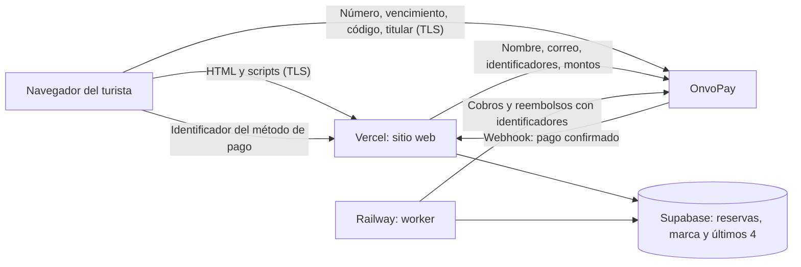
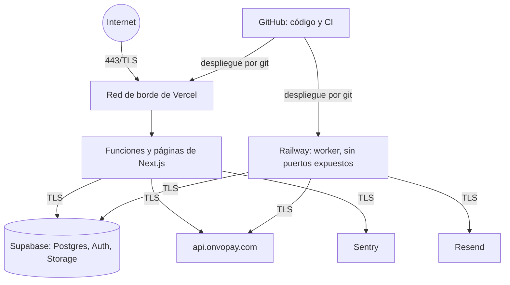

# Autoevaluación PCI DSS — SAQ A-EP

- **Comercio**: el operador de los tours (razón social pendiente; hoy los datos del panel dicen "PRUEBA")
- **Sitio evaluado**: https://reservas.bokaverdecr.com
- **Fecha de la evaluación**: 2026-10-05
- **Versión del código evaluada**: `main` `491afb4`
- **Norma**: PCI DSS v4.0.1. La lista de requisitos sale del formulario oficial "SAQ A-EP" del PCI Security Standards Council (edición v4.0, que trae los mismos requisitos; al llenar el formulario hay que usar la edición v4.0.1 vigente).
- **Quién evaluó**: Kenneth Araya, con Claude Code, contra el código y la configuración versionada.

## Resultado

**El sitio hoy no cumple el SAQ A-EP.** De 139 requisitos:

| Respuesta                                               | Cantidad |
| ------------------------------------------------------- | -------- |
| Cumple                                                  | 37       |
| No cumple                                               | 60       |
| No aplica                                               | 34       |
| Por verificar en las cuentas (no se ve desde el código) | 8        |

El formulario oficial solo admite "In Place", "In Place with CCW", "In Place with Remediation", "Not Applicable" y "Not in Place". Con un solo "Not in Place" la declaración final (sección 3) tiene que marcarse **"Non-Compliant"**, con una fecha objetivo por cada faltante. Los "por verificar" hay que resolverlos antes de llenar el formulario: no existe esa opción.

Lo que sí está bien resuelto: ningún dato de tarjeta llega a nuestros servidores ni se guarda; todo viaja cifrado; el panel tiene cuentas individuales, roles y bitácora inmutable; el código se desarrolla con specs, pruebas y revisiones.

Lo que falta se agrupa en cinco bloques (detalle en la sección 6):

1. **Documentos** que no existen: política de seguridad, plan de respuesta a incidentes, estándar de configuración, capacitación (22 requisitos).
2. **Acceso al panel**: doble factor, contraseñas de 12 caracteres, cierre por inactividad, bloqueo de 30 minutos (9 requisitos).
3. **Registros**: no se registran los inicios de sesión ni los cambios de usuarios, nadie revisa los registros y no se conservan 12 meses (12 requisitos).
4. **Pruebas externas**: escaneo trimestral por un proveedor aprobado (ASV), prueba de penetración, protección contra ataques web (8 requisitos).
5. **Scripts de la página de pago**: falta verificar su integridad y detectar cambios (2 requisitos), más el manejo de vulnerabilidades de dependencias (3 requisitos).

**Alternativa que conviene evaluar primero**: si la tarjeta del cobro posterior a la reserva se capturara en un formulario alojado por OnvoPay (como ya pasa en el cobro al reservar), el comercio pasaría al **SAQ A**, que tiene unos 30 requisitos y deja fuera casi todo lo de los bloques 2 a 5. Depende de que OnvoPay ofrezca guardar una tarjeta desde su propio componente; hay que preguntárselo.

## 1. Cómo se aceptan las tarjetas

Un solo canal: comercio electrónico. No hay cobros por teléfono, en persona ni en papel.

| Flujo                                                                  | Dónde escribe la tarjeta el turista                                                              | A dónde viajan los datos                                                                                            | Qué recibe nuestro servidor              |
| ---------------------------------------------------------------------- | ------------------------------------------------------------------------------------------------ | ------------------------------------------------------------------------------------------------------------------- | ---------------------------------------- |
| Cobro al reservar                                                      | En el componente de OnvoPay (`sdk.onvopay.com/sdk.js`), incrustado en nuestra página de checkout | Del componente a OnvoPay                                                                                            | La confirmación del pago, por webhook    |
| Cobro posterior a la reserva                                           | En **campos propios** de nuestra página (`web/components/public/CheckoutForm/CardFields.tsx`)    | Del navegador directo a `api.onvopay.com/v1/payment-methods` (`web/lib/payments/adapters/onvopay/tokenize-card.ts`) | Solo el identificador del método de pago |
| Cambio de tarjeta (`/booking/{token}/card`)                            | Igual que el anterior                                                                            | Igual                                                                                                               | Igual                                    |
| Confirmación con el banco, 3D Secure (`/booking/{token}/authenticate`) | No se escribe la tarjeta                                                                         | La librería `js.onvopay.com/v1/` habla con OnvoPay y el banco                                                       | El resultado                             |

El segundo y el tercer flujo son los que obligan al SAQ A-EP: la página que controla el formulario es nuestra.

**Qué se guarda**: marca, últimos cuatro dígitos, mes y año de vencimiento, y los identificadores de OnvoPay (`bookings.card_brand`, `card_last4`, `card_exp_month`, `card_exp_year`, `payment_method_id`, `customer_external_id`). No existe ninguna columna para el número completo ni para el código de seguridad. El número y el código viven solo en la memoria del navegador mientras se envían.

### Diagrama de flujo de los datos de tarjeta

### Diagrama de red

No hay servidores, redes ni cortafuegos administrados por el comercio: todo corre en plataformas administradas.

## 2. Elegibilidad para el SAQ A-EP

| Criterio del formulario                                                                        | ¿Se cumple?                 | Evidencia                                                                                                                                     |
| ---------------------------------------------------------------------------------------------- | --------------------------- | --------------------------------------------------------------------------------------------------------------------------------------------- |
| Solo se aceptan transacciones de comercio electrónico                                          | Sí                          | Único canal: el sitio                                                                                                                         |
| El procesamiento de los datos de tarjeta está tercerizado en un procesador validado en PCI DSS | Sí, **falta la constancia** | OnvoPay declara certificación PCI DSS; no tenemos su constancia (AOC)                                                                         |
| El sitio no recibe datos de tarjeta, pero controla cómo se envían al procesador                | Sí                          | `tokenize-card.ts`: el navegador envía a OnvoPay; al servidor llega solo el identificador                                                     |
| Si el sitio lo aloja un tercero, ese tercero está validado en PCI DSS                          | **Falta la constancia**     | Vercel publica una constancia PCI DSS; hay que descargarla y guardarla                                                                        |
| Todo elemento de la página de pago viene del sitio del comercio o de un proveedor validado     | Sí                          | Bundle propio y scripts de OnvoPay. Los servicios de IP y ThreatMetrix solo cargan en la página del 3D Secure, donde no se escribe la tarjeta |
| El comercio no almacena, procesa ni transmite datos de tarjeta en sus sistemas                 | Sí                          | Sin columnas, sin registros, sin paso por el servidor                                                                                         |
| Lo que se conserva de los datos de tarjeta está en papel y no se recibe electrónicamente       | Sí (no se conserva nada)    | A confirmar con el operador que no anota tarjetas en papel                                                                                    |

## 3. Alcance

Entran en el alcance los sistemas que sirven la página de pago o pueden cambiarla:

| Componente                                   | Quién lo administra                                                      | Por qué entra                         |
| -------------------------------------------- | ------------------------------------------------------------------------ | ------------------------------------- |
| Sitio web (Next.js en Vercel)                | Vercel la plataforma; nosotros el código y la configuración del proyecto | Sirve la página de pago               |
| Repositorio y CI (GitHub)                    | GitHub la plataforma; nosotros el repositorio                            | Un cambio en `main` se despliega solo |
| Cuentas de administración de Vercel y GitHub | Nosotros                                                                 | Pueden cambiar la página de pago      |
| Equipos de desarrollo                        | Nosotros                                                                 | Desde ahí se cambia el código         |

Sistemas conectados, sin datos de tarjeta: Supabase (base y autenticación del panel), Railway (worker, guarda la llave secreta de OnvoPay), Resend, Sentry. El panel administrativo del sitio no administra la página de pago, pero corre en la misma aplicación; por eso sus controles de acceso se evalúan acá.

## 4. Proveedores y reparto de responsabilidades (requisitos 12.8.1 y 12.8.5)

| Proveedor                      | Servicio                                                      | Datos que recibe                                                  | Requisitos PCI a su cargo                                   | Constancia PCI (AOC) en nuestro poder |
| ------------------------------ | ------------------------------------------------------------- | ----------------------------------------------------------------- | ----------------------------------------------------------- | ------------------------------------- |
| OnvoPay (ONVO Costa Rica S.A.) | Procesa los pagos, guarda las tarjetas, 3D Secure, antifraude | Número, vencimiento, código, titular; nombre y correo del turista | 3, 4 (lo suyo), y todo lo del procesamiento                 | **No**                                |
| Vercel                         | Aloja y sirve el sitio                                        | Tráfico, registros, secretos de entorno                           | 1, 2 (plataforma), 5, 9, 10.6, 11.5.1 de su infraestructura | **No**                                |
| GitHub                         | Código y CI                                                   | Código                                                            | Seguridad de la plataforma                                  | **No**                                |
| Supabase                       | Base de datos y autenticación del panel                       | Reservas, marca y últimos 4 dígitos, usuarios internos            | Seguridad de la plataforma                                  | No (no maneja datos de tarjeta)       |
| Railway                        | Ejecuta el worker                                             | Llave secreta de OnvoPay, llave de servicio de la base            | Seguridad de la plataforma                                  | No (no maneja datos de tarjeta)       |
| Resend                         | Correo                                                        | Correo y contenido de los avisos                                  | —                                                           | No aplica                             |
| Sentry                         | Errores                                                       | Errores depurados                                                 | —                                                           | No aplica                             |
| ipify, my-ip.io, ThreatMetrix  | Antifraude de OnvoPay en el 3D Secure                         | IP y huella del dispositivo, desde el navegador                   | Los contrata OnvoPay                                        | No aplica                             |

A cargo del comercio queda todo lo demás: el código de la página de pago, sus scripts, las cuentas de administración, las políticas y la respuesta a incidentes.

## 5. Respuestas por requisito

Claves: **Cumple** · **No cumple** · **N/A** (no aplica) · **Verificar** (depende de la configuración de una cuenta que no está en el código; hay que mirarla antes de llenar el formulario).

### Requisito 1 — Controles de seguridad de red

| N.º   | Requisito                                                                             | Respuesta | Evidencia o faltante                                                                                    |
| ----- | ------------------------------------------------------------------------------------- | --------- | ------------------------------------------------------------------------------------------------------- |
| 1.1.1 | Políticas y procedimientos de este requisito, documentados y conocidos                | No cumple | No existe ningún documento                                                                              |
| 1.2.1 | Estándares de configuración de las reglas de red                                      | N/A       | No administramos cortafuegos; la red es de Vercel                                                       |
| 1.2.2 | Cambios de red aprobados y controlados                                                | N/A       | Ídem                                                                                                    |
| 1.2.3 | Diagrama de red vigente                                                               | Cumple    | Sección 1 de este documento                                                                             |
| 1.2.4 | Diagrama de flujo de datos de tarjeta vigente                                         | Cumple    | Sección 1 de este documento                                                                             |
| 1.2.5 | Servicios, protocolos y puertos permitidos, identificados y justificados              | Cumple    | Solo HTTPS (443) hacia el sitio; el worker no expone puertos (`docs/cutover-produccion.md`)             |
| 1.2.6 | Medidas de seguridad para servicios inseguros en uso                                  | N/A       | No hay servicios inseguros                                                                              |
| 1.2.7 | Revisión semestral de la configuración de red                                         | N/A       | Red administrada por Vercel                                                                             |
| 1.2.8 | Archivos de configuración de red protegidos                                           | N/A       | Ídem                                                                                                    |
| 1.3.1 | Tráfico entrante restringido a lo necesario                                           | Cumple    | Solo 443 por la red de borde de Vercel                                                                  |
| 1.3.2 | Tráfico saliente restringido a lo necesario                                           | No cumple | Las funciones de Vercel pueden llamar a cualquier destino; no hay restricción de salida                 |
| 1.3.3 | Controles entre redes inalámbricas y el entorno                                       | N/A       | No hay redes propias                                                                                    |
| 1.4.1 | Controles entre redes confiables y no confiables                                      | N/A       | Responsabilidad de Vercel                                                                               |
| 1.4.2 | Tráfico entrante desde redes no confiables limitado                                   | Cumple    | Solo el sitio público por 443                                                                           |
| 1.4.3 | Medidas contra suplantación de direcciones                                            | N/A       | Responsabilidad de Vercel                                                                               |
| 1.4.4 | Los sistemas que guardan datos de tarjeta no son accesibles desde redes no confiables | N/A       | No se guardan datos de tarjeta                                                                          |
| 1.4.5 | No se divulgan direcciones internas                                                   | N/A       | No hay red interna propia                                                                               |
| 1.5.1 | Controles de seguridad en los equipos que se conectan a internet y al entorno         | Verificar | Equipo de desarrollo: confirmar cortafuegos y antivirus activos y que el usuario no pueda desactivarlos |

### Requisito 2 — Configuraciones seguras

| N.º   | Requisito                                                    | Respuesta | Evidencia o faltante                                                                                                                           |
| ----- | ------------------------------------------------------------ | --------- | ---------------------------------------------------------------------------------------------------------------------------------------------- |
| 2.1.1 | Políticas y procedimientos documentados                      | No cumple | No existen                                                                                                                                     |
| 2.2.1 | Estándares de configuración para todos los componentes       | No cumple | Hay una guía sin completar (`docs/security-audits/GUIA-VERIFICACION-MANUAL.md`); no es un estándar aprobado                                    |
| 2.2.2 | Cuentas por defecto del proveedor cambiadas o deshabilitadas | Cumple    | No hay cuentas por defecto: el primer admin se crea por invitación; el registro público está cerrado (verificado en prod, 2026-10-03)          |
| 2.2.3 | Funciones con distinto nivel de seguridad, separadas         | N/A       | Plataforma administrada                                                                                                                        |
| 2.2.4 | Solo los servicios y funciones necesarios                    | Cumple    | Registro público apagado; funciones de la base cerradas a roles públicos (auditorías `audit_public_executable_functions`, 0 hallazgos en prod) |
| 2.2.5 | Servicios inseguros justificados y protegidos                | N/A       | No hay                                                                                                                                         |
| 2.2.6 | Parámetros de seguridad configurados para evitar mal uso     | Cumple    | Cabeceras de seguridad en `web/next.config.ts:18-27`; CSP en `web/lib/security/csp.ts`                                                         |
| 2.2.7 | Acceso administrativo remoto cifrado                         | Cumple    | Todas las consolas son HTTPS                                                                                                                   |

### Requisito 3 — Datos de tarjeta almacenados

| N.º     | Requisito                                                             | Respuesta | Evidencia o faltante                                                                                                                                                                                         |
| ------- | --------------------------------------------------------------------- | --------- | ------------------------------------------------------------------------------------------------------------------------------------------------------------------------------------------------------------ |
| 3.1.1   | Políticas y procedimientos documentados                               | No cumple | No existen                                                                                                                                                                                                   |
| 3.2.1   | Almacenamiento mínimo, con política de retención y borrado            | Cumple    | No se guarda el número. Marca, últimos 4 y vencimiento se borran al anonimizar (18 meses, `…050_datos_del_aviso.sql:76-80`). Observación: `audit_logs` conserva marca y últimos 4 sin plazo (`…044:312-313`) |
| 3.3.1   | No se conservan datos sensibles de autenticación tras la autorización | Cumple    | Nunca llegan al servidor                                                                                                                                                                                     |
| 3.3.1.2 | No se conserva el código de seguridad                                 | Cumple    | Vive solo en la memoria del navegador (`CardDetailsForm.tsx:43`) y se envía a OnvoPay                                                                                                                        |
| 3.3.1.3 | No se conserva el PIN                                                 | N/A       | No se pide PIN                                                                                                                                                                                               |

### Requisito 4 — Cifrado en tránsito

| N.º   | Requisito                                                      | Respuesta | Evidencia o faltante                                                                             |
| ----- | -------------------------------------------------------------- | --------- | ------------------------------------------------------------------------------------------------ |
| 4.1.1 | Políticas y procedimientos documentados                        | No cumple | No existen                                                                                       |
| 4.2.1 | Criptografía fuerte al transmitir el número por redes públicas | Cumple    | TLS de Vercel; HSTS de 2 años con preload (`web/next.config.ts:19`); el envío a OnvoPay es HTTPS |
| 4.2.2 | El número nunca se envía por mensajería sin proteger           | Cumple    | El sistema no envía números de tarjeta por correo ni por ningún otro medio                       |

### Requisito 5 — Software malicioso

| N.º     | Requisito                                                    | Respuesta | Evidencia o faltante                                                                        |
| ------- | ------------------------------------------------------------ | --------- | ------------------------------------------------------------------------------------------- |
| 5.1.1   | Políticas y procedimientos documentados                      | No cumple | No existen                                                                                  |
| 5.2.1   | Antimalware en todos los componentes en riesgo               | N/A       | El sitio corre en funciones sin servidor; no hay sistemas operativos a nuestro cargo        |
| 5.2.2   | El antimalware detecta y bloquea                             | N/A       | Ídem                                                                                        |
| 5.2.3   | Evaluación periódica de los componentes "sin riesgo"         | No cumple | No hay evaluación documentada                                                               |
| 5.2.3.1 | Frecuencia de esa evaluación definida por análisis de riesgo | No cumple | No hay análisis de riesgo                                                                   |
| 5.3.1   | Antimalware actualizado                                      | N/A       |                                                                                             |
| 5.3.2   | Escaneos periódicos o en tiempo real                         | N/A       |                                                                                             |
| 5.3.2.1 | Frecuencia de escaneos por análisis de riesgo                | N/A       |                                                                                             |
| 5.3.3   | Antimalware para medios removibles                           | N/A       |                                                                                             |
| 5.3.4   | Registros del antimalware                                    | N/A       |                                                                                             |
| 5.3.5   | El antimalware no se puede desactivar                        | N/A       |                                                                                             |
| 5.4.1   | Mecanismos contra phishing para el personal                  | Verificar | Confirmar las protecciones del proveedor de correo y que el dominio tenga SPF, DKIM y DMARC |

### Requisito 6 — Desarrollo y mantenimiento seguros

| N.º   | Requisito                                                                           | Respuesta | Evidencia o faltante                                                                                                                                                                     |
| ----- | ----------------------------------------------------------------------------------- | --------- | ---------------------------------------------------------------------------------------------------------------------------------------------------------------------------------------- |
| 6.1.1 | Políticas y procedimientos documentados                                             | No cumple | Hay convenciones (`CONTRIBUTING.md`, skills del repo) pero no una política                                                                                                               |
| 6.2.1 | El software propio se desarrolla de forma segura                                    | Cumple    | Spec previo a cada cambio, pruebas obligatorias, revisión por agentes especializados (`.claude/agents/`), 45 specs con su registro                                                       |
| 6.2.2 | Capacitación anual en desarrollo seguro                                             | No cumple | Sin evidencia                                                                                                                                                                            |
| 6.2.4 | Técnicas para prevenir ataques comunes                                              | Cumple    | Validación de entradas, seguridad por fila en la base, precio calculado en el servidor, CSP con nonce, auditorías internas de junio de 2026 (`docs/security-audits/`)                    |
| 6.3.1 | Vulnerabilidades identificadas y clasificadas por riesgo                            | No cumple | No hay `pnpm audit` en CI, ni Dependabot, ni proceso                                                                                                                                     |
| 6.3.2 | Inventario del software propio y de componentes de terceros                         | Cumple    | Cuatro lockfiles versionados                                                                                                                                                             |
| 6.3.3 | Parches críticos dentro de un mes                                                   | No cumple | Sin proceso ni alertas                                                                                                                                                                   |
| 6.4.1 | Aplicaciones web públicas revisadas contra amenazas nuevas                          | No cumple | Sin revisión anual por especialista ni protección automática                                                                                                                             |
| 6.4.2 | Solución automática que detecta y previene ataques web                              | No cumple | Vercel Firewall sin configurar                                                                                                                                                           |
| 6.4.3 | Scripts de la página de pago: autorizados, con integridad asegurada e inventariados | No cumple | Autorización: sí (CSP con nonce por solicitud, `csp.ts`). Inventario: sección 5.1. **Integridad: no** (sin SRI; los scripts de OnvoPay no tienen versión fija)                           |
| 6.5.1 | Cambios en producción con motivo, impacto, aprobación, pruebas y reversión          | Cumple    | Spec, changelog, pruebas, respaldo antes de cada migración. Observación: los últimos cambios se subieron a `main` saltando la verificación automática; las pruebas se corrieron en local |
| 6.5.2 | Tras un cambio significativo, se confirma que PCI DSS sigue cumpliéndose            | No cumple | Sin proceso                                                                                                                                                                              |

#### 5.1 Inventario de scripts de las páginas de pago (requisito 6.4.3)

| Página                                             | Script                     | Origen                                                 | Para qué                                |
| -------------------------------------------------- | -------------------------- | ------------------------------------------------------ | --------------------------------------- |
| Checkout, cobro al reservar                        | `sdk.js`                   | `sdk.onvopay.com`                                      | Componente de pago de OnvoPay           |
| Checkout, cobro posterior; `/booking/{token}/card` | Bundle de Next.js          | Sitio propio                                           | Formulario de tarjeta y envío a OnvoPay |
| `/booking/{token}/authenticate`                    | `v1/`                      | `js.onvopay.com`                                       | 3D Secure                               |
| `/booking/{token}/authenticate`                    | Lo que cargue esa librería | `h.online-metrix.net`, `api.ipify.org`, `api.my-ip.io` | Antifraude de OnvoPay                   |
| Todas                                              | Sentry (dentro del bundle) | Sitio propio                                           | Reporte de errores                      |

No hay analítica, publicidad ni otros scripts de terceros.

### Requisito 7 — Acceso por necesidad

| N.º   | Requisito                                                | Respuesta | Evidencia o faltante                                                                                                 |
| ----- | -------------------------------------------------------- | --------- | -------------------------------------------------------------------------------------------------------------------- |
| 7.2.2 | Acceso asignado por función y mínimo privilegio          | Cumple    | Roles admin, staff y guía, impuestos en middleware, acciones del servidor y la base (`web/lib/auth/server.ts:61-71`) |
| 7.2.3 | Privilegios aprobados por personal autorizado            | Cumple    | Solo un admin crea cuentas (`web/lib/users/actions.ts:19`)                                                           |
| 7.2.4 | Revisión semestral de cuentas y privilegios              | No cumple | Sin proceso                                                                                                          |
| 7.2.5 | Cuentas de aplicación y de sistema con mínimo privilegio | Cumple    | La llave de servicio solo existe en el servidor y el worker; las funciones de la base rechazan roles públicos        |

### Requisito 8 — Identificación y autenticación

| N.º    | Requisito                                                                            | Respuesta | Evidencia o faltante                                                                                           |
| ------ | ------------------------------------------------------------------------------------ | --------- | -------------------------------------------------------------------------------------------------------------- |
| 8.1.1  | Políticas y procedimientos documentados                                              | No cumple | No existen                                                                                                     |
| 8.2.1  | Identificador único por usuario                                                      | Cumple    | Una cuenta de Supabase Auth por persona                                                                        |
| 8.2.2  | Cuentas compartidas solo por excepción                                               | Verificar | En el sitio no hay cuentas compartidas. Confirmar que las de Vercel, GitHub, Supabase y Railway son personales |
| 8.2.4  | Altas, bajas y cambios autorizados                                                   | Cumple    | Solo admin; rol y correo inmutables (`web/lib/users/manage.ts:11`)                                             |
| 8.2.5  | Acceso revocado de inmediato al terminar                                             | Cumple    | Desactivar bloquea el acceso y niega el token (`manage.ts:84-101`; `…050:299-324`)                             |
| 8.2.6  | Cuentas inactivas 90 días, deshabilitadas                                            | No cumple | Sin proceso ni tarea automática                                                                                |
| 8.2.7  | Cuentas de terceros habilitadas solo cuando hacen falta                              | N/A       | Ningún tercero tiene cuenta                                                                                    |
| 8.2.8  | Reautenticación tras 15 minutos de inactividad                                       | No cumple | No hay cierre por inactividad (`supabase/config.toml:290-294`, comentado)                                      |
| 8.3.1  | Todo acceso se autentica con al menos un factor                                      | Cumple    | Correo y contraseña                                                                                            |
| 8.3.2  | Credenciales ilegibles en tránsito y en reposo                                       | Cumple    | Supabase Auth guarda el hash; todo por TLS                                                                     |
| 8.3.3  | Identidad verificada antes de cambiar una credencial                                 | Cumple    | Enlace de un solo uso al correo (`auth/confirm/route.ts`)                                                      |
| 8.3.4  | Bloqueo tras 10 intentos como máximo, por 30 minutos o hasta que un admin lo levante | No cumple | Hay límite de 5 intentos, pero se libera a los 15 minutos (`shared/constants/rate-limit.ts:23`)                |
| 8.3.5  | Contraseña inicial o restablecida única y de cambio obligatorio                      | Cumple    | No hay contraseñas temporales: el invitado define la suya desde el enlace                                      |
| 8.3.6  | Contraseñas de 12 caracteres, con letras y números                                   | No cumple | Mínimo actual: 8 (`web/lib/auth/password-policy.ts:9-19`)                                                      |
| 8.3.7  | No reutilizar las últimas 4 contraseñas                                              | No cumple | Sin historial                                                                                                  |
| 8.3.8  | Políticas de autenticación comunicadas a los usuarios                                | No cumple | Sin documento                                                                                                  |
| 8.3.9  | Si la contraseña es el único factor: cambio cada 90 días o análisis dinámico         | No cumple | Sin caducidad ni doble factor                                                                                  |
| 8.3.11 | Factores físicos o certificados asignados a una sola persona                         | N/A       | No se usan                                                                                                     |
| 8.4.1  | Doble factor para todo acceso administrativo                                         | Verificar | Confirmar doble factor activo en GitHub, Vercel, Supabase y Railway. En el panel del sitio no existe           |
| 8.4.2  | Doble factor para todo acceso al entorno                                             | No cumple | El panel del sitio no tiene doble factor (`config.toml:320-327`)                                               |
| 8.4.3  | Doble factor para todo acceso remoto                                                 | Verificar | Igual que 8.4.1                                                                                                |
| 8.5.1  | El doble factor no es evitable ni reutilizable                                       | Verificar | Depende de 8.4.1                                                                                               |
| 8.6.1  | Cuentas de sistema con uso interactivo, controladas                                  | N/A       | Las llaves de servicio no permiten inicio de sesión interactivo                                                |
| 8.6.2  | Sin contraseñas de sistema en el código                                              | Cumple    | Secretos solo en variables de entorno, validados al arrancar (`web/lib/env.ts`); `.env*` fuera del repositorio |
| 8.6.3  | Contraseñas de sistema protegidas y rotadas                                          | No cumple | Sin procedimiento de rotación de llaves                                                                        |

### Requisito 9 — Acceso físico

| N.º     | Requisito                                                 | Respuesta | Evidencia o faltante                                           |
| ------- | --------------------------------------------------------- | --------- | -------------------------------------------------------------- |
| 9.2.1   | Controles de ingreso a las instalaciones                  | N/A       | Sin instalaciones propias; centros de datos de los proveedores |
| 9.4.1   | Medios con datos de tarjeta, protegidos                   | N/A       | No hay medios con datos de tarjeta                             |
| 9.4.1.1 | Respaldos fuera de línea con datos de tarjeta, protegidos | N/A       | Ídem                                                           |
| 9.4.2   | Medios clasificados por sensibilidad                      | N/A       | Ídem                                                           |
| 9.4.3   | Envío seguro de medios                                    | N/A       | Ídem                                                           |
| 9.4.4   | Aprobación de la gerencia para mover medios               | N/A       | Ídem                                                           |
| 9.4.6   | Destrucción de papel con datos de tarjeta                 | N/A       | A confirmar con el operador que no anota tarjetas en papel     |

### Requisito 10 — Registros y monitoreo

| N.º      | Requisito                                                              | Respuesta | Evidencia o faltante                                                                                                     |
| -------- | ---------------------------------------------------------------------- | --------- | ------------------------------------------------------------------------------------------------------------------------ |
| 10.2.1   | Registros de auditoría activos en todos los componentes                | No cumple | El sitio tiene bitácora de negocio (`audit_logs`), pero no de acceso; los registros de las plataformas dependen del plan |
| 10.2.1.1 | Se registra todo acceso individual a datos de tarjeta                  | N/A       | No hay datos de tarjeta                                                                                                  |
| 10.2.1.2 | Se registran las acciones de los administradores                       | No cumple | Se registran reservas, cobros, reembolsos y configuración; no las altas, bajas ni cambios de usuarios                    |
| 10.2.1.3 | Se registra el acceso a los registros                                  | No cumple |                                                                                                                          |
| 10.2.1.4 | Se registran los intentos de acceso inválidos                          | No cumple | Solo quedan en los registros de Supabase Auth, con retención corta                                                       |
| 10.2.1.5 | Se registran los cambios de credenciales                               | No cumple |                                                                                                                          |
| 10.2.1.6 | Se registra el inicio, la pausa y el fin de los registros              | No cumple |                                                                                                                          |
| 10.2.1.7 | Se registra la creación y el borrado de objetos del sistema            | Verificar | Registros de auditoría de GitHub y Vercel, según el plan                                                                 |
| 10.2.2   | Cada evento registra usuario, tipo, fecha, resultado, origen y recurso | Cumple    | Para lo que sí se registra: actor, acción, entidad, fecha y detalle (`…018:72-81`)                                       |
| 10.3.1   | Lectura de los registros limitada a quien la necesita                  | Cumple    | Solo la llave de servicio lee `audit_logs` (`…038:38`)                                                                   |
| 10.3.2   | Registros protegidos contra modificación                               | Cumple    | Disparadores que bloquean cambios y borrados, también para la llave de servicio (`…021:13-29`)                           |
| 10.3.3   | Registros respaldados en un lugar central y seguro                     | No cumple | Sin centralización; prod sin respaldos automáticos (plan Free de Supabase)                                               |
| 10.3.4   | Detección de cambios sobre los registros                               | No cumple |                                                                                                                          |
| 10.4.1   | Revisión diaria de los registros de seguridad                          | No cumple | Nadie los revisa                                                                                                         |
| 10.4.1.1 | Revisión con mecanismos automáticos                                    | No cumple | Solo alertas puntuales de Sentry                                                                                         |
| 10.4.2   | Revisión periódica de los demás registros                              | No cumple |                                                                                                                          |
| 10.4.2.1 | Frecuencia definida por análisis de riesgo                             | No cumple |                                                                                                                          |
| 10.4.3   | Se atienden las anomalías encontradas                                  | No cumple | Sin proceso                                                                                                              |
| 10.5.1   | 12 meses de historial, 3 disponibles de inmediato                      | No cumple | `audit_logs` no se borra nunca; los registros de las plataformas duran entre 1 y 30 días                                 |
| 10.6.1   | Relojes sincronizados                                                  | Cumple    | Plataformas administradas; las fechas las pone la base                                                                   |
| 10.6.2   | Hora correcta y consistente                                            | Cumple    | Todo en UTC (`timestamptz`)                                                                                              |
| 10.6.3   | Configuración de hora protegida                                        | N/A       | A cargo de los proveedores                                                                                               |

### Requisito 11 — Pruebas de seguridad

| N.º      | Requisito                                                                                                 | Respuesta | Evidencia o faltante                                                                                                                                                                                             |
| -------- | --------------------------------------------------------------------------------------------------------- | --------- | ---------------------------------------------------------------------------------------------------------------------------------------------------------------------------------------------------------------- |
| 11.3.2   | Escaneo externo trimestral por un proveedor aprobado (ASV)                                                | No cumple | Nunca se hizo                                                                                                                                                                                                    |
| 11.3.2.1 | Escaneo externo tras cambios significativos                                                               | No cumple |                                                                                                                                                                                                                  |
| 11.4.1   | Metodología de pruebas de penetración definida                                                            | No cumple |                                                                                                                                                                                                                  |
| 11.4.3   | Prueba de penetración externa anual y tras cambios significativos                                         | No cumple | Hubo una prueba interna contra el entorno local el 2026-06-14 (`docs/security-audits/2026-06-14-pentest-activo.md`); no cubrió producción ni el formulario propio de tarjeta, y no la hizo alguien independiente |
| 11.4.4   | Se corrigen y se vuelven a probar los hallazgos                                                           | No cumple | Depende de 11.4.3                                                                                                                                                                                                |
| 11.4.5   | Pruebas de la segmentación                                                                                | N/A       | No hay segmentación                                                                                                                                                                                              |
| 11.5.1   | Detección o prevención de intrusiones en el perímetro                                                     | Verificar | A cargo de Vercel; confirmar con su constancia                                                                                                                                                                   |
| 11.5.2   | Detección de cambios en archivos críticos                                                                 | No cumple | Los despliegues son inmutables y salen solo de git, pero no hay comparación ni alerta                                                                                                                            |
| 11.6.1   | Detección de cambios y manipulación en las cabeceras y los scripts de la página de pago, al menos semanal | No cumple | No hay mecanismo; la CSP no reporta violaciones                                                                                                                                                                  |

### Requisito 12 — Políticas y programas

| N.º      | Requisito                                                           | Respuesta | Evidencia o faltante                                                                                      |
| -------- | ------------------------------------------------------------------- | --------- | --------------------------------------------------------------------------------------------------------- |
| 12.1.1   | Política de seguridad de la información establecida y difundida     | No cumple | No existe                                                                                                 |
| 12.1.2   | Política revisada al menos una vez al año                           | No cumple |                                                                                                           |
| 12.1.3   | Roles y responsabilidades de seguridad definidos                    | No cumple |                                                                                                           |
| 12.1.4   | Responsable de seguridad designado formalmente                      | No cumple |                                                                                                           |
| 12.3.1   | Análisis de riesgo para cada requisito de frecuencia flexible       | No cumple |                                                                                                           |
| 12.6.1   | Programa de concientización en seguridad                            | No cumple |                                                                                                           |
| 12.6.3.1 | La capacitación cubre phishing e ingeniería social                  | No cumple |                                                                                                           |
| 12.8.1   | Lista de proveedores con los servicios que prestan                  | Cumple    | Sección 4 de este documento                                                                               |
| 12.8.2   | Acuerdos escritos en que cada proveedor reconoce su responsabilidad | No cumple | Acuerdos pendientes de aceptar; falta el contrato con OnvoPay a la vista                                  |
| 12.8.3   | Proceso para contratar proveedores, con diligencia previa           | Cumple    | Verificación obligatoria antes de sumar un servicio (`.claude/skills/external-services-vetting/SKILL.md`) |
| 12.8.4   | Seguimiento anual del cumplimiento PCI de los proveedores           | No cumple | No tenemos las constancias de OnvoPay ni de Vercel                                                        |
| 12.8.5   | Qué requisitos cubre cada proveedor y cuáles el comercio            | Cumple    | Sección 4 de este documento (a confirmar con las constancias)                                             |
| 12.10.1  | Plan de respuesta a incidentes listo para activarse                 | No cumple | No existe                                                                                                 |
| 12.10.3  | Personal designado y disponible 24/7 para incidentes                | No cumple |                                                                                                           |

## 6. Plan para cerrar los faltantes

Ordenado por lo que más requisitos cierra con menos esfuerzo.

| N.º | Acción                                                                                                                                                                                                           | Quién                                                                           | Requisitos que cierra                                                                                                                                    |
| --- | ---------------------------------------------------------------------------------------------------------------------------------------------------------------------------------------------------------------- | ------------------------------------------------------------------------------- | -------------------------------------------------------------------------------------------------------------------------------------------------------- |
| 1   | **Preguntarle a OnvoPay** si su componente permite guardar una tarjeta sin cobrar. Si sí, mover ahí el formulario del cobro posterior: el comercio pasa al SAQ A y la mayoría de lo que sigue deja de aplicar    | Kenneth                                                                         | Cambia el alcance entero                                                                                                                                 |
| 2   | Pedir las constancias PCI (AOC) de OnvoPay y de Vercel, y aceptar los acuerdos pendientes                                                                                                                        | Kenneth                                                                         | 12.8.2, 12.8.4, elegibilidad, 11.5.1                                                                                                                     |
| 3   | Revisar las cuentas: doble factor en GitHub, Vercel, Supabase y Railway; que sean personales; registros de auditoría según plan; equipo de desarrollo protegido; SPF, DKIM y DMARC                               | Kenneth                                                                         | 1.5.1, 5.4.1, 8.2.2, 8.4.1, 8.4.3, 8.5.1, 10.2.1.7                                                                                                       |
| 4   | Escribir los documentos: política de seguridad con roles y responsable, estándar de configuración, política de acceso y contraseñas, plan de respuesta a incidentes, análisis de riesgo, guía de concientización | Claude redacta, el operador aprueba                                             | 1.1.1, 2.1.1, 2.2.1, 3.1.1, 4.1.1, 5.1.1, 5.2.3, 5.2.3.1, 6.1.1, 6.2.2, 6.5.2, 8.1.1, 8.3.8, 12.1.1 a 12.1.4, 12.3.1, 12.6.1, 12.6.3.1, 12.10.1, 12.10.3 |
| 5   | Panel: contraseñas de 12 caracteres, bloqueo de 30 minutos, cierre a los 15 minutos de inactividad, doble factor obligatorio, baja automática a los 90 días sin uso, revisión semestral de cuentas               | Claude (código)                                                                 | 7.2.4, 8.2.6, 8.2.8, 8.3.4, 8.3.6, 8.3.7, 8.3.9, 8.4.2                                                                                                   |
| 6   | Registros: anotar inicios de sesión, intentos fallidos, altas, bajas y cambios de credenciales; enviar los registros a un servicio que los conserve 12 meses y alerte; revisión diaria automática                | Claude (código) y un servicio de registros (requiere verificación de proveedor) | 10.2.1 a 10.2.1.6, 10.3.3, 10.3.4, 10.4.x, 10.5.1                                                                                                        |
| 7   | Dependencias: `pnpm audit` en CI, Dependabot, plazo de un mes para parches críticos; procedimiento de rotación de llaves                                                                                         | Claude (código)                                                                 | 6.3.1, 6.3.3, 8.6.3                                                                                                                                      |
| 8   | Página de pago: reportes de CSP, verificación semanal automática de cabeceras y scripts, integridad de los scripts de OnvoPay (pedirles versiones fijas con hash)                                                | Claude (código) y OnvoPay                                                       | 6.4.3, 11.5.2, 11.6.1                                                                                                                                    |
| 9   | Activar Vercel Firewall con reglas contra ataques web; evaluar restringir el tráfico saliente                                                                                                                    | Kenneth (cuenta)                                                                | 6.4.1, 6.4.2, 1.3.2                                                                                                                                      |
| 10  | Contratar un proveedor de escaneo aprobado (ASV) para el escaneo trimestral, y una prueba de penetración externa anual                                                                                           | Kenneth (costo)                                                                 | 11.3.2, 11.3.2.1, 11.4.1, 11.4.3, 11.4.4                                                                                                                 |

Los puntos 5 a 8 son cambios de comportamiento del sistema: cada uno necesita su spec antes de implementarse.

## 7. Cómo pasar esto al formulario oficial

1. Descargar el "SAQ A-EP" v4.0.1 desde la biblioteca de documentos del PCI SSC (pcisecuritystandards.org/document_library), o usar el portal que indique OnvoPay.
2. Sección 1: datos del comercio y descripción del entorno (secciones 1 a 4 de este documento).
3. Sección 2: una respuesta por requisito (sección 5). "Cumple" es "In Place"; "N/A" es "Not Applicable" y exige explicar el motivo en el Apéndice D; "No cumple" es "Not in Place".
4. Sección 3: marcar "Non-Compliant" mientras quede algún "Not in Place", con fecha objetivo por requisito (sección 6). La firma es del representante del comercio.

## 8. Límites de esta evaluación

- Se evaluó el código y la configuración versionada. La configuración real de Vercel, GitHub, Supabase, Railway y OnvoPay no se revisó: de ahí los "Verificar".
- No se revisó si el SDK de Sentry del navegador captura el cuerpo de la llamada que envía la tarjeta a OnvoPay. El filtro propio (`web/lib/observability/sentry-scrub.ts`) no depura cuerpos de solicitudes. Hay que comprobarlo antes de operar en modo real.
- La lista de requisitos se tomó del formulario v4.0; la edición v4.0.1 puede diferir en redacción.
- Esto es una autoevaluación preparada por el desarrollador. No reemplaza el criterio de un asesor de seguridad calificado (QSA).
