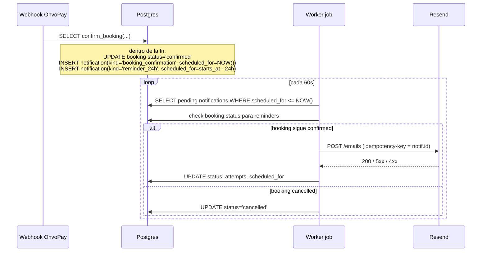

# 0007 — Notificaciones por email (confirmación + recordatorio 24h)

- **Estado**: approved
- **Autor**: Kenneth
- **Creado**: 2026-05-29
- **Última actualización**: 2026-05-29 (rev. 4: templates/adapters relocados a worker/, no React Email)
- **Rama**: feat/0007-notificaciones-email (pendiente)
- **PR**: pendiente

## 1. Contexto y motivación

Hoy el flujo de reserva (spec 0006) termina con el booking en estado `confirmed` después del webhook de OnvoPay, pero el cliente no recibe ninguna confirmación por email. Esto rompe una expectativa básica del usuario (¿se confirmó mi reserva? ¿con qué datos?) y obliga al operador a responder consultas manualmente.

Además, las reservas suelen hacerse con días o semanas de anticipación. Sin un recordatorio cercano a la fecha del tour, una parte significativa de los clientes olvida la cita o llega tarde al punto de encuentro, lo que genera no-shows que el operador no puede compensar (la política no devuelve dinero <24h) y reseñas negativas.

Esta feature introduce la infraestructura mínima de notificaciones por email: una tabla `notifications` con cola persistente, un adaptador Resend, un job del worker que despacha pendientes, dos templates (confirmación inmediata y recordatorio 24h antes), y la lógica de reintentos.

Es la primera feature que usa Resend en este repo, y la primera que introduce un job del worker que escribe en la DB (`release-expired-holds` solo libera capacidad).

## 2. Objetivos

- Enviar al cliente un email de confirmación inmediato cuando su reserva pasa a `confirmed`.
- Enviar al cliente un email de recordatorio aproximadamente 24h antes del inicio del tour reservado.
- Garantizar entrega confiable: si Resend falla transitoriamente, reintentar con backoff antes de declarar la notificación como fallida.
- No enviar recordatorios para reservas que el cliente o el operador hayan cancelado entre la confirmación y la fecha del tour.

## 3. Fuera de alcance

- No se envían notificaciones por SMS ni WhatsApp.
- No se envían recordatorios adicionales (1h antes, día de, post-tour).
- No se envía un email separado de "recibo de pago": la confirmación de reserva incluye el desglose del cobro y funciona como recibo. Un recibo PDF formal queda para una iteración posterior.
- No se notifica al guía ni al operador en este spec (los emails internos quedan para spec 0009 — asignación de guías).
- No se envían recordatorios para reservas creadas en estado `confirmed` antes del deploy de esta feature. Solo aplica a reservas confirmadas a partir del deploy.
- No hay panel admin para ver/reintentar manualmente notificaciones. Si hace falta, se reintenta vía SQL directo en esta etapa.
- No hay tracking de aperturas/clicks en este spec.
- No se manejan bounces ni unsubscribes automáticos (queda para iteración posterior; por ahora solo se loggea el fallo).

## 4. Historias de usuario

> Como turista que acabo de pagar una reserva, quiero recibir un email de confirmación con todos los detalles del tour, para tener el comprobante y la información operativa a mano.

Criterios de aceptación:

- [ ] Cuando el webhook de OnvoPay confirma un pago, el cliente recibe un email de confirmación dentro de los 2 minutos siguientes en condiciones normales.
- [ ] El email incluye: nombre del tour, fecha y hora de inicio, cantidad y tipo de tickets, monto total cobrado y moneda, punto de encuentro, nombre del operador, link a la reserva (`/reserva/<id>`).
- [ ] El email se envía en el idioma con que el cliente reservó (campo a definir en el booking; ver §5).
- [ ] Si Resend devuelve error transitorio, el sistema reintenta hasta 3 veces antes de marcar la notificación como `failed`.

> Como turista que reservó con anticipación, quiero recibir un recordatorio por email 24h antes del tour, para no olvidar la fecha y llegar preparado.

Criterios de aceptación:

- [ ] El recordatorio se envía entre 24h y 23h antes de `tour_instance.starts_at` (ventana de tolerancia ±30 minutos según frecuencia del polling).
- [ ] Solo se envía si la reserva sigue en estado `confirmed` al momento de despachar.
- [ ] Si la reserva fue cancelada o reembolsada después de confirmarse, el recordatorio pendiente queda como `cancelled` y no se envía.
- [ ] Si la reserva se confirma con menos de 24h de anticipación, el recordatorio se despacha en el siguiente ciclo del worker.
- [ ] El email incluye: nombre del tour, fecha y hora, punto de encuentro (con link a mapa si está disponible), qué llevar, contacto del operador, link a la reserva.

## 5. Diseño técnico

### Servicios externos

Se define una interfaz `EmailAdapter` con el método `send({ to, subject, html, text, idempotencyKey }): Promise<{ providerMessageId: string }>` y dos implementaciones:

- `worker/src/notifications/adapters/resend.ts` — usa la API HTTP de Resend (`POST https://api.resend.com/emails`) vía `fetch` nativo de Node, aprovecha la cabecera nativa `Idempotency-Key`. Se usa en staging y producción.
- `worker/src/notifications/adapters/mailpit.ts` — usa nodemailer contra el SMTP de Mailpit que ya levanta `supabase start` en `localhost:1025` (puerto SMTP estándar de Mailpit; el `:54324` es la UI). Se usa en dev y en tests de integración del worker. La idempotencia no se traslada al transporte SMTP, pero el `UNIQUE (booking_id, kind)` en la tabla y el lock `SELECT FOR UPDATE SKIP LOCKED` ya impiden el doble despacho desde el lado nuestro.

**Desvío del spec original (rev. 4)**: los adapters viven en `worker/`, no en `web/lib/notifications/adapters/` como decía rev. 1–3. Razón: el único consumidor de los adapters es el job del worker; ponerlos en `web/` obliga a cross-imports entre paquetes que el monorepo no tiene configurados, y agrega complejidad sin beneficio. Si en el futuro el web necesita enviar emails sincrónicamente (p. ej., un endpoint admin de "reenviar"), se promueven a `shared/`.

El adaptador concreto se elige por `env.EMAIL_PROVIDER` (`'resend' | 'mailpit'`). Se aplica el patrón de adapter ya usado en `lib/payments/adapters/`.

**Razón de Mailpit en dev y no Resend sandbox**: cero fricción (ya corre como parte de `supabase start`), tests de integración E2E sin red, no consume cuota. Se acepta como tradeoff que un bug específico de la API HTTP de Resend no aparece en dev — staging cubre esa ventana antes de producción.

Resend ya figura como servicio validado en la memoria del proyecto (`tech-decisions.md`). No requiere vetting adicional. Variables nuevas:

- `EMAIL_PROVIDER` — `mailpit` en dev y CI, `resend` en staging/prod.
- `RESEND_API_KEY` — solo en staging/prod.
- `SMTP_HOST`, `SMTP_PORT` — solo en dev/CI; defaults `localhost` y `1025`.
- `EMAIL_FROM` — pendiente de definir con el cliente; se aplica en todos los entornos. Mientras esté pendiente, se usa el placeholder `Boka Trails <no-reply@localhost>` en dev.

### Cola persistente: tabla `notifications`

La cola vive en Postgres. Razones: ya tenemos transaccionalidad con el resto del flujo de booking, no necesitamos infra extra, y el volumen esperado para MVP (decenas de reservas/día) está holgado para polling cada 60s.

### Encolado de notificaciones

**Confirmación**: se encola dentro de la función `confirm_booking` (ya existe, ver `supabase/migrations/20260527000012_create_bookings.sql:75`). Se agrega al final del bloque, en la misma transacción que confirma el booking. Razón: si por algún motivo la confirmación falla y rollbackea, la notificación no queda huérfana, y el webhook puede reintentar de forma idempotente. La idempotencia de la notificación se garantiza con un constraint único `(booking_id, kind)` — el segundo intento del webhook hace `INSERT ... ON CONFLICT DO NOTHING`.

**Recordatorio 24h**: también se encola dentro de `confirm_booking`, con `scheduled_for = tour_instance.starts_at - INTERVAL '24 hours'`. Si la resta da una fecha pasada (reserva confirmada con <24h de anticipación), se inserta igual con esa fecha y el worker la despacha en el próximo ciclo (la lógica del worker es `scheduled_for <= NOW()`).

### Job del worker: `send-notifications`

Nuevo job en `worker/src/jobs/send-notifications.ts`. Patrón idéntico a `release-expired-holds`: corre cada 60s (`setInterval`).

Cada ciclo:

1. SELECT FOR UPDATE SKIP LOCKED `notifications WHERE status='pending' AND scheduled_for <= NOW() ORDER BY scheduled_for LIMIT N` (N=20 para MVP).
2. Para cada notificación:
   - Si `kind='reminder_24h'`, verificar que `bookings.status = 'confirmed'`. Si no, marcar `status='cancelled'` y continuar.
   - Renderizar template según `kind` y `locale` con datos del booking.
   - Llamar al adaptador Resend con `idempotencyKey = notification.id` (Resend soporta idempotency keys nativamente).
   - Si éxito: `status='sent'`, guardar `provider_message_id`, `sent_at = NOW()`.
   - Si error transitorio (5xx, network, timeout): incrementar `attempts`, calcular próximo `scheduled_for` con backoff exponencial (1min, 5min, 30min), dejar en `pending`. Después del 3er intento fallido pasar a `status='failed'` y loggear con Sentry.
   - Si error permanente (4xx no-2xx no-429: payload inválido, bounced, etc.): `status='failed'` inmediato.

### Cancelación de recordatorios pendientes

Cuando una reserva pasa a `cancelled` o `refunded`, el job de despacho lo detecta en el check del paso 2 y no envía. No se hace UPDATE proactivo al cambiar el estado del booking — el chequeo "just-in-time" es suficiente y simplifica.

Como segunda red de seguridad, el job ignora notificaciones `pending` cuyo booking ya no existe o cuyo `tour_instance.starts_at` ya pasó por más de 1h (las marca `cancelled` con `cancelled_reason='stale'`).

### Templates de email

Templates como funciones puras TypeScript en `worker/src/notifications/templates/`. Cada template exporta una función `(props, locale) => { subject, html, text }`.

Templates en este spec:

- `booking-confirmation.ts` — confirmación inmediata.
- `reminder-24h.ts` — recordatorio 24h.

**Desvío del spec original (rev. 4)**: no se usa React Email. Razón: el worker es un proceso Node puro sin React; agregar React + `@react-email/render` para dos templates planos es overhead. El usuario confirmó (2026-05-29) que la estética de la app entera está pendiente de mejora; cuando ese trabajo se aborde, los templates pueden migrar a React Email o a un sistema más rico. Los strings de los templates se definen inline en cada archivo de template, en ES y EN, sin pasar por `next-intl` (el worker no carga next-intl).

### Diagrama del flujo



## 6. Modelo de datos

### Tabla nueva: `notifications`

- **Acción**: create
- **Columnas**:
  - `id uuid PRIMARY KEY DEFAULT gen_random_uuid()`
  - `booking_id uuid NOT NULL REFERENCES bookings(id) ON DELETE CASCADE`
  - `kind text NOT NULL CHECK (kind IN ('booking_confirmation','reminder_24h'))`
  - `channel text NOT NULL DEFAULT 'email' CHECK (channel IN ('email'))`
  - `recipient_email text NOT NULL` — snapshot del email del cliente al momento de encolar; sobrevive si después se edita el booking.
  - `locale text NOT NULL CHECK (locale IN ('es','en'))`
  - `status text NOT NULL DEFAULT 'pending' CHECK (status IN ('pending','sent','failed','cancelled'))`
  - `scheduled_for timestamptz NOT NULL`
  - `attempts integer NOT NULL DEFAULT 0`
  - `provider text` — `'resend'` cuando se intenta el envío.
  - `provider_message_id text` — id que devuelve Resend para tracking.
  - `last_error text` — mensaje del último error en caso de fallo.
  - `sent_at timestamptz`
  - `cancelled_reason text`
  - `created_at timestamptz NOT NULL DEFAULT NOW()`
  - `updated_at timestamptz NOT NULL DEFAULT NOW()`
- **Constraints**:
  - `UNIQUE (booking_id, kind)` — garantiza idempotencia del encolado.
- **Índices**:
  - `notifications_pending_idx ON (scheduled_for) WHERE status='pending'` — el job lee siempre por status pending.
  - `notifications_booking_idx ON (booking_id)` — para joins desde booking.
- **RLS**: enabled, sin políticas para anon/authenticated. Solo `service_role` lee/escribe (igual que `bookings`).
- **Trigger**: `set_notifications_updated_at` con la función ya existente `trigger_set_updated_at`.
- **Migración**: `20260530000013_create_notifications.sql`.

### Alteración a `bookings`

- **Acción**: alter
- **Columnas**:
  - Agregar `locale text NOT NULL DEFAULT 'es' CHECK (locale IN ('es','en'))`.
- **Migración**: incluida en la misma migración `20260530000013_create_notifications.sql`.
- **Razón**: el idioma del email debe ser el idioma en que el cliente hizo el checkout. Hoy `next-intl` ya conoce el locale activo en la página de reserva; basta capturarlo y persistirlo al crear el booking.

### Actualización a `confirm_booking`

La función gana dos `INSERT INTO notifications` al final del bloque exitoso (ver §5). Usa `ON CONFLICT (booking_id, kind) DO NOTHING` para mantenerse idempotente ante reintentos del webhook.

## 7. Estados y transiciones

Nueva máquina de estados para `notifications`:

```
pending ──► sent        (Resend 200)
pending ──► pending     (Resend 5xx, attempts < 3 — backoff)
pending ──► failed      (Resend 4xx OR attempts >= 3)
pending ──► cancelled   (booking ya no es confirmed, o stale)
```

Estados terminales: `sent`, `failed`, `cancelled`.

Sin cambios a la máquina de estados de `bookings`.

## 8. Casos borde y errores

- **Reserva confirmada con <24h de anticipación**: el recordatorio se inserta con `scheduled_for` en el pasado y el worker lo despacha en el siguiente ciclo (≤60s). En la práctica el cliente recibe confirmación + recordatorio casi al mismo tiempo; esto es deseable porque le da una alerta extra cercana al evento.
- **Webhook OnvoPay reintenta y dispara `confirm_booking` por segunda vez**: la función ya es idempotente (`IF v_booking.status = 'confirmed' THEN RETURN`); el `INSERT ON CONFLICT DO NOTHING` evita duplicar notificaciones.
- **Resend devuelve 429 (rate limit)**: tratar como error transitorio (mismo path que 5xx). El backoff exponencial mitiga.
- **Resend devuelve 5xx persistente por 3 intentos**: la notificación queda `failed`. Sentry registra el error. No hay retry automático más allá de esto en MVP — si hace falta reintentar, se hace SQL directo (`UPDATE notifications SET status='pending', attempts=0 WHERE id=...`).
- **Reserva se cancela entre confirmación y recordatorio**: el chequeo just-in-time en el job evita el envío. La notificación de confirmación, en cambio, sale al instante de confirmar y no se cancela aunque la reserva se cancele después (es la verdad histórica: la reserva sí se confirmó).
- **Tour es cancelado por el operador (cambio de `tour_instance.status`)**: fuera de alcance en este spec porque la edición de instancias no está implementada todavía. Cuando se implemente, el spec que lo cubra debe agregar el manejo correspondiente.
- **Email del cliente con typo**: el envío sale (Resend no valida el destinatario antes de enviar); si rebota, queda en logs. Manejo de bounces es fuera de alcance.
- **Falla del worker** (proceso muerto, crash): al reiniciar el worker reprocesa todo lo `pending` con `scheduled_for <= NOW()`. Los emails ya enviados quedaron como `sent` antes del crash; el `SELECT FOR UPDATE SKIP LOCKED` evita doble despacho entre worker e hipotéticos workers concurrentes (no hay concurrencia hoy, pero el patrón está listo).
- **El cliente nunca confirma el pago** (booking queda `pending_payment` y luego es cleanup): ninguna notificación se encola hasta que `confirm_booking` corra. Sin trabajo.

## 9. Impacto en otras áreas

- **Migración nueva** (`20260530000013_create_notifications.sql`) — tabla notifications + alter bookings + update a `confirm_booking`.
- **Web (`/checkout`)**: capturar `locale` actual (`next-intl`) y persistirlo en el INSERT del booking. Cambio chico en la action que crea el booking.
- **Worker**: nuevo job `send-notifications.ts`, registrado en `worker/src/index.ts` con polling de 60s siguiendo el patrón de `release-expired-holds`.
- **Templates de email** nuevos en `worker/src/notifications/templates/` (TypeScript puro, sin React Email — ver §5).
- **Dependencias nuevas** (en `worker/`): `nodemailer` + `@types/nodemailer`. Resend se llama vía `fetch` nativo, sin SDK.
- **i18n**: nuevos diccionarios `messages/es/emails.json` y `messages/en/emails.json` con strings de los templates.
- **Variables de entorno nuevas** (a documentar en `.env.example`): `EMAIL_PROVIDER`, `RESEND_API_KEY` (staging/prod), `SMTP_HOST`/`SMTP_PORT` (dev/CI), `EMAIL_FROM`. Viven en el worker (que es quien envía). El web también las necesita si en algún momento se hacen previews server-side, pero por ahora solo el worker.
- **Sin cambios** en panel admin, reportes, ni políticas de cancelación/refund.

## 10. Plan de tests

**Unit** (worker):

- Renderizado de `booking-confirmation` y `reminder-24h`: dado un payload, el HTML/texto resultante contiene los campos esperados (nombre tour, fecha, punto de encuentro, link). Casos para ES y EN.
- Cálculo de `nextScheduledFor` para backoff: dado `attempts ∈ {0,1,2}`, devuelve `+1min`, `+5min`, `+30min`.
- Lógica del job para decidir send / cancel / retry según el estado del booking y la respuesta del adaptador (con MSW mockeando Resend HTTP).

**Integration** (web):

- `confirm_booking` encola las dos notificaciones (`booking_confirmation` y `reminder_24h`) con los campos correctos.
- `confirm_booking` llamada dos veces con el mismo `booking_id` no duplica las notificaciones (unique constraint).
- Si la reserva se reserva con `starts_at` a 2h del momento actual, la notificación de recordatorio queda con `scheduled_for` en el pasado.

**Integration** (worker):

- Insertar booking confirmado + notificaciones, correr el job, verificar que se llamó a Resend con el payload esperado y la notificación quedó `sent`.
- Insertar notificación de recordatorio con booking ya `cancelled`, correr el job, verificar que quedó `cancelled` y no se llamó a Resend.
- Insertar notificación, simular Resend 503, verificar que `attempts=1` y `scheduled_for` se movió +1min. Repetir 3 veces, verificar que pasa a `failed`.
- Insertar notificación, simular Resend 400, verificar que pasa a `failed` inmediato.

**Manual** (documentar en PR):

- Hacer una reserva real en local con tarjeta de prueba OnvoPay, verificar email de confirmación en la UI de Mailpit (`http://localhost:54324`).
- Para validar el recordatorio sin esperar 24h reales: insertar manualmente una notificación `reminder_24h` con `scheduled_for = NOW()` y verificar despacho en el siguiente ciclo del worker.

## 11. Plan de rollout

- **Feature flag**: no. Es funcionalidad aditiva (la falta de email era el bug); habilitarla no rompe nada existente.
- **Migración de datos**: ninguna. Las reservas pre-existentes en `confirmed` no reciben emails retroactivos (declarado fuera de alcance §3).
- **Pre-deploy**:
  - Crear cuenta Resend, verificar el dominio que el cliente confirme para `EMAIL_FROM` (DKIM, SPF).
  - Crear API key con scope mínimo (`emails:send`).
  - Cargar `EMAIL_PROVIDER=resend`, `RESEND_API_KEY`, `EMAIL_FROM` en Railway (worker). El web solo necesita `EMAIL_FROM` si en algún momento se hacen previews server-side.
- **Deploy**:
  - Aplicar migración `20260530000013`.
  - Deploy del web (captura `locale` al crear booking).
  - Deploy del worker con el nuevo job.
- **Verificación post-deploy**:
  - Hacer una reserva real con monto mínimo, validar recepción del email.
  - Esperar a que llegue un recordatorio 24h en el primer caso real con anticipación suficiente.
- **Reversibilidad**: si algo va mal, deshabilitar el job en el worker (env var `NOTIFICATIONS_ENABLED=false` que el worker chequea al inicio del loop — sí lo incluyo como pequeña salvaguarda). La tabla y el encolado siguen funcionando; solo no se despachan los emails. La cola queda intacta para reanudar cuando se corrija.

## 12. Métricas de éxito

- **Tasa de entrega**: ≥95% de las notificaciones `pending` pasan a `sent` en menos de 5 minutos desde su `scheduled_for`. Observable con SQL sobre la tabla.
- **Tasa de fallo persistente**: <2% de notificaciones quedan en `failed`. Si supera ese umbral, hay un problema (dominio mal verificado, rate limits, etc.).
- **Reducción de no-shows**: medible una vez que haya volumen comparable antes/después; objetivo cualitativo para este MVP, no se va a medir formalmente en este spec.

## 13. Preguntas abiertas

- [x] **Resuelta (2026-05-29)**: En dev/local usamos Mailpit vía adaptador SMTP propio. Resend solo en staging/prod. Ver §5.
- [ ] **Pregunta**: ¿Qué dirección y dominio usamos para `EMAIL_FROM`? Depende de qué dominio el cliente verifique en Resend. No bloquea la implementación (Mailpit en dev acepta cualquier dirección), pero bloquea el primer envío real en staging/prod. **Dueño**: Kenneth (chequear con cliente). **Antes de**: deploy a staging.
