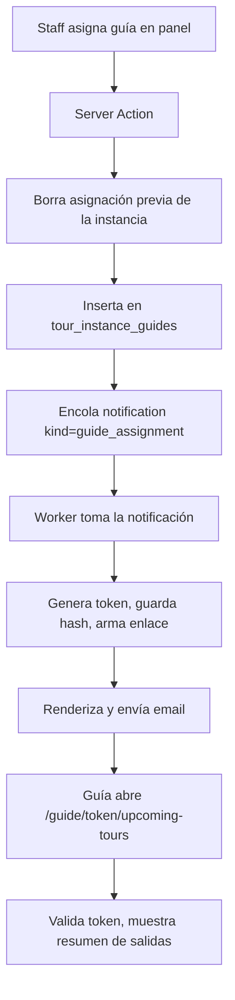

# 0009 — Gestión y asignación de guías

- **Estado**: implemented
- **Autor**: Kenneth
- **Creado**: 2026-05-31
- **Última actualización**: 2026-06-01
- **Rama**: feat/0009-gestion-asignacion-guias
- **PR**: #17 (mergeado a `dev`, commit `c5e89e7`)

## 1. Contexto y motivación

Hoy el sistema permite publicar tours, generar instancias concretas (`tour_instances`), venderlas y operarlas desde el panel (check-in en spec 0008). Pero falta el último eslabón operativo: **decir quién guía cada salida**. El staff necesita asignar un guía a cada instancia concreta de tour, y el guía necesita saber qué salidas tiene asignadas y cuándo.

Los guías son personal de campo: no usan el panel administrativo ni tienen por qué autenticarse con usuario y contraseña en una computadora. Necesitan algo que abran desde el teléfono. La solución es un **enlace mágico** (magic link) que les llega por email cuando se les asigna una salida y que los lleva a una página simple con sus próximos tours.

Actores involucrados:

- **Staff** (operador interno): asigna y desasigna guías a instancias desde el panel.
- **Guía**: recibe el email de asignación y consulta sus próximas salidas vía el enlace.

Los guías ya existen en el sistema como `users` con `role = 'guide'` (enum `UserRole.Guide`); el seed incluye `carlos@bokatrails.com`. Lo que falta es la relación instancia↔guía, el flujo de notificación, y la vista del guía.

## 2. Objetivos

- Permitir que el staff asigne y desasigne un guía a una `tour_instance` concreta desde el panel.
- Notificar al guía por email automáticamente en el momento de la asignación, reutilizando la cola `notifications` existente.
- Dar al guía una vista pública (sin login) protegida por un token que expira, donde ve un resumen de sus próximas salidas asignadas.
- Dejar el modelo de datos preparado para múltiples guías por instancia en el futuro, aunque el MVP opere con uno solo.

## 3. Fuera de alcance

- **Múltiples guías por instancia en la UI**: el modelo de datos lo soporta (tabla puente), pero el panel asigna y muestra un solo guía por instancia en este spec. La capacidad multi-guía se habilita en un spec futuro sin migración.
- **Check-in por parte del guía**: el guía solo consulta; el check-in de pasajeros sigue siendo exclusivo del staff (spec 0008). La vista del guía no tiene acciones que muten estado.
- **Roster de pasajeros en la vista del guía**: el guía ve un resumen agregado (cantidad de pasajeros, fecha, punto de encuentro), no la lista nominal de clientes. Se evita exponer datos personales de clientes a través de un enlace de baja fricción.
- **Notificación al guía ante cambios posteriores** (reprogramación, cancelación de la instancia, desasignación): este spec solo dispara email al asignar. Notificar cambios queda para un spec futuro junto con la edición de instancias.
- **Recordatorio al guía 24h antes** (análogo al del cliente): fuera de alcance; se puede agregar luego reusando la misma cola.
- **Gestión de disponibilidad/calendario del guía** (marcar días libres, evitar doble-asignación a la misma hora): fuera de alcance. Ver caso borde de solapamiento en sección 8.
- **CRUD de guías como usuarios**: la creación de usuarios con rol `guide` ya existe (spec 0002). Este spec no agrega gestión de altas/bajas de guías.

## 4. Historias de usuario

> Como staff que opera las salidas del día, quiero asignar un guía a cada instancia de tour, para que quede registrado quién la dirige y el guía sea notificado.

Criterios de aceptación:

- [ ] Desde el detalle de una instancia en el panel, el staff puede seleccionar un guía de la lista de usuarios con `role = 'guide'` y asignarlo.
- [ ] Al asignar, el sistema encola un email al guía y la asignación queda visible en el panel.
- [ ] El staff puede desasignar el guía de una instancia. Al desasignar no se envía email (fuera de alcance) pero la relación se elimina.
- [ ] Reasignar a otro guía reemplaza la asignación previa y notifica al guía nuevo.
- [ ] No se puede asignar como guía a un usuario que no tenga `role = 'guide'`.

> Como guía, quiero recibir un email cuando me asignan una salida y poder abrir un enlace para ver mis próximos tours, para saber qué tengo que guiar y cuándo, sin tener que iniciar sesión.

Criterios de aceptación:

- [ ] Al ser asignado, el guía recibe un email con el nombre del tour, fecha/hora, punto de encuentro y un enlace a su página de próximas salidas.
- [ ] El enlace lleva a `/guide/[token]/upcoming-tours` sin requerir login.
- [ ] La página muestra, ordenadas por fecha ascendente, las instancias futuras asignadas al guía, cada una con: nombre del tour, fecha y hora de inicio, punto de encuentro, y cantidad total de pasajeros confirmados.
- [ ] Las instancias ya pasadas no se muestran.
- [ ] Si el token expiró o no existe, la página muestra un mensaje claro ("Este enlace ya no es válido, pedí uno nuevo al operador") y no filtra datos.
- [ ] El enlace está disponible en español e inglés según el idioma del guía.

## 5. Diseño técnico

### Relación instancia↔guía (tabla puente)

Se crea `tour_instance_guides` como tabla puente entre `tour_instances` y `users`, con clave primaria compuesta `(tour_instance_id, guide_id)`. Aunque el MVP usa un solo guía por instancia, la tabla puente evita una migración con backfill cuando se habilite multi-guía. La unicidad de "un guía por instancia" en el MVP se garantiza en la capa de aplicación (la Server Action borra cualquier asignación previa de esa instancia antes de insertar la nueva), no con un constraint, para que habilitar multi-guía después no requiera tocar el schema.

**Decisión y alternativa considerada**: la alternativa era una columna `guide_id` en `tour_instances`. Se descartó porque pasar a multi-guía exigiría una migración que mueva datos a una tabla puente; arrancar con la puente cuesta lo mismo hoy y deja la puerta abierta gratis. El tradeoff es un JOIN extra en las lecturas, despreciable a esta escala.

### Token de acceso del guía (magic link propio, no Supabase Auth)

El enlace del guía **no usa Supabase Auth**. Usa un token propio, generado con `crypto.randomBytes`, del que se guarda **solo el hash SHA-256 en DB**; el texto plano viaja únicamente en el email. Esto sigue la regla de workflow-rules (tokens: hash en DB, plano solo en email) y evita el gotcha de PKCE de Supabase documentado en tech-decisions, que aplica a flujos de browser con verifier en cookie — inadecuado para un enlace que el guía abre desde el teléfono días después.

El token es **a nivel guía**, no a nivel asignación: la página muestra _todas_ las próximas salidas del guía, así que un token por guía sirve para todas. Se crea la tabla `guide_access_tokens`. El token **expira a los 30 días** de emitido.

**Quién genera el token (decisión por la regla hash-only):** como solo se guarda el hash en DB y el texto plano viaja únicamente en el email, **es imposible "reutilizar" un token entre requests** (nadie puede recuperar el plano a partir del hash). Por eso el token lo **genera el worker en el momento de despachar el email** de asignación, no la Server Action: el worker crea el plano, guarda el hash con expiración a 30 días, arma el enlace y lo manda. Cada email de asignación lleva su propio token; todos los tokens vigentes de un guía funcionan en paralelo (hasta expirar). La Server Action solo encola la notificación; no toca tokens. Una reentrega por reintento puede generar un token extra para el guía: es inocuo (todos expiran a 30 días) y evita almacenar el plano en la cola.

La validación en la página hashea el token de la URL y busca una fila con ese `token_hash` y `expires_at > NOW()`. La lectura de las instancias del guía se hace **server-side con service role** después de validar el token, no vía RLS con sesión (el visitante es anónimo). El token gatea el acceso; sin token válido no se ejecuta ninguna query de datos.

### Notificación de asignación (reúso de la cola `notifications`)

Se reutiliza la cola `notifications` y toda su maquinaria del worker (polling 60s, adapters Mailpit/Resend, backoff exponencial, estados `pending→sent|failed|cancelled`). El valor de reusar es no reimplementar reintentos ni despacho.

El costo es que `notifications` hoy es **booking-céntrica** y hay que generalizarla:

- `booking_id` pasa a ser **nullable** (un email de guía no tiene booking).
- Se agregan columnas nullable `tour_instance_id uuid REFERENCES tour_instances(id) ON DELETE CASCADE` y `guide_id uuid REFERENCES users(id) ON DELETE CASCADE`.
- El `CHECK` de `kind` agrega `'guide_assignment'`.
- Se **conserva** el `UNIQUE (booking_id, kind)` original. Con `booking_id` nullable, los NULL son distintos (NULLS DISTINCT por defecto en Postgres), así que las filas de guía no colisionan entre sí y `confirm_booking` sigue usando su `ON CONFLICT (booking_id, kind)` sin cambios. La idempotencia de la asignación de guía la da un índice único parcial nuevo `(tour_instance_id, guide_id, kind) WHERE kind = 'guide_assignment'`. (Dropear el unique por un índice parcial rompía la RPC: un índice parcial no sirve como arbiter de ese `ON CONFLICT`.)
- Se agrega un `CHECK` que garantiza coherencia: si `kind = 'guide_assignment'` entonces `tour_instance_id` y `guide_id` son NOT NULL y `booking_id` es NULL; en otro caso `booking_id` es NOT NULL.

En el worker, `send-notifications` ramifica por `kind`:

- `booking_confirmation` / `reminder_24h`: camino actual (carga booking, render con `BookingRow`).
- `guide_assignment`: carga la instancia + tour + guía + conteo de pasajeros, **genera el token de acceso** (hash en `guide_access_tokens`), arma el enlace y renderiza un template nuevo `guide-assignment.ts`. `recipient_email` es el email del guía; `locale` el idioma del guía (columna `users.locale`, ver modelo de datos), ambos fijados al encolar.

El email del guía se encola desde la **Server Action de asignación** (no desde una función Postgres como `confirm_booking`), porque la asignación es una acción de panel, no un evento transaccional de pago. La inserción usa `ON CONFLICT DO NOTHING` contra el índice único parcial de asignación.

### UI del panel

La asignación vive en el **detalle de la instancia** dentro del panel. La memoria indica que el panel está bajo `/dashboard` (no `/admin`). El punto exacto de montaje (detalle de instancia existente vs. sección nueva) se resuelve en implementación según lo que ya exista en `/dashboard`; el spec exige que sea accesible desde donde el staff ya gestiona instancias/salidas. Componente: un selector de guía + botón asignar/desasignar, como Server Action.

### Vista del guía

Route group propio para la vista pública del guía, separado de `(admin)`, en `/guide/[token]/upcoming-tours`. Server Component que: valida el token, y si es válido renderiza tarjetas-resumen por instancia futura asignada. Sin acciones de mutación.

## 6. Modelo de datos

### Tabla: `tour_instance_guides`

- **Acción**: create
- **Columnas**:
  - `tour_instance_id uuid NOT NULL REFERENCES public.tour_instances(id) ON DELETE CASCADE`
  - `guide_id uuid NOT NULL REFERENCES public.users(id) ON DELETE CASCADE`
  - `assigned_at timestamptz NOT NULL DEFAULT NOW()`
  - `assigned_by uuid REFERENCES public.users(id)` (staff que asignó; nullable por si el origen es un job futuro)
  - **PRIMARY KEY** `(tour_instance_id, guide_id)`
- **Índices**: `tour_instance_guides_guide_idx ON (guide_id)` para la consulta "próximas salidas del guía".
- **RLS**: habilitada. Acceso solo `service_role` y `authenticated` con `user_role` de staff/admin (mismo patrón que el panel 0008). La vista del guía no lee por RLS sino server-side con service role tras validar token.
- **Migración**: `2026XXXX_create_tour_instance_guides.sql`

### Tabla: `guide_access_tokens`

- **Acción**: create
- **Columnas**:
  - `id uuid NOT NULL DEFAULT gen_random_uuid() PRIMARY KEY`
  - `guide_id uuid NOT NULL REFERENCES public.users(id) ON DELETE CASCADE`
  - `token_hash text NOT NULL UNIQUE` (SHA-256 hex del token plano)
  - `expires_at timestamptz NOT NULL`
  - `created_at timestamptz NOT NULL DEFAULT NOW()`
  - `last_used_at timestamptz`
- **Índices**: UNIQUE en `token_hash` (lookup de validación); índice en `(guide_id, expires_at)` para encontrar token vigente al asignar.
- **RLS**: habilitada, solo `service_role`. Nunca se expone a clientes.
- **Migración**: misma migración o una contigua.

### Tabla: `notifications`

- **Acción**: alter
- **Cambios**:
  - `booking_id` → `DROP NOT NULL`.
  - `ADD COLUMN tour_instance_id uuid REFERENCES public.tour_instances(id) ON DELETE CASCADE`
  - `ADD COLUMN guide_id uuid REFERENCES public.users(id) ON DELETE CASCADE`
  - `kind` CHECK extendido a `('booking_confirmation','reminder_24h','guide_assignment')`.
  - Se conserva el `UNIQUE (booking_id, kind)` original (NULLS DISTINCT permite múltiples filas de guía con `booking_id NULL`). Se agrega `notifications_assignment_uniq ON (tour_instance_id, guide_id, kind) WHERE kind = 'guide_assignment'`.
  - `ADD CONSTRAINT` de coherencia (CHECK) entre `kind` y qué FKs deben estar presentes.
- **Migración**: `2026XXXX_generalize_notifications_for_guides.sql`

### Tabla: `users`

- **Acción**: alter
- `users` no tiene columna de idioma hoy. Se agrega `locale text NOT NULL DEFAULT 'es' CHECK (locale IN ('es','en'))` para elegir el idioma del email del guía (y de comunicaciones futuras a usuarios internos). Default `'es'` por ser personal local en CR; el admin puede cambiarlo por guía.

## 7. Estados y transiciones

No se introduce una máquina de estados nueva para la asignación: una instancia tiene cero o un guía asignado (fila en `tour_instance_guides` o ausencia de ella). Reasignar = borrar + insertar.

Se reutiliza la máquina existente de `notifications`: `pending → sent | failed | cancelled`. La notificación `guide_assignment` nace `pending` con `scheduled_for = NOW()` y la despacha el worker en el siguiente ciclo.

El token de acceso no tiene estados explícitos: es válido si `expires_at > NOW()`, inválido si no.

## 8. Casos borde y errores

- **Usuario seleccionado no es guía**: la Server Action valida `role = 'guide'` antes de insertar; si no, error de validación y no se asigna.
- **Reasignación**: asignar un guía distinto borra la asignación previa de esa instancia (regla de un guía por instancia en MVP) y notifica al nuevo, salvo que ese guía ya hubiera sido notificado antes para esta instancia (ver idempotencia). No se notifica al guía removido (fuera de alcance).
- **Idempotencia del email — a lo sumo uno por (instancia, guía)**: antes de encolar, la Server Action verifica si ya existe una notificación `guide_assignment` para ese par; si existe (en cualquier estado), no encola otra. El índice único parcial `notifications_assignment_uniq` lo respalda a nivel DB ante carreras. Consecuencia: si un guía ya recibió el email de una instancia, reasignarlo a la misma instancia (tras haberlo quitado) no le manda otro email — su vista de próximas salidas se actualiza sola igual. Es el comportamiento deseado (no spamear) y suficiente para el MVP.
- **Token expirado**: la página muestra mensaje de enlace inválido, sin filtrar datos ni revelar si el guía existe.
- **Token vigente al reasignar**: se reutiliza; el guía no acumula tokens. Si el token venció entre asignaciones, se genera uno nuevo y el enlace del email lleva el nuevo.
- **Instancia cancelada después de asignar**: la vista del guía filtra por instancias futuras; una instancia `cancelled` se decide si se oculta o se muestra marcada. MVP: se muestran solo instancias con `status != 'cancelled'` y `starts_at > NOW()`. Notificar la cancelación al guía es fuera de alcance.
- **Guía sin email**: no debería ocurrir (los `users` tienen email), pero si `recipient_email` es nulo, la Server Action no encola y registra el problema en logs; la asignación igual se persiste.
- **Solapamiento horario** (mismo guía en dos instancias a la misma hora): permitido en este spec; no se valida disponibilidad. Documentado como fuera de alcance.
- **Conteo de pasajeros**: "pasajeros confirmados" = suma de tickets de bookings en estado `confirmed` de esa instancia. Reservas `pending_payment` no cuentan.
- **Borrado del guía (user)**: `ON DELETE CASCADE` limpia asignaciones y tokens.

## 9. Impacto en otras áreas

- **Panel admin**: nueva UI de asignación/desasignación en el detalle de instancia bajo `/dashboard`. Guards de rol existentes (claim `user_role`).
- **Worker**: `send-notifications` ramifica por `kind`; nuevo template `worker/src/notifications/templates/guide-assignment.ts`; `renderForKind` y los tipos del repositorio se generalizan para soportar una notificación sin booking. La función `loadBookingForNotification` se complementa con un loader de asignación.
- **Emails/templates**: un template nuevo (guía), en ES y EN, siguiendo el patrón de funciones puras del spec 0007 (sin React Email).
- **i18n**: textos nuevos para (a) la UI de asignación del panel y (b) la vista pública del guía y (c) el email. **Agregar el namespace nuevo a AMBOS `web/locales/es.json` Y `web/locales/en.json`** — en 0008 se olvidó `en.json` y crasheó `/en/*` con MISSING_MESSAGE.
- **Pagos/refunds/cancelaciones**: sin impacto.
- **Métricas/reportes**: sin impacto en este spec.

## 10. Plan de tests

- **Unit (web)**: validación de que solo usuarios `role='guide'` son asignables; generación y hash del token (el plano nunca se persiste; el hash coincide); lógica de "reusar token vigente vs. generar nuevo" según `expires_at`.
- **Unit (worker)**: `renderForKind` para `guide_assignment` produce asunto/cuerpo correctos en ES y EN; el branch de carga no rompe el camino de booking existente.
- **Integración (web)**: Server Action de asignación contra DB real — inserta en `tour_instance_guides`, encola `notifications` con `kind='guide_assignment'`, idempotencia en reasignación del mismo guía; desasignación borra la fila; validación de rol rechaza no-guías.
- **Integración (web)**: validación del token en la ruta del guía — token válido devuelve solo instancias futuras del guía con el conteo correcto; token expirado no devuelve datos; token inexistente no revela información.
- **Integración (worker)**: despacho real de una notificación `guide_assignment` contra DB + Mailpit, verificando destinatario (email del guía) y contenido.
- **Manual (PR)**: asignar guía desde el panel, ver el email en Mailpit, abrir el enlace, confirmar el resumen; probar enlace expirado.

## 11. Plan de rollout

- **Sin feature flag**: es funcionalidad nueva aislada; no reemplaza comportamiento existente.
- **Migración de datos**: no hay datos existentes de asignación que migrar. La generalización de `notifications` es retrocompatible (las filas actuales tienen `booking_id` no nulo y caen en el índice único parcial de booking).
- **Variables de entorno**: ninguna nueva. El TTL del token (30 días) vive como constante en el código.
- **Comunicación a operadores**: explicar al staff cómo asignar guías y al cliente (operador del negocio) que los guías reciben enlaces por email.
- **Reversibilidad**: la feature es aditiva. Ante problemas, se deja de asignar guías; las migraciones de tablas nuevas son reversibles con `DROP`. La generalización de `notifications` no rompe el flujo de bookings.

## 12. Métricas de éxito

- 100% de las instancias operadas tienen un guía asignado antes de su `starts_at` (medible en panel/consulta).
- ≥95% de los emails de asignación se despachan exitosamente (estado `sent`) en el primer intento.
- Los guías abren el enlace (registrado en `last_used_at`) para una mayoría de las asignaciones — señal de que el canal funciona.

## 13. Preguntas abiertas

Ninguna. Decisiones cerradas en la aprobación (2026-06-01):

- **TTL del token del guía**: 30 días, reutilizando token vigente y regenerando al expirar.
- **Idioma del email del guía**: columna `users.locale` por guía (default `'es'`).
- **Punto de montaje en el panel**: a discreción de la implementación, donde resulte más natural según lo que ya exista bajo `/dashboard`.
