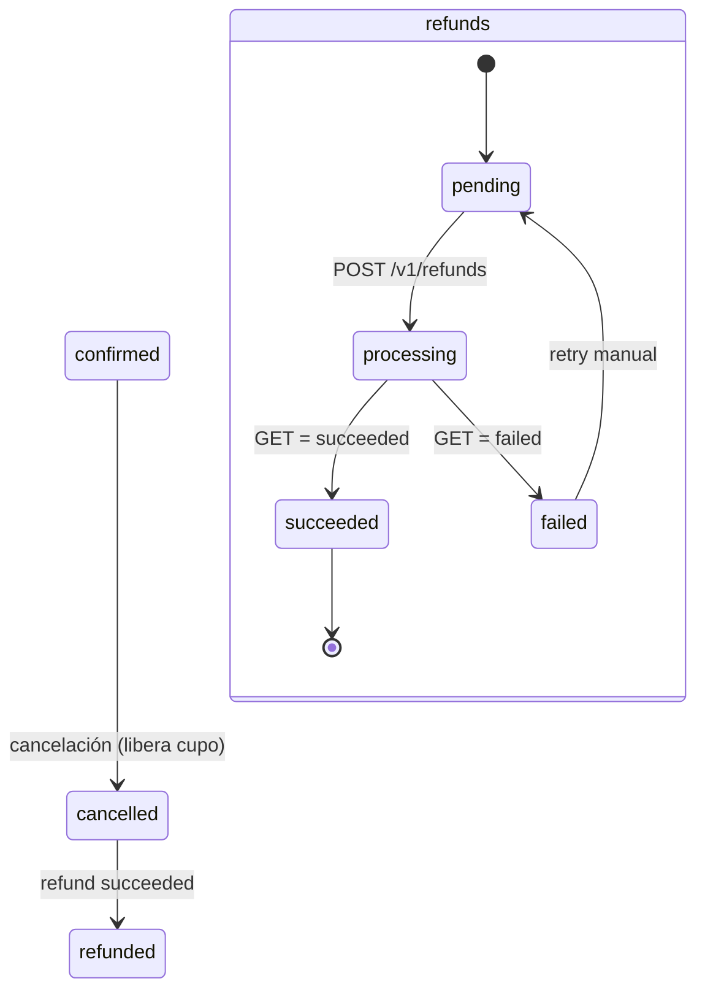

# 0011 — Cancelaciones con refund automático

- **Estado**: approved
- **Autor**: Kenneth
- **Creado**: 2026-06-02
- **Última actualización**: 2026-06-02
- **Rama**: feat/0011-cancelaciones-refund-automatico (cuando aplique)
- **PR**: # (cuando aplique)

## 1. Contexto y motivación

Hoy una reserva confirmada no se puede cancelar desde el producto. Si un turista quiere cancelar, tiene que escribir al operador, y el operador no tiene forma de devolver la plata ni de liberar el cupo salvo tocando la base a mano. No hay registro de quién canceló qué ni cuándo. Esto genera trabajo manual, errores, y cero trazabilidad sobre un evento que mueve dinero.

Esta feature le da al **turista** una forma self-service de cancelar su reserva desde un link en su email, viendo con claridad **antes de confirmar** si le corresponde reembolso o no; y le da al **staff** la capacidad de cancelar desde el panel. Cuando corresponde reembolso, el sistema lo procesa automáticamente contra OnvoPay y le avisa al cliente. Toda cancelación queda registrada en una bitácora de auditoría (`audit_logs`), tabla cuya creación se difirió explícitamente desde el spec 0008 justamente hasta esta feature, donde el historial importa de verdad.

Durante el diseño se detectaron dos cosas del estado actual que esta feature corrige de paso:

1. **El link "Ver mi reserva" de los emails (0007) apunta a un 404.** La confirmación y el recordatorio generan `${appUrl}/${locale}/reserva/${booking.id}`, pero esa ruta nunca se construyó. La página de ver/gestionar la reserva — landing natural de la cancelación — se crea acá.
2. **No existe ningún token de acceso a la reserva.** La página de éxito del checkout accede a la reserva por UUID crudo en query param. Como la cancelación dispara un reembolso, el acceso se endurece con un token hasheado propio (mismo patrón que el magic link del guía en 0009).

## 2. Objetivos

- Permitir que un turista cancele su reserva confirmada de forma self-service, viendo antes de confirmar si tiene derecho a reembolso y por cuánto.
- Permitir que el staff cancele una reserva desde el panel, con el mismo motor de cancelación y reembolso.
- Procesar el reembolso automáticamente contra OnvoPay cuando la política lo concede, de forma reintentable y sin perder plata ante fallas transitorias.
- Registrar cada cancelación y cada movimiento de reembolso en una bitácora de auditoría consultable.
- Reemplazar el acceso por UUID crudo a la reserva por un token hasheado, resolviendo de paso el 404 del link de los emails.

## 3. Fuera de alcance

- **No** se cancela una salida entera (`tour_instance`) con reembolso en lote a todos los reservantes (cancelación operativa por clima / cupo mínimo). Es un spec aparte; acá solo se cancelan reservas individuales.
- **No** se cancelan reservas en estado `pending_payment` (checkout abandonado). Esas las cubre la deuda técnica de "reservas pending_payment colgadas" en un spec futuro; su hold expira solo y no hay pago que reembolsar.
- **No** se soportan reembolsos parciales por la UI (devolver solo algunos tickets de una reserva). El reembolso es del total de la reserva o nada, según la política de ventana. (El endpoint de OnvoPay soporta parcial; el modelo de datos deja la puerta abierta, pero la feature no lo expone.)
- **No** se define la política de reembolso comercial definitiva: el cliente todavía no la confirmó (ver sección 13). Se implementa una **política binaria por ventana de 24h** parametrizada y aislada en un solo lugar, lista para cambiar sin tocar el resto.
- **No** se construye un panel de auditoría con UI rica sobre `audit_logs`. Se crea la tabla y se escribe en ella; consultarla es por ahora vía SQL / panel de detalle. La UI de reportes es otro spec (0012).
- **No** se notifica al guía asignado cuando una reserva se cancela. Su lista de próximos tours refleja el cupo actualizado, pero no recibe email por reserva individual.

## 4. Historias de usuario

> Como turista que reservó un tour, quiero cancelar mi reserva desde el link de mi email y ver claramente si me devuelven la plata antes de confirmar, para decidir con información y no depender de escribirle al operador.

Criterios de aceptación:

- [ ] Desde el link de la reserva, el turista llega a una página de cancelación que muestra el estado de la reserva, el tour y la fecha.
- [ ] Antes de confirmar, la página muestra de forma inequívoca **"Tenés derecho a reembolso: SÍ — ₡X"** o **"Esta cancelación no tiene reembolso"**, según la ventana de 24h.
- [ ] Al confirmar, la reserva pasa a cancelada, el cupo se libera, y si corresponde reembolso, se inicia automáticamente.
- [ ] El turista recibe un email de confirmación de cancelación; si hubo reembolso, recibe además un email cuando el reembolso se acredita.
- [ ] Cancelar dos veces (doble submit, recargar) no genera doble cancelación ni doble reembolso.
- [ ] Un token inválido o vencido muestra un error claro, no un 404 ni datos de otra reserva.

> Como staff, quiero cancelar una reserva desde el panel de detalle, para resolver casos que el cliente gestiona por teléfono, dejando registro de que la cancelé yo.

Criterios de aceptación:

- [ ] En el detalle de una reserva confirmada, el staff ve un botón "Cancelar reserva" con la misma vista de "tiene/no tiene reembolso".
- [ ] La cancelación por staff queda en `audit_logs` con `actor_type=staff` y el id del usuario.
- [ ] El staff no puede cancelar una reserva ya cancelada o reembolsada (el botón no aparece o la acción es idempotente y lo informa).

> Como operador, quiero que un reembolso que OnvoPay rechaza no se pierda en silencio, para poder reintentarlo.

Criterios de aceptación:

- [ ] Si OnvoPay rechaza el reembolso, la reserva queda cancelada pero el reembolso queda marcado como fallido y visible en el detalle.
- [ ] El staff puede reintentar el reembolso fallido desde el panel.
- [ ] Un reembolso fallido nunca deja la reserva en estado `refunded`.

## 5. Diseño técnico

### Política de reembolso (aislada y parametrizable)

Una sola fuente de verdad para la regla, en `shared/constants/policies.ts`:

- `CANCELLATION_WINDOW_MS = 24 * 60 * 60 * 1000` — ventana mínima de antelación.
- Función pura `computeRefund({ startsAt, totalAmountCents, now }) → { eligible: boolean; amountCents: number }`. Hoy: `eligible = (startsAt - now) >= CANCELLATION_WINDOW_MS`; `amountCents = eligible ? totalAmountCents : 0`. **Placeholder explícito** marcado con comentario `TODO(política-cliente)`: el cliente puede pedir escalonado o full-menos-comisión; cambiar solo esta función.

La función vive sin `server-only` para poder unit-testear el borde exacto de 24h sin arrastrar el guard (patrón de 0009).

### Token de acceso a la reserva

Mismo patrón hash-only que el magic link del guía (0009), tabla nueva `booking_access_tokens`:

- Se guarda **solo el hash SHA-256**; el texto plano viaja únicamente en el email.
- Lo emite el **worker al despachar** cada email de reserva (confirmación, recordatorio): genera un plaintext fresco, inserta su hash, y arma el link con el plaintext. Como cada email inserta su propia fila, **ambos links quedan válidos** (no hay overwrite como en guías).
- `expires_at = tour_instance.starts_at` (gestionar una reserva tiene sentido hasta que arranca el tour). Validación: hash existe y no venció.
- Helper `web/lib/booking/access-token.ts` (`validateBookingToken(db, plaintext) → booking_id | null`), con `hashBookingToken` en un archivo sin `server-only` reusable por el worker. El worker reusa el mismo algoritmo (igual que `hashGuideToken`).

`render.ts` del worker cambia el link de `/${locale}/reserva/${booking.id}` a `/${locale}/booking/${plaintext}` (ruta en inglés, ver [[url-naming]]).

### Motor de cancelación (capa lib + función DB atómica)

`web/lib/booking/cancel.ts` orquesta; la mutación atómica vive en una función Postgres `cancel_booking` (SECURITY DEFINER, REVOKE de PUBLIC), espejo de `confirm_booking`:

1. `SELECT ... FOR UPDATE` de la reserva. Si no existe → error. Si `status != 'confirmed'` → retorno idempotente (ya cancelada/reembolsada).
2. `UPDATE bookings SET status = 'cancelled'`.
3. Decrementa `tour_instances.capacity_reserved` por los asientos de la reserva (reverso exacto de `confirm_booking`).
4. Cancela el recordatorio pendiente: `UPDATE notifications SET status='cancelled', cancelled_reason=... WHERE booking_id = ... AND kind='reminder_24h' AND status='pending'`.
5. Encola la notificación `cancellation_confirmation` (`ON CONFLICT (booking_id, kind) DO NOTHING`).
6. Si `computeRefund` concede reembolso, inserta la fila en `refunds` (status `pending`) **dentro de la misma transacción** — así la cancelación y la intención de reembolso son atómicas.

La elegibilidad y el monto se calculan en la capa lib **antes** de llamar a la función (la función recibe el monto a reembolsar o 0), porque la regla de política es de aplicación, no de DB.

### Procesamiento del reembolso (job del worker, reintentable, por polling)

**Vetting OnvoPay (external-services-vetting, 2026-06-02):** el endpoint de refunds existe y es asíncrono **sin webhook**. Por lo tanto el resultado se obtiene por polling, no por callback.

- `POST /v1/refunds` — body `{ paymentIntentId, amount?, reason }`. Sin `amount` reembolsa total; con `amount` parcial (no lo usamos). Respuesta 201 con objeto Refund (`id`, `status`, `failureReason`, ...).
- `GET /v1/refunds/:id` — consulta el estado.
- Status del Refund en OnvoPay: `pending → succeeded | failed`.
- **No hay evento de webhook de refund** (los eventos OnvoPay son solo `payment-intent.*`, `subscription.*`, `checkout-session.succeeded`, `mobile-transfer.received`).

**Corrección de diseño (2026-06-02, durante implementación):** el cliente HTTP de refunds de OnvoPay vive en el **worker**, no en el `PaymentProvider` de `web/lib/payments`. Razón: el reembolso lo dispara el job del worker, y el worker es self-contained (no importa `web/lib`); además ya tiene `ONVOPAY_SECRET_KEY` en su env. `web` nunca llama a OnvoPay para reembolsar (solo encola la fila `refunds`), así que agregar métodos de refund al adapter de web sería código muerto. El worker tiene su propio adapter `worker/src/refunds/onvopay.ts` (mismo patrón de adapter, preservado dentro del worker):

- `createRefund({ externalPaymentId, amountCents?, reason }) → { externalRefundId, status, failureReason? }`
- `getRefund(externalRefundId) → { status, failureReason? }`

Nuevo job del worker `process-refunds` (polling cada 60s, igual cadencia que el resto):

- Toma `refunds WHERE status IN ('pending','processing')`.
- `status='pending'` (aún no se llamó a OnvoPay): llama `createRefund`, guarda `external_refund_id` y pasa a `processing`. La fila se "reclama" con un `UPDATE ... WHERE status='pending'` row-locked antes de llamar, para single-flight (evita doble POST si el ciclo se solapa).
- `status='processing'`: `getRefund` y, según el resultado, transición a `succeeded` o `failed`.
- En `succeeded`: `UPDATE payments SET status='refunded'`, `UPDATE bookings SET status='refunded'`, encola `refund_confirmation`, escribe `audit_logs` (`refund.succeeded`).
- En `failed`: deja la reserva `cancelled`, marca el reembolso `failed` con `failure_reason`, escribe `audit_logs` (`refund.failed`). Visible en el panel para retry manual.
- `attempts` se incrementa por ciclo; tras N intentos de un `createRefund` que falla en red/5xx se deja `failed` para no spinear indefinidamente.

El reembolso **no** se ejecuta en el handler de la Server Action: se encola (fila `refunds` pending) y el worker lo procesa, consistente con la regla de pagos de codebase-conventions.

### Auditoría

Tabla `audit_logs` (creada acá; ver sección 6). Se escribe (vía service client, helper `web/lib/audit/log.ts`) en: `booking.cancelled` (actor turista o staff), `refund.requested`, `refund.succeeded`, `refund.failed`, `refund.retried`. La escritura de auditoría chequea su `error` y lo loggea, pero **no** revierte la operación principal si falla (la auditoría no debe bloquear una cancelación ya consumada); el fallo queda en logs.

### Rutas y superficies (rutas en inglés — [[url-naming]])

- `web/app/[locale]/(public)/booking/[token]/page.tsx` — ver mi reserva (resuelve el 404). Detalle read-only + botón "Cancelar reserva" si está `confirmed`.
- `web/app/[locale]/(public)/booking/[token]/cancel/page.tsx` — página de cancelación con la vista "tenés derecho a reembolso: SÍ/NO + monto" y confirmación.
- Server Action `cancelBookingByToken(plaintext)` (turista): valida token → resuelve booking → `cancel.ts`. `actor_type=tourist`.
- Server Action `cancelBookingByStaff(bookingId)` en el panel: guard de rol (admin/staff), `actor_type=staff` + `actor_id`. Botón en el detalle existente `/dashboard/bookings/[id]`.
- Server Action `retryRefund(refundId)` (admin/staff): re-pone el reembolso `failed` en `pending`. `audit_logs: refund.retried`.

Todas las Server Actions chequean el `error` de cada escritura y devuelven un resultado de falla tipado (no asumen éxito) — endureciendo desde el día uno lo que en 0008/0009 quedó como deuda.

## 6. Modelo de datos

Migración nueva: `supabase/migrations/<ts>_create_refunds_audit_and_booking_tokens.sql`.

**Tabla `refunds`** — acción: create.

- `id` uuid pk default gen_random_uuid()
- `booking_id` uuid not null → bookings(id)
- `payment_id` uuid not null → payments(id)
- `external_refund_id` text null (id del Refund en OnvoPay; null hasta crearse) UNIQUE
- `amount_cents` integer not null CHECK (> 0)
- `currency` text not null default 'USD'
- `status` text not null default 'pending' CHECK (status IN ('pending','processing','succeeded','failed'))
- `reason` text null
- `failure_reason` text null
- `attempts` integer not null default 0 CHECK (>= 0)
- `created_at` / `updated_at` timestamptz, trigger `set_updated_at`
- Índices: `(status)` parcial WHERE status IN ('pending','processing') para el job; `(booking_id)`.
- UNIQUE parcial `(booking_id) WHERE status <> 'failed'` — a lo sumo un reembolso vigente por reserva (idempotencia ante doble cancelación; un fallido permite reintento creando/retomando).
- RLS habilitada, sin políticas (solo service_role), igual que payments.

**Tabla `audit_logs`** — acción: create.

- `id` uuid pk default gen_random_uuid()
- `actor_type` text not null CHECK (actor_type IN ('tourist','staff','admin','system'))
- `actor_id` uuid null → users(id) (null para tourist/system)
- `action` text not null (ej. 'booking.cancelled', 'refund.succeeded')
- `entity_type` text not null (ej. 'booking', 'refund')
- `entity_id` uuid not null
- `metadata` jsonb not null default '{}'
- `created_at` timestamptz not null default NOW()
- Índices: `(entity_type, entity_id)`, `(created_at)`.
- RLS habilitada; SELECT para `authenticated` con rol admin/staff (patrón InitPlan `(select auth.jwt())`); writes solo service_role.

**Tabla `booking_access_tokens`** — acción: create. Espejo de `guide_access_tokens`.

- `id` uuid pk default gen_random_uuid()
- `booking_id` uuid not null → bookings(id) ON DELETE CASCADE
- `token_hash` text not null UNIQUE
- `expires_at` timestamptz not null
- `created_at` timestamptz not null default NOW()
- `last_used_at` timestamptz null
- Índice `(booking_id, expires_at)`. RLS habilitada, sin políticas (solo service_role).

**Función `cancel_booking`** — acción: create. SECURITY DEFINER, REVOKE de PUBLIC. Descrita en sección 5.

Sin cambios de columnas en `bookings` ni `payments` (sus enums de status ya incluyen `cancelled`/`refunded`). Cambio en `notifications`: extender el CHECK de `kind` para sumar `cancellation_confirmation` y `refund_confirmation`, y ajustar el constraint `notifications_target_coherence` para que ambos nuevos kinds exijan `booking_id IS NOT NULL` (caen en la rama `kind <> 'guide_assignment'`, así que el constraint actual ya los cubre; solo hay que ampliar el CHECK de kind).

## 7. Estados y transiciones

**bookings.status** (enum ya existente):

- `confirmed → cancelled`: disparador = cancelación (turista o staff). Libera cupo. Terminal si no hay reembolso.
- `cancelled → refunded`: disparador = reembolso `succeeded` en el worker. Terminal.
- Una reserva con reembolso pendiente/fallido permanece `cancelled` (nunca `refunded` hasta acreditarse). `refunded` es terminal y solo lo alcanza un reembolso exitoso.
- `pending_payment`, `confirmed` no cancelables vía este flujo salvo `confirmed` (pending_payment fuera de alcance).

**payments.status**: `succeeded → refunded` cuando el reembolso se acredita.

**refunds.status** (nuevo): `pending → processing → succeeded | failed`. `failed → pending` por retry manual (staff). `succeeded` terminal.

**notifications**: usa la máquina existente `pending → sent | failed | cancelled`. El `reminder_24h` pendiente de una reserva cancelada pasa a `cancelled`.

## 8. Casos borde y errores

- **Borde exacto de 24h**: si `starts_at - now == CANCELLATION_WINDOW_MS` exacto, **hay reembolso** (`>=`). Test unitario obligatorio del borde (justo igual, 1ms antes, 1ms después).
- **Doble cancelación (doble submit / recarga)**: `cancel_booking` con `FOR UPDATE` + chequeo de status es idempotente; la segunda pasada retorna sin re-cancelar ni re-encolar (ON CONFLICT) ni crear segundo refund (UNIQUE parcial).
- **Doble procesamiento del reembolso**: la fila `refunds` se reclama con `UPDATE ... WHERE status='pending'` row-locked antes del POST (single-flight). Si el worker cae después del POST pero antes de persistir el `external_refund_id`, la fila sigue en `pending`: hay riesgo teórico de doble POST. Mitigación: el reclamo pasa la fila a `processing` en la misma sentencia que lee, y el `external_refund_id` se persiste inmediatamente; OnvoPay no documenta clave de idempotencia, así que el riesgo se acota pero se anota como residual (worker es single-process, ventana mínima).
- **OnvoPay rechaza el reembolso (status failed o 4xx)**: reserva queda `cancelled`, refund `failed` con `failure_reason`, audit `refund.failed`, visible en panel, retry manual disponible. Nunca pasa a `refunded`.
- **OnvoPay 5xx / timeout al crear**: se reintenta en ciclos siguientes; tras N intentos, `failed` para retry manual (no spin infinito).
- **Token inválido / vencido / de otra reserva**: la página muestra error genérico ("este enlace no es válido o expiró"), no 404 ni datos ajenos. La validación es por hash exacto.
- **Cancelar una reserva ya `cancelled`/`refunded`**: la página/acción lo detecta y muestra el estado, sin re-procesar.
- **Cancelar después de que el tour ya pasó**: el token expira en `starts_at`; además la política no concede reembolso. Se bloquea por token vencido.
- **Reserva sin payment `succeeded`** (caso anómalo): guard antes de crear el refund; si no hay pago exitoso, se cancela sin reembolso y se audita la anomalía.
- **Concurrencia cancelación vs check-in**: si el staff hace check-in mientras el turista cancela, gana el `FOR UPDATE`; una reserva con `checked_in_at` podría igual cancelarse — se permite (un check-in erróneo se revierte cancelando), pero queda en auditoría. (Decisión: no bloquear por check-in; documentado.)

## 9. Impacto en otras áreas

- **Panel admin**: el detalle de reserva (`/dashboard/bookings/[id]`) suma botón "Cancelar reserva" y, si hay reembolso, su estado + botón "Reintentar reembolso" cuando está fallido.
- **Emails**: dos templates nuevos (worker, funciones puras ES/EN como el resto): `cancellation-confirmation` y `refund-confirmation`. Además `render.ts` cambia el link de la reserva a la ruta nueva con token. Nuevos kinds en `NotificationKind` (`shared/constants/notifications.ts`).
- **Worker**: job nuevo `process-refunds` (polling 60s). Reusa el ciclo y el patrón de `send-notifications`. Debe estar corriendo para que los reembolsos avancen (mismo gotcha operativo que los emails).
- **Pagos**: el cliente de refunds de OnvoPay vive en el worker (`worker/src/refunds/onvopay.ts`), no en el adapter de web (ver corrección en sección 5). Mock MSW en tests del worker. El adapter de `web/lib/payments` no cambia.
- **i18n**: namespace nuevo `cancellation` en `es.json` **y** `en.json` (página de ver/cancelar reserva). Copy de los dos emails ES/EN.
- **Notificación de fallo al staff**: **descartada** (decisión 2026-06-02). Un reembolso `failed` se ve en el panel de detalle + retry manual; no se envía email interno. Evita generalizar notificaciones a destinatarios internos para algo que el pull del panel ya cubre.
- **Reportes (0012)**: `audit_logs` y la tasa de cancelación quedan disponibles para cuando se construya ese spec; acá no se consumen.
- **Variables de entorno**: ninguna nueva (OnvoPay ya configurado).

## 10. Plan de tests

Unit (vitest):

- `computeRefund`: borde exacto de 24h (igual / -1ms / +1ms), monto total vs 0, reserva en el pasado.
- `hashBookingToken`: determinismo (mismo algoritmo plano que valida el worker).
- Adapter OnvoPay `createRefund`/`getRefund`: mapeo de request/response y de status, vía MSW.

Integración (vitest, requiere `supabase start`):

- `cancel_booking` (función DB): libera cupo exacto, idempotencia ante doble llamada, cancela el `reminder_24h` pendiente, crea el `refunds` pending cuando corresponde y no cuando no.
- Server Action turista: token válido cancela; token inválido/vencido no expone datos; doble submit no duplica.
- Server Action staff: guard de rol; auditoría con `actor_type=staff`.
- Job `process-refunds`: pending → processing → succeeded (payments/bookings a refunded, encola `refund_confirmation`, audita); processing → failed (no toca a refunded, audita, deja retry); single-flight (no doble POST). OnvoPay mockeado.
- Worker: render de los dos templates nuevos ES/EN; emisión del token de acceso de booking en el despacho.

Manual (documentar en el PR): cancelar end-to-end en navegador con tarjeta de prueba reembolsada en sandbox OnvoPay, con worker corriendo; verificar Mailpit (cancelación + reembolso) y el cupo liberado en el portal.

## 11. Plan de rollout

- **Sin feature flag**: es funcionalidad nueva, no reemplaza un flujo existente.
- **Migración de datos**: las reservas `confirmed` previas al deploy no tienen `booking_access_tokens` (se emiten al despachar emails). Para reservas vivas cuyos emails ya se enviaron con el link viejo (404), el token se genera la próxima vez que se despache un email de esa reserva (ej. el recordatorio 24h). Reservas históricas sin emails futuros quedan sin link self-service: se cancelan vía staff. Aceptable (el universo de reservas reales pre-feature es chico/nulo en este punto).
- **OnvoPay**: el reembolso real se valida en sandbox; en producción aplica con las claves live (ya contempladas en [[pre-production-checklist]]).
- **Reversible**: deshabilitar el job `process-refunds` detiene el procesamiento sin romper nada (los refunds quedan `pending`); ocultar los botones de cancelación detiene la entrada. Las tablas nuevas son aditivas.

## 12. Métricas de éxito

- ≥95% de los reembolsos concedidos llegan a `succeeded` sin intervención manual.
- 0 casos de reserva en `refunded` sin reembolso efectivamente acreditado en OnvoPay (consistencia dinero ↔ estado).
- Reducción a ~0 de cancelaciones gestionadas por SQL crudo / fuera del producto.

## 13. Preguntas abiertas

- [ ] **Pregunta**: ¿Cuál es la política de reembolso definitiva del cliente (binaria 24h full/nada, full menos comisión de OnvoPay, o escalonada por antelación)? **Dueño**: Kenneth (con el cliente). **Antes de**: el go-live de la feature en producción. _Mientras tanto se implementa la binaria 24h aislada en `computeRefund`, lista para cambiar en un solo lugar._
- [ ] **Pregunta**: ¿OnvoPay retiene su comisión de procesamiento en un reembolso, o la devuelve al comercio? **Investigado el 2026-06-02 sin confirmación oficial**: la doc técnica de refunds no lo menciona, la página de precios tampoco, el PDF de Términos y Condiciones devuelve 404. Tarifas confirmadas: tarjeta 3.9% + ~$0.25–0.35 por transacción exitosa, SINPE 2.5%, SINPE Móvil 1.5%. Por estándar de industria y el wording "por transacción exitosa", lo más probable es que **OnvoPay retenga** su comisión (el comercio absorbe el fee del cobro original). **No afecta el código**: `computeRefund` reembolsa al cliente el 100% de lo que pagó; el trato de la comisión es economía del comercio y solo incide en la definición comercial de "full". **Dueño**: Kenneth (confirmar por canal directo con OnvoPay). **Antes de**: cerrar la política comercial definitiva.

**Resuelta (2026-06-02)** — ~~¿Notificación por email al staff cuando un reembolso queda `failed`?~~ **No.** Alcanza con verlo en el panel + retry manual (el roadmap se conforma con eso); el email interno se consideró innecesario. Reflejado en la sección 9.
