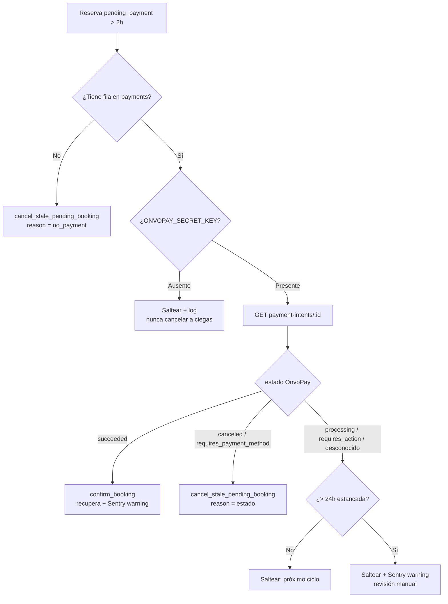

# 0013 — Reconciliación de pagos pendientes y limpieza de reservas abandonadas

- **Estado**: approved
- **Autor**: Kenneth
- **Creado**: 2026-06-07
- **Última actualización**: 2026-06-08 (aprobado; revisión de spec-reviewer incorporada)
- **Rama**: feat/0013-reconciliacion-pagos-pendientes
- **PR**: # (cuando aplique)

## 1. Contexto y motivación

Cuando un turista inicia el checkout (spec 0006), el sistema crea la reserva en
estado `pending_payment` **antes** de abrir el widget de pago de OnvoPay. Si el
turista abandona el checkout (cierra la pestaña, su tarjeta es rechazada, o
simplemente no termina), la reserva queda en `pending_payment` para siempre. El
hold de capacidad (spec 0005) expira a los 15 minutos y libera el cupo, pero la
reserva basura permanece: ensucia el panel de reservas (spec 0008) y los reportes
(spec 0012), y obliga al operador a distinguir a mano reservas reales de chatarra.

Existe además un problema más grave y silencioso de **dinero**: la confirmación de
una reserva depende del webhook `payment-intent.succeeded` de OnvoPay. Si ese
webhook se pierde (endpoint caído, timeout, problema de red), el turista **pagó**
pero su reserva queda en `pending_payment`: pagó y no recibió nada, sin que nadie
se entere. Hoy no hay ninguna red de seguridad para este caso.

Esta feature introduce un job del worker que **reconcilia** las reservas
`pending_payment` vencidas contra OnvoPay: recupera las que sí se pagaron
(confirmándolas) y cancela las realmente abandonadas. El actor afectado es el
**operador** (ve un panel limpio y deja de perder reservas pagadas) y,
indirectamente, el **turista** (si pagó, su reserva se confirma sola aunque el
webhook se haya perdido).

## 2. Objetivos

- Recuperar automáticamente las reservas cuyo pago fue exitoso en OnvoPay pero
  cuyo webhook de confirmación nunca llegó, confirmándolas como lo haría el webhook.
- Cancelar las reservas `pending_payment` genuinamente abandonadas (sin pago, o con
  pago no completado en OnvoPay) pasado un umbral de antigüedad.
- No cancelar nunca una reserva que pudo haberse pagado sin verificarlo primero
  contra OnvoPay (seguridad del dinero como criterio rector).
- Mantener el panel de reservas y los reportes libres de reservas chatarra.

## 3. Fuera de alcance

- No se modifica el flujo de checkout (spec 0006) ni el handler del webhook
  (spec 0006). Esta feature es una red de seguridad posterior, no un reemplazo.
- No se resuelve la race condition de idempotencia del webhook anotada en la
  pre-production-checklist (es un fix aparte; este job la complementa pero no la
  sustituye).
- No se notifica al turista cuando su reserva abandonada se cancela (abandonó; no
  hay nada que comunicar). Sí recibe el email de confirmación normal si se recupera.
- No se construye UI nueva en el panel. La trazabilidad queda en `audit_logs`,
  visible a futuro con el spec que muestre la bitácora.
- No se cancelan reservas `confirmed`, `cancelled` ni `refunded`: solo
  `pending_payment`.
- No se cobra, reintenta ni modifica ningún pago en OnvoPay: el job solo **lee**
  el estado del payment intent (GET), nunca escribe.

## 4. Historias de usuario

> Como operador, quiero que las reservas que quedan colgadas en pago pendiente se
> resuelvan solas, para ver en el panel solo reservas reales y no perder reservas
> que el cliente sí pagó.

Criterios de aceptación:

- [ ] Una reserva `pending_payment` con más de 2 horas de antigüedad y **sin** fila
      en `payments` se cancela (status `cancelled`).
- [ ] Una reserva `pending_payment` vencida cuyo payment intent en OnvoPay está en
      `succeeded` se **confirma** (igual que la haría el webhook: status
      `confirmed`, cupo reservado, email de confirmación encolado).
- [ ] Una reserva `pending_payment` vencida cuyo payment intent está en `canceled`
      o `requires_payment_method` se cancela.
- [ ] Una reserva `pending_payment` vencida cuyo payment intent está en `processing`
      o `requires_action` **no** se toca: se deja para un ciclo posterior.
- [ ] Toda confirmación o cancelación hecha por el job queda registrada en
      `audit_logs` con `actor_type='system'`.
- [ ] El job nunca cancela una reserva sin haber verificado el estado real del pago
      en OnvoPay (salvo el caso sin fila de `payments`, donde no hubo pago posible).

## 5. Diseño técnico

### Vetting del servicio externo (OnvoPay)

OnvoPay ya es la pasarela vetada del proyecto (decisión documentada: única opción
que opera para entidades de Costa Rica). Esta feature usa un endpoint **nuevo** de
la API ya integrada, verificado en la documentación oficial el 2026-06-07:

- **`GET /v1/payment-intents/:id`** — recupera un payment intent por id.
  Base `https://api.onvopay.com/v1`, auth `Authorization: Bearer <secret>`. Al
  implementar, el path concreto se arma sobre la base que ya incluye `/v1` (igual que
  el cliente de refunds), o sea `${BASE}/payment-intents/${id}` — no duplicar `/v1`.
- Estados posibles del payment intent (doc oficial, sección "Common states"):
  `requires_payment_method`, `requires_action`, `processing`, `succeeded`,
  `canceled`.

No se incorpora ningún proveedor nuevo; no cambian las restricciones de país/entidad
ya evaluadas. Fuente: https://docs.onvopay.com/ (Payment Intents).

### Componentes

1. **Cliente OnvoPay de payment intents en el worker**
   (`worker/src/reconciliation/onvopay.ts`). Espejo del cliente de refunds
   (`worker/src/refunds/onvopay.ts`): `Bearer`, `AbortSignal.timeout(15s)`
   defensivo, mapeo de estados por lookup (no literales sueltos, por la regla de
   lint). Expone `getPaymentIntent(id) -> { status }` con `status` mapeado al enum
   conocido; cualquier estado desconocido se trata como `processing` (no terminal →
   no se cancela).

2. **Función SQL `cancel_stale_pending_booking`** (migración nueva). Atómica, espejo
   conceptual de `cancel_booking` (0011) pero para reservas **no confirmadas**:
   - `SELECT ... FOR UPDATE` sobre la reserva; si no está `pending_payment`,
     `RETURN` (idempotente: el webhook pudo confirmarla en paralelo).
   - `UPDATE bookings SET status='cancelled'`.
   - `UPDATE payments SET status='failed' WHERE booking_id=... AND status='pending'`
     (cierra el pago abandonado/rechazado; deja de ser ambiguo para futuras corridas).
     Nota: los literales de estado en SQL son los que usan todas las funciones del
     repo; la regla de lint que prohíbe literales de estado aplica **solo al código de
     negocio TS** (de ahí el lookup map en el cliente OnvoPay), no a las migraciones.
   - `UPDATE tour_holds SET status='expired' WHERE id=hold_id AND status='active'`
     (defensivo; normalmente ya expiró).
   - **No** decrementa `capacity_reserved`: una reserva `pending_payment` nunca lo
     incrementó (solo `confirm_booking` lo hace). Esta es la diferencia clave con
     `cancel_booking`.
   - `INSERT INTO audit_logs` con `actor_type='system'`, `actor_id = NULL` (acción del
     sistema, no de un usuario), `action='booking.expired_pending'`, metadata `{reason}`
     (`'no_payment'` o el estado de OnvoPay).
   - No encola ninguna notificación.
   - `SECURITY DEFINER`, `SET search_path=''`, `REVOKE EXECUTE ... FROM PUBLIC`
     (mismo endurecimiento que las funciones del 0011, ver tech-decisions).

3. **Recuperación**: el job reusa la RPC existente `confirm_booking` (la misma que
   llama el webhook). Es idempotente y ya encola la confirmación + recordatorio 24h
   (spec 0007). No se crea función nueva para esto. **Contrato (igual que el webhook,
   ver `web/app/api/webhooks/onvopay/route.ts`):** la RPC exige tres argumentos y el
   **llamador** los calcula —no la función:
   - `p_booking_id`: id de la reserva.
   - `p_external_payment_id`: `payments.external_payment_id` de la fila de pago.
   - `p_total_seats`: suma `tickets_adult + tickets_child + tickets_student` de la
     reserva (es el valor que `confirm_booking` suma a `capacity_reserved`).
     El audit `booking.recovered_via_reconcile` lo escribe el **job** después de la RPC
     (no `confirm_booking`, que no audita): es best-effort y no transaccional con la
     confirmación, consistente con el resto de los audits best-effort del proyecto. Si
     el audit fallara, la confirmación ya quedó firme (no se revierte).

4. **Job del worker** (`worker/src/jobs/reconcile-pending-payments.ts`), registrado
   en `worker/src/index.ts` con `setInterval` cada **5 minutos** (el umbral es de 2h;
   no necesita correr cada minuto). Lógica por ciclo:
   - Guard de single-flight a nivel módulo (`isRunning`): si el ciclo anterior sigue
     corriendo, este se saltea. Evita apilar ciclos y llamadas duplicadas a OnvoPay.
   - Selecciona un lote acotado (máx. 50) de `bookings` en `pending_payment` con
     `created_at < NOW() - umbral`, junto con su fila de `payments` (si existe).
   - Para cada reserva:
     - **Sin fila de `payments`** → `cancel_stale_pending_booking(reason='no_payment')`.
     - **Con fila de `payments`**:
       - Si `ONVOPAY_SECRET_KEY` no está seteada → saltear + log (no se puede
         reconciliar con seguridad; nunca cancelar a ciegas).
       - `getPaymentIntent(external_payment_id)`:
         - `succeeded` → `confirm_booking(...)` (recupera). Audita `booking.recovered_via_reconcile`
           y emite `Sentry.captureMessage` nivel `warning` (ver "Alertas" abajo).
         - `canceled` | `requires_payment_method` → `cancel_stale_pending_booking(reason=<estado>)`.
         - `processing` | `requires_action` | desconocido → saltear (próximo ciclo). Si además la
           reserva lleva > 24h estancada en este estado, emitir un `Sentry.captureMessage` nivel
           `warning` agrupado para revisión manual (nunca se auto-cancela).
   - Errores por reserva se capturan individualmente: una reserva que falla no aborta
     el lote. Cada error se loggea y se reporta a Sentry; el `try/catch` del runner en
     `index.ts` ya envuelve el job entero como segunda red.

   **Invariante de idempotencia del job**: tras procesar una reserva, esta deja de
   estar en `pending_payment` (pasa a `confirmed` o `cancelled`), por lo que no vuelve
   a entrar al lote en ciclos siguientes. Sumado a que `confirm_booking` y
   `cancel_stale_pending_booking` son idempotentes y row-locked, correr el job dos
   veces (o dos ciclos solapados) no duplica efectos. Las únicas que se reprocesan son
   las que se saltean a propósito (`processing`/`requires_action`), lo cual es deseado.

### Umbral parametrizable

`STALE_PENDING_PAYMENT_AFTER_MS = 2 * 60 * 60 * 1000` (2 horas) en
el propio job del worker (`worker/src/jobs/reconcile-pending-payments.ts`). **No van
en `shared/constants`** (corrección durante la implementación): el worker es
self-contained y **no resuelve el alias `@shared` en runtime** (`tsx`/`node dist`),
solo en typecheck y en los configs de vitest; importar de shared pasaría typecheck y
tests pero rompería en runtime (dev y Railway). Como solo el worker usa estos
umbrales, viven en el worker. Se elige 2h por estar muy por encima de los 15 min del
hold y de la ventana de reintentos de webhook de OnvoPay. **Supuesto (no
verificado en la doc de OnvoPay)**: esa ventana de reintentos es del orden de minutos.
Aunque fuera mayor, reconciliar antes es inocuo: `confirm_booking` es idempotente, así
que a lo sumo se confirma una reserva que el webhook igual iba a confirmar. Cambiar la
política es tocar solo esa constante.

`STUCK_PROCESSING_ALERT_AFTER_MS = 24 * 60 * 60 * 1000` (24 horas) en el mismo
módulo del worker: umbral a partir del cual un pago estancado en `processing`/
`requires_action` se reporta a Sentry para revisión manual (sin auto-cancelar).

### Alertas (Sentry)

Decisión de revisión (2026-06-07): las alertas van a **Sentry**, no por email al
operador. Una recuperación no requiere acción del operador (la reserva ya queda
confirmada y el turista ya recibe su email de confirmación); es una señal de salud
del sistema, no un evento de negocio accionable. Emailear en cada recuperación sería
ruido. Dos alertas, ambas `Sentry.captureMessage` nivel `warning` y agrupadas por
`fingerprint` fijo (una issue agregada, no un evento por reserva ni por ciclo):

- **Recuperación** (`succeeded` reconciliado): fingerprint `reconcile-recovered`.
  Síntoma de webhook perdido; sirve para vigilar la salud del webhook.
- **Estancado en `processing`/`requires_action` > 24h**: fingerprint
  `reconcile-stuck-processing`. Marca las reservas que necesitan revisión manual.

El worker ya inicializa Sentry (`worker/src/index.ts`); solo se habilita realmente
con `SENTRY_DSN` en `NODE_ENV=production`. En dev/CI las llamadas son no-op.

## 6. Modelo de datos

Sin cambios de columnas ni tablas nuevas. Se agrega una **función**.

- **Tabla**: `bookings` — sin cambios de schema. Se consulta por
  `status='pending_payment' AND created_at < ...`. Se reusa el `bookings_status_idx`
  existente; **no se agrega índice nuevo**: el volumen de `pending_payment` es bajo y
  el lote está acotado a 50. (Si el volumen creciera, un índice parcial sobre
  `created_at WHERE status='pending_payment'` sería la mejora, pero no en MVP.)
- **Tabla**: `payments` — sin cambios de schema. El job marca `status='failed'` las
  filas `pending` de reservas canceladas (transición ya permitida por el CHECK).
- **Función nueva**: `public.cancel_stale_pending_booking(p_booking_id uuid, p_reason text)`.
- **Migración**: `supabase/migrations/<timestamp>_cancel_stale_pending_booking.sql`.

## 7. Estados y transiciones

No se introducen estados nuevos. Se usan transiciones ya permitidas por los CHECK
existentes:

- `bookings`: `pending_payment → cancelled` (limpieza) y `pending_payment → confirmed`
  (recuperación, vía `confirm_booking`). Terminales sin cambios.
- `payments`: `pending → failed` (limpieza) y `pending → succeeded` (recuperación, vía
  `confirm_booking`).
- `tour_holds`: `active → expired` (defensivo en la limpieza).

Árbol de decisión del job para una reserva `pending_payment` vencida (> umbral):

## 8. Casos borde y errores

- **Race con el webhook**: el webhook confirma la reserva justo cuando el job intenta
  cancelarla. `cancel_stale_pending_booking` hace `SELECT ... FOR UPDATE` y verifica
  `status='pending_payment'` dentro de la transacción; si el webhook ya la confirmó,
  el job no hace nada (idempotente). A la inversa, si el job confirma vía
  `confirm_booking` y luego llega el webhook, `confirm_booking` es idempotente
  (RETURN si ya está `confirmed`).
- **Pago exitoso pero la instancia se llenó mientras tanto**: al recuperar con
  `confirm_booking` se incrementa `capacity_reserved` sin chequear capacidad, lo que
  puede sobre-vender. **Se honra el pago** igual (el turista pagó; reembolsar sería
  peor experiencia) y se audita para que el operador resuelva el sobrecupo
  manualmente. Documentado como riesgo aceptado.
- **Tour ya ocurrido al recuperar**: si la reserva estuvo colgada y el tour ya pasó,
  se confirma igual (el turista pagó). El recordatorio 24h encolado quedará con
  `scheduled_for` en el pasado; el job de notificaciones (0007) ya envía de inmediato
  o lo deja vencido según su lógica. No se agrega manejo especial.
- **`ONVOPAY_SECRET_KEY` ausente** (p. ej. entorno mal configurado): el job procesa
  solo las reservas sin fila de `payments` y saltea las que tienen pago, loggeando
  que no puede reconciliar. Nunca cancela a ciegas una reserva con pago.
- **OnvoPay caído o lento**: el `fetch` tiene timeout de 15s; un error en el GET de
  una reserva la saltea (se reintenta el próximo ciclo), sin afectar al resto del lote.
- **Estado desconocido de OnvoPay** (la API agrega un estado nuevo): se trata como no
  terminal (`processing`) → no se cancela. Falla del lado seguro.
- **Pago estancado en `processing`/`requires_action`**: nunca se auto-cancela (decisión
  de revisión). Se deja para revisión manual; si supera las 24h estancado, se emite
  una alerta agrupada a Sentry para que sea visible (ver §5 "Alertas").
- **Concurrencia entre ciclos del worker**: el guard `isRunning` evita solapamiento;
  además todas las RPC son idempotentes y row-locked.
- **404 del payment intent en OnvoPay** (id inexistente): se trata como error del GET
  → se saltea y loggea (no se asume cancelado, para no cancelar por un id mal guardado).

## 9. Impacto en otras áreas

- **Panel admin**: indirecto y positivo (menos reservas chatarra). Sin cambios de
  código.
- **Reportes (0012)**: indirecto y positivo (las canceladas dejan de contar como
  pendientes; las recuperadas aparecen como ingreso real). Sin cambios de código.
- **Worker**: un job nuevo (`reconcile-pending-payments`), 5º del worker.
- **Emails/templates**: ninguno nuevo. La recuperación reusa el template de
  confirmación existente vía `confirm_booking`.
- **i18n**: sin textos nuevos (no hay UI ni emails nuevos).
- **Pagos/refunds**: solo lectura de payment intents; no toca refunds.
- **audit_logs**: dos acciones nuevas (`booking.expired_pending`,
  `booking.recovered_via_reconcile`).
- **Observabilidad (Sentry)**: dos alertas nuevas agrupadas (recuperación y estancado
  > 24h). No se agrega ninguna variable de entorno (reusa el `SENTRY_DSN` existente).

## 10. Plan de tests

- **Unit (worker)**: mapeo de estados de OnvoPay (`succeeded`/`canceled`/
  `requires_payment_method`/`processing`/`requires_action`/desconocido) → decisión
  (`confirm` / `cancel` / `skip`). Lógica de selección de la rama "sin fila de pago".
- **Unit (worker)**: el cliente `getPaymentIntent` parsea la respuesta y aplica el
  timeout (MSW).
- **Integración (worker)** contra DB real (`supabase start`):
  - Reserva `pending_payment` vieja sin payment → queda `cancelled`, audit escrito,
    cupo intacto.
  - Reserva vieja con payment y OnvoPay `succeeded` (MSW) → queda `confirmed`, cupo
    reservado, notificación de confirmación encolada.
  - Reserva vieja con payment y OnvoPay `canceled`/`requires_payment_method` (MSW) →
    `cancelled`, payment `failed`.
  - Reserva vieja con payment y OnvoPay `processing` (MSW) → intacta.
  - Reserva `pending_payment` reciente (< umbral) → intacta (no entra al lote).
  - Idempotencia: correr el job dos veces no duplica efectos.
  - Concurrencia: `cancel_stale_pending_booking` sobre una reserva ya confirmada por
    `confirm_booking` no la toca.
- **Unit (worker)**: la decisión de alertar (recuperación siempre; estancado solo si
  > 24h) se verifica con un spy sobre el cliente Sentry mockeado, sin depender de un
  > DSN real.
- **Manual (documentado en el PR)**: con el sandbox de OnvoPay, dejar una reserva sin
  pagar >2h (o bajar el umbral temporalmente) y verificar la cancelación; simular un
  webhook perdido (pagar y bloquear el webhook) y verificar la recuperación.

## 11. Plan de rollout

- **Feature flag**: no. Se puede deshabilitar comentando el registro del job en
  `worker/src/index.ts` si hiciera falta (reversible en un deploy).
- **Migración de datos**: ninguna automática. Las reservas `pending_payment`
  históricas existentes serán reconciliadas por el job en sus primeros ciclos
  (las muy viejas sin pago se cancelan; las que tengan pago se verifican). Esto es
  deseado, pero conviene revisar el primer log para detectar recuperaciones masivas
  inesperadas.
- **Comunicación a operadores**: mencionar que las reservas pendientes viejas se
  limpiarán solas y que cualquier recuperación quedará confirmada con su email.
- **Reversibilidad**: el job no borra datos; las cancelaciones son un cambio de estado
  reversible a mano si fuera necesario. Las recuperaciones reflejan pagos reales.

## 12. Métricas de éxito

- 0 reservas `pending_payment` con antigüedad > 24h en estado estable (todas
  resueltas a `confirmed` o `cancelled`).
- Toda reserva con pago `succeeded` en OnvoPay termina `confirmed` en ≤ 1 ciclo del
  job tras superar el umbral (no quedan pagos huérfanos).
- Conteo de `audit_logs` con `action='booking.recovered_via_reconcile'` = cantidad de
  webhooks perdidos detectados (métrica de salud del webhook).

## 13. Preguntas abiertas

Ninguna. Las dos preguntas de la primera versión se resolvieron en revisión
(2026-06-07):

- **Alertas de recuperación** → van a **Sentry** (no email al operador): es una señal
  de salud del sistema, no un evento accionable por el operador. Ver §5 "Alertas".
- **Pagos `processing` estancados > 24h** → **revisión manual**, nunca auto-cancelar;
  se reportan a Sentry para que sean visibles. Ver §5 y §8.
