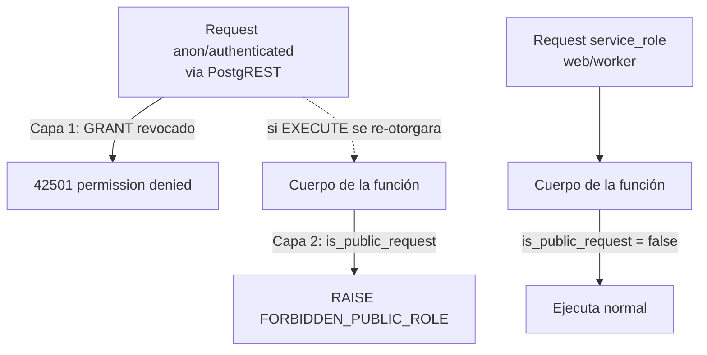

# 0018 — Cierre de ejecución de RPC de funciones privilegiadas (retrospectivo)

- **Estado**: implemented
- **Autor**: claude (2da auditoría de seguridad)
- **Creado**: 2026-06-11
- **Última actualización**: 2026-06-11
- **Rama**: fix/quick-revoca-execute-funciones-anon
- **PR**: #36

> Spec **retrospectivo**: documenta un hallazgo CRÍTICO de la segunda auditoría de
> seguridad y el fix que ya se implementó en el mismo PR. Se escribe después del
> código (no antes) porque fue un hotfix de seguridad, siguiendo la regla de
> commit-and-pr de abrir un spec retrospectivo cuando el bug ameritaba investigación
> de causa raíz.

## 1. Contexto y motivación

La segunda auditoría de seguridad (2026-06-11) incluyó un pentest activo contra el
stack local, invocando las funciones RPC directamente como rol `anon` (con la anon
key, que es pública y viaja al browser) contra PostgREST — sin pasar por la capa de
aplicación.

Resultado: **todas las funciones `SECURITY DEFINER` del proyecto eran ejecutables
por `anon` y `authenticated`**, salvo `custom_access_token_hook`. Esto permitía, a
cualquiera con la anon key:

- **`confirm_booking`** → confirmar una reserva sin pagar (bypass de pago). El
  checkout devuelve `bookingId` + `paymentIntentId` al cliente, así que el atacante
  tiene los argumentos.
- **`cancel_booking`** → cancelar cualquier reserva confirmada y, peor, encolar un
  reembolso de monto arbitrario, saltándose la política de 24h (que solo vive en la
  capa de aplicación).
- **`create_hold_atomic`** → reservar cupo masivamente, saltándose el rate-limit del
  checkout (DoS de disponibilidad).
- **`check_rate_limit`** → agotar el presupuesto de login/forgot de una víctima
  (la clave es `sha256(email)` sin secreto) y contaminar el store.
- **`settle_refund`**, **`flag_payment_mismatch`**, **`cancel_stale_pending_booking`**
  → tampering de estado de reservas/refunds.

La causa raíz es un **gotcha de Supabase**: las funciones del esquema `public`
reciben `GRANT EXECUTE` para `anon` y `authenticated` por los _default privileges_
del esquema. Las migraciones del proyecto solo hacían `REVOKE EXECUTE ... FROM
PUBLIC`, que **no toca** esos grants de rol. La única función bien cerrada era
`custom_access_token_hook`, cuya migración (`20260523000007`) hizo
`REVOKE EXECUTE ... FROM authenticated, anon, public` — el patrón correcto.

La primera auditoría no lo detectó porque verificó las funciones con `service_role`
(o asumió que `FROM PUBLIC` bastaba), no con `anon`.

## 2. Objetivos

- Impedir que `anon` y `authenticated` ejecuten cualquier función privilegiada del
  esquema `public` directamente vía PostgREST RPC.
- Mantener intacto el camino legítimo de la aplicación (todas estas funciones se
  invocan con `service_role`).
- Agregar una segunda barrera (defensa en profundidad) dentro de las funciones que
  mueven dinero, para que rechacen la invocación incluso si por error se les volviera
  a otorgar `EXECUTE` a un rol público.
- Dejar una regresión automatizada que falle si una función privilegiada queda
  ejecutable por un rol público.

## 3. Fuera de alcance

- No se cambia el modelo de claves de Supabase (se siguen usando las API keys nuevas
  `sb_publishable_*` / `sb_secret_*`).
- No se mueve la lógica de negocio fuera de las funciones SQL ni se rediseñan los
  flujos de pago/refund. El monto autoritativo (0015), la validación de monto del
  webhook (0014) y la política de refund (0011) siguen igual.
- No se agrega un guard de identidad a `create_hold_atomic`, `check_rate_limit` ni
  `cancel_stale_pending_booking`: no mueven dinero y quedan protegidos por el REVOKE.
- No se cubre el bloqueo de DoS volumétrico a nivel de borde (Vercel Firewall, ya
  anotado como tarea de cutover).

## 4. Historias de usuario

> Como operador del negocio, quiero que solo el backend (service_role) pueda confirmar
> pagos, emitir reembolsos y mover el estado del dinero, para que nadie con la anon
> key pública pueda reservar gratis ni auto-reembolsarse montos arbitrarios.

Criterios de aceptación:

- [ ] `anon` que invoca `confirm_booking`, `cancel_booking`, `create_hold_atomic`,
      `check_rate_limit`, `settle_refund`, `flag_payment_mismatch` o
      `cancel_stale_pending_booking` recibe `42501 permission denied for function`.
- [ ] `authenticated` (sesión de usuario real) recibe lo mismo en esas funciones.
- [ ] `anon` no puede ejecutar `report_revenue` / `report_occupancy` /
      `report_refunds_summary`; `authenticated` sí (el panel las usa).
- [ ] `service_role` sigue ejecutando todas (la app no se rompe).
- [ ] Aun si se re-otorgara `EXECUTE` a `anon`/`authenticated`, `confirm_booking`,
      `cancel_booking`, `settle_refund` y `flag_payment_mismatch` rechazan la llamada
      con un error explícito cuando el rol de la request es `anon`/`authenticated`.

## 5. Diseño técnico

Dos capas, en dos migraciones dentro del mismo PR:

**Capa 1 — REVOKE (control primario), migración `20260611000028`.**
`REVOKE EXECUTE ON FUNCTION ... FROM anon, authenticated` en las siete funciones
`SECURITY DEFINER` que mutan estado. Para las `report_*` (que son `SECURITY INVOKER`
y las invoca el panel con sesión `authenticated`) se revoca solo `anon`, conservando
el `GRANT` a `authenticated` de `20260606000022`. La app no se afecta porque invoca
todas estas funciones con el **service client** (`createSupabaseServiceClient` en web;
`createClient(..., SERVICE_ROLE_KEY)` en el worker). En la misma migración se fija
`SET search_path = ''` en `create_hold_atomic` (única `SECURITY DEFINER` que no lo
tenía; el endurecimiento del 0011 la salteó).

**Capa 2 — Guard de identidad in-función (defensa en profundidad), migración
`20260611000029`.** Se agrega un helper:

```
public.is_public_request() RETURNS boolean
```

que devuelve `true` si el rol de la request (leído del JWT que PostgREST deja en el
GUC de sesión `request.jwt.claims`) es `anon` o `authenticated`. Se verificó
empíricamente que ese GUC se popula correctamente incluso con las API keys nuevas
opacas (`anon` → `"anon"`, secret → `"service_role"`) y que sobrevive dentro del
contexto `SECURITY DEFINER` (donde `current_user` es el owner, no el llamador). Las
funciones que mueven dinero (`confirm_booking`, `cancel_booking`, `settle_refund`,
`flag_payment_mismatch`) llaman al helper al inicio y hacen `RAISE EXCEPTION` si es
una request de rol público. `service_role` y los contextos sin JWT (migraciones,
superusuario, seed) pasan, así que no se rompe ningún camino legítimo.

Por qué el GUC y no `current_user`: dentro de una función `SECURITY DEFINER`,
`current_user` es siempre el owner (`postgres`); el único dato que refleja el rol
original del llamador es el GUC `request.jwt.claims` que setea PostgREST por request.

### Diagrama de capas



## 6. Modelo de datos

Sin cambios de tablas. Cambios de funciones:

- **Migración `20260611000028`**: `REVOKE EXECUTE` (anon, authenticated) en
  `create_hold_atomic`, `confirm_booking`, `cancel_booking`, `settle_refund`,
  `flag_payment_mismatch`, `cancel_stale_pending_booking`, `check_rate_limit`;
  `REVOKE EXECUTE` (anon) en `report_revenue`/`report_occupancy`/
  `report_refunds_summary`; `CREATE OR REPLACE create_hold_atomic` con
  `SET search_path = ''`.
- **Migración `20260611000029`**: `CREATE FUNCTION public.is_public_request()`
  (`STABLE`, `SET search_path = ''`); `CREATE OR REPLACE` de `confirm_booking`
  (`uuid, text, integer, text`), `cancel_booking` (`uuid, text, integer, uuid`),
  `settle_refund` (`uuid`), `flag_payment_mismatch` (`uuid, integer, text, text`) con
  la llamada al guard al inicio (cuerpo idéntico al vigente en `…024`/`…020`/`…019`/
  `…025`); re-`REVOKE` de las cuatro desde `anon, authenticated`. Además
  `CREATE FUNCTION public.secdef_functions_public_executable()` (service-role-only):
  lista las funciones `SECURITY DEFINER` de `public` ejecutables por anon/authenticated
  vía `has_function_privilege` — base de la regresión no enumerativa (debe ser vacía).

Ambas migraciones son forward-only y aditivas (grants y guards); no tocan datos.

## 7. Estados y transiciones

No aplica. No se introducen ni modifican estados de `bookings`, `payments`,
`refunds` ni `notifications`. El guard solo decide ejecutar o abortar; no altera
ninguna transición existente.

## 8. Casos borde y errores

- **Worker llamando con service_role**: el GUC `request.jwt.claims` lleva
  `role=service_role` (verificado), `is_public_request()` → `false`, ejecuta normal.
- **Migración/seed/psql directo (sin JWT)**: `request.jwt.claims` no está seteado →
  `is_public_request()` → `false` → no bloquea (no rompe `db reset`).
- **Usuario autenticado real (sesión de staff/admin)**: el JWT lleva
  `role=authenticated` → bloqueado por el guard en las funciones de dinero (y por el
  REVOKE en todas). El panel nunca llama estas funciones con la sesión del usuario;
  usa server actions que corren con service_role.
- **Re-grant accidental futuro**: si una migración volviera a `GRANT EXECUTE ... TO
anon`, la Capa 1 se rompería pero la Capa 2 seguiría rechazando las funciones de
  dinero. La regresión (`rpc-execute-grants.test.ts`) además fallaría en CI.
- **PostgREST sin el GUC poblado** (configuración anómala): `is_public_request()`
  devolvería `false` y el guard no bloquearía, pero la Capa 1 (REVOKE) sigue siendo
  el control primario. El guard es defensa en profundidad, no el único control.

## 9. Impacto en otras áreas

- **Panel admin**: sin cambios. Los reportes siguen funcionando con sesión
  authenticated.
- **Worker**: sin cambios de código; sigue invocando con service_role.
- **Emails / i18n**: sin cambios.
- **Pagos / refunds**: sin cambio de comportamiento observable; solo se cierra el
  acceso no autorizado.
- **Pre-producción**: la migración debe desplegarse a la DB de producción cuanto
  antes — el agujero es explotable en prod (la anon key es pública). Agregar a
  `pre-production-checklist`.

## 10. Plan de tests

- Integración `web/tests/integration/rpc-execute-grants.test.ts` (regresión de la
  Capa 1): `anon` y `authenticated` → `42501` en las funciones de estado;
  `service_role` ejecuta; reportes: `anon` denegado, `authenticated` permitido.
- Integración no enumerativa (`rpc-execute-grants.test.ts`): `service_role` llama
  `secdef_functions_public_executable()` y se espera lista **vacía** — cubre cualquier
  función `SECURITY DEFINER` futura que quede ejecutable por un rol público.
- Validación manual del guard (Capa 2), documentada en el PR: otorgar temporalmente
  `EXECUTE` a `anon` sobre `confirm_booking`, invocarla como `anon`, verificar que
  aborta con `FORBIDDEN_PUBLIC_ROLE` (no `BOOKING_NOT_FOUND`); revocar de nuevo;
  confirmar que `service_role` pasa el guard. (No se automatiza en la suite porque
  requiere `GRANT`/`REVOKE` por SQL crudo, fuera del alcance del cliente supabase-js.)
- Suite completa de integración (web + worker) en verde tras `supabase db reset`,
  confirmando que el camino service_role (checkout, webhook, cancelación, refunds,
  reconciliación) no se rompió.

## 11. Plan de rollout

- Sin feature flag.
- Sin migración de datos.
- Reversible en teoría (`GRANT EXECUTE ... TO anon, authenticated` + `DROP FUNCTION
is_public_request` + restaurar cuerpos sin guard), pero **no se debe revertir**:
  reabriría la vulnerabilidad.
- **Acción de despliegue obligatoria**: aplicar ambas migraciones a la DB de
  producción apenas se mergee (es un hotfix de seguridad explotable en prod).

## 12. Métricas de éxito

- 0 funciones privilegiadas ejecutables por `anon`/`authenticated` (verificado por la
  regresión en cada corrida de CI).
- 0 regresiones en el flujo de dinero (suite de integración verde).
- Ningún evento de `confirm_booking`/`cancel_booking` originado fuera de service_role
  en producción (auditable por logs de PostgREST si se necesitara).

## 13. Preguntas abiertas

Ninguna pendiente de decisión. Riesgos residuales documentados (no bloqueantes):

- **Funciones nuevas sin revocar (causa raíz del bug)**: el patrón sigue siendo fácil
  de repetir — una migración futura puede crear una `SECURITY DEFINER` y olvidar el
  `REVOKE ... FROM anon, authenticated`. Mitigación: la regresión no enumerativa
  (`secdef_functions_public_executable()`) lo caza en CI, y el subagente
  `db-schema-guardian` debe verificar el patrón en cada PR que toque migraciones. No
  cubre una función `SECURITY INVOKER` nueva otorgada a anon, pero ese caso queda
  protegido por RLS (el INVOKER corre como el llamador).
- **`check_rate_limit` / `cancel_stale_pending_booking` / `create_hold_atomic` sin
  guard in-función**: decisión deliberada (no mueven dinero). Dependen solo del REVOKE
  (Capa 1). `check_rate_limit` permite lockout dirigido si el REVOKE se revirtiera;
  se acepta porque el impacto es DoS de una cuenta, no pérdida de dinero, y la
  regresión protege contra el re-grant.
- **Rama `fix/quick-*`**: el header se desvía del patrón `feat/<id>-<slug>` del
  template a propósito — es un hotfix de seguridad, no una feature planificada.
