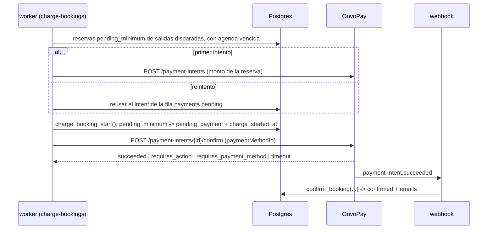
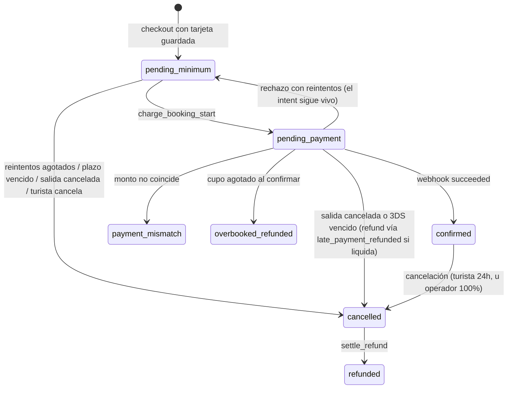

# 0029 — Cupo mínimo por salida y cobro diferido con tarjeta guardada

- **Estado**: in-review
- **Autor**: Kenneth (con Claude Code)
- **Creado**: 2026-08-13
- **Última actualización**: 2026-09-13
- **Rama**: (sin asignar — tres workstreams, ver §11)
- **PR**: (sin asignar)

> **Prerrequisito cumplido**: el spec 0028 está en `dev` (PRs #67, #68 y #69, mergeados el 2026-09-13). Las citas a archivo y línea de este spec se revalidaron contra ese código.

> **Historial de revisión.** Aprobado el 2026-08-13 con este mismo mecanismo. El 2026-09-13 se evaluó y **descartó** autorizar al reservar y capturar después (motivo en §5.1), y se volvió a este diseño con lo aprendido: la especificación OpenAPI de OnvoPay, la evidencia de sus suscripciones y los hallazgos de tres rondas de revisión. **Requiere re-aprobación.**

## 1. Contexto y motivación

Hoy el turista paga al reservar: el checkout crea un payment intent, el widget de OnvoPay cobra y el webhook confirma. La salida se opera con la gente que haya.

Eso no refleja el negocio. Un tour tiene un piso de participantes por debajo del cual no es rentable salir. Cuando no se llega, el operador cancela — y hoy eso significa devolver plata ya cobrada, con la fricción y la comisión de cada reembolso.

Este spec invierte el orden: el turista deja su tarjeta guardada al reservar y **no se le cobra**. El cobro se ejecuta cuando la salida junta suficiente gente. Si no la junta, no hubo cobro que devolver.

Actores: **turista** (reserva sin cargo inmediato), **staff** (configura el mínimo y decide sobre salidas flojas), **operador** (deja de perder plata bajo el piso y en comisiones).

## 2. Objetivos

- Permitir reservar guardando la tarjeta, sin cargo hasta que la salida se confirme.
- Cobrar automáticamente a todas las reservas de una salida al alcanzar el mínimo del tour, sin importar cuánto falte para la fecha.
- Dar al staff información y controles para confirmar o cancelar una salida que llega a la ventana de decisión bajo el mínimo; o cancelarla automáticamente según la configuración del tour.
- Mantener al turista informado en cada transición: reserva registrada, cobro ejecutado, salida cancelada, problema con la tarjeta.
- Garantizar que ninguna reserva quede sin cobrar, sin cancelar y sin agenda — y que **jamás se cobre dos veces**.

## 3. Fuera de alcance

- **No se guarda la tarjeta para compras futuras.** El método de pago pertenece a esa reserva; no hay "mis tarjetas" ni checkout de un clic.
- **No se autoriza el monto al reservar ni se retienen fondos** (descartado en §5.1).
- **No se cambia la política de reembolso de 24h** (`shared/constants/policies.ts`) para cancelaciones del turista. Sí se define un camino nuevo para cancelaciones **iniciadas por el operador** (§5.8).
- **No se notifica al staff por email**; la notificación es en el panel.
- **No hay lista de espera** ni cambios a la prevención de sobreventa del spec 0025.
- **SINPE Móvil queda estructuralmente excluido**, no diferido: es un pago push y nunca podrá soportar un cobro con tarjeta guardada.
- **No se implementa cobro parcial ni seña.**
- **No se migran reservas existentes** (§11).
- **No se cambia el modelo de refunds** (un refund activo por reserva). El diseño depende de ese invariante y lo protege (§5.6).

## 4. Historias de usuario

> Como turista, quiero reservar dejando mi tarjeta sin que me cobren todavía, para no tener plata comprometida en una salida que quizás no se realice.

- [ ] Al reservar, el turista ve que **no se le cobró** y qué monto se le cobrará al confirmarse la salida.
- [ ] Autoriza explícitamente el cargo futuro; esa autorización queda registrada con fecha y versión de términos.
- [ ] Si su tarjeta vence antes de la fecha del tour, el checkout la rechaza y le pide otra.
- [ ] Recibe un email de "reserva registrada" con el monto y los últimos 4 dígitos de la tarjeta.
- [ ] Su cupo queda reservado desde ese momento.

> Como turista, quiero que me cobren y me avisen apenas la salida se confirma.

- [ ] Al alcanzar el mínimo se cobra a todas las reservas pendientes y cada turista recibe el email de confirmación existente.
- [ ] El cobro ocurre aunque falten semanas para la fecha.
- [ ] Si la tarjeta es rechazada, recibe un email con enlace para actualizarla y su reserva sigue viva durante la ventana de recuperación.
- [ ] Si el banco pide autenticación 3DS, recibe un enlace para completarla.
- [ ] Puede cancelar su reserva antes del cobro, sin cargo.

> Como staff, quiero enterarme de las salidas bajo el mínimo antes de la fecha, para decidir si la sostengo o la cancelo.

- [ ] Una salida que entra en la ventana bajo el mínimo aparece marcada en `/dashboard/departures` con asientos reservados vs mínimo.
- [ ] El staff puede **confirmar** (se cobra a todos) o **cancelar** (nadie es cobrado; los ya cobrados reciben reembolso total).
- [ ] En modo automático la salida se cancela sola y no aparece en la bandeja.

> Como staff, quiero configurar el mínimo y el modo de resolución por tour.

- [ ] El formulario de tours permite editar el mínimo (campo ya existente, hoy sin efecto) y elegir modo manual o automático.
- [ ] Una página de configuración permite fijar la ventana de decisión en horas, común a todos los tours.

## 5. Diseño técnico

### 5.1. Verificación de OnvoPay (2026-09-12)

Verificado contra la especificación publicada (`https://docs.onvopay.com/openapi.yaml`) y las guías (`https://docs.onvopay.com/en/llms-full.txt`). No hay proveedor nuevo, así que no aplica `external-services-vetting` completo; se documenta la capacidad:

- `POST /v1/payment-methods` se llama desde el navegador con la publishable key. OnvoPay tokeniza y verifica la tarjeta antes de crear el objeto (`cards.invalid_card_info` si falla). El `cvv` es opcional al crearlo.
- `POST /v1/payment-intents/{id}/confirm` con `paymentMethodId` cobra desde el servidor. Su cuerpo acepta solo `paymentMethodId`, `cvv`, `credixInstallmentMonths` y `returnUrl`: **no existe un parámetro para declarar un cobro sin el cliente presente**.
- **Evidencia de que la plataforma hace este cobro**: en cada renovación de un cargo recurrente, OnvoPay "genera una intención de pago para ese período y la confirma con el método de pago indicado", sin el cliente presente y con reintentos propios (`attemptCount`, `nextPaymentAttempt`). Es el mismo par de operaciones que usa este spec. Lo que la documentación no dice es si un cobro único recibe el mismo tratamiento que una renovación; eso se le pregunta a OnvoPay (§13, Q1).
- Un intent rechazado **permanece** en `requires_payment_method` y se puede re-confirmar "indicando uno diferente". OnvoPay recomienda "exactamente un intent por pago".
- 3DS: `confirm` devuelve `requires_action` con `nextAction.redirectToUrl`, o se resuelve con `onvo.handleNextAction({ paymentIntentId })` cargando `https://js.onvopay.com/v1/`.
- Webhooks documentados: `payment-intent.succeeded`, `payment-intent.failed` y `payment-intent.deferred`.
- `POST /v1/payment-intents/{id}/cancel` existe, pero **no documenta sobre qué estados funciona**.
- `POST /v1/payment-methods/{id}/detach` (el estado `detached` es irreversible) y `DELETE /v1/customers/{id}` existen.

**Descartado de forma definitiva: autorizar al reservar y capturar después** (`captureMethod: "manual"`). El OpenAPI dice que OnvoPay libera los fondos si no se captura "en un máximo de 30 días", pero ese es el plazo de su sistema, no el de la marca de la tarjeta. Las marcas fijan la validez de una autorización online en **unos 7 días**; los 30 días son una **autorización extendida** que el procesador tiene que pedir explícitamente (la API de OnvoPay no lo expone), restringida a rubros como hotelería, alquiler de autos y cruceros, y pensada para cuando no se conoce el monto final. Con esa validez, y midiendo la retención hasta la fecha del tour, la anticipación máxima de reserva quedaba en 5–6 días. Fuentes: documentación de Stripe sobre autorización extendida y cambios al marco de autorización de Visa (abril de 2024).

**También descartado**: modelar cada reserva como un cargo recurrente con `paymentBehavior: "allow_incomplete"`, para que el cobro lo hiciera el motor de suscripciones. Presenta una compra única como recurrente ante la marca y, si la cancelación del cargo recurrente falla, genera un segundo cobro que el modelo de reembolsos no puede reparar.

**Precondiciones a verificar en sandbox:**

- **Antes de aprobar el workstream B**, porque B ya cobra dinero real:
  - **(a) — bloqueante:** confirmar un intent con una tarjeta guardada **sin enviar `cvv`**, días después de guardarla. Si OnvoPay lo exige, el cobro diferido no es viable, porque el CVV no se puede guardar.
  - **(f)** que ese `confirm` emita `payment-intent.succeeded`, porque todo §5.3 depende de ese webhook.
- **Antes de aprobar el workstream C**:
  - **(b)** re-confirmar el mismo intent con otra tarjeta después de un rechazo;
  - **(c)** qué hace `cancel` sobre un intent en `requires_action`;
  - **(d)** qué ocurre al confirmar dos veces el mismo intent;
  - **(e)** que `cancel` funcione sobre `requires_payment_method`.

### 5.2. Recolección de la tarjeta y alcance PCI

El SDK embebido solo sabe cobrar un intent; **no tiene modo para guardar una tarjeta sin cobrar**. Con el flag encendido, el checkout pasa a un **formulario propio** que llama `POST /v1/payment-methods` desde el navegador con la publishable key. El servidor recibe solo `paymentMethodId`, `customerId`, marca, últimos 4 dígitos y mes y año de vencimiento.

**Consecuencia de cumplimiento, decidida y aceptada por el usuario (2026-08-13)**: se pasa de **SAQ A** (widget en iframe) a **SAQ A-EP**, aunque los datos nunca toquen nuestro servidor. Es obligación del **cliente** (es el comercio). Se suma al `pre-production-checklist`.

Reglas no negociables:

- PAN, CVV y expiración **nunca** llegan a nuestro backend, ni a logs, ni a Sentry. Viven en un componente cliente que solo hace `fetch` a OnvoPay.
- **El formulario envía el CVV al tokenizar**, para que la verificación inicial de OnvoPay no suba la tasa de rechazo. El CVV no se guarda nunca; si el cobro posterior lo exigiera, rige la precondición (a).
- Se persisten solo `payment_method_id`, `customer_external_id`, `card_brand`, `card_last4`, `card_exp_month` y `card_exp_year`.
- **Tarjeta que vence antes del tour**: el checkout rechaza la tarjeta si su vencimiento (último día del mes indicado) es anterior a la fecha de la salida en hora de Costa Rica, y le pide otra al turista. Elimina el caso de rechazo más previsible.
- **CSP** (`web/lib/security/csp.ts`, con nonces y `strict-dynamic` desde el spec 0024):
  - Hoy el SDK se inyecta con `document.createElement('script')` desde el bundle con nonce (`web/components/public/CheckoutForm/OnvoPaymentWidget.tsx:45-52`, `csp.ts:41`). La librería de 3DS (`https://js.onvopay.com/v1/`) se carga igual, **nunca** con un `<script src>` estático sin nonce.
  - `connect-src` permite `https://api.onvopay.com` (`csp.ts:17,45`), pero no `https://api.dev.onvopay.com`: hay que sumarlo para probar en sandbox desde el navegador, y exponer la base URL como env **pública** (hoy `ONVOPAY_API_BASE_URL` es server-only).
  - `frame-src https://*.onvopay.com` (`csp.ts:18,46`) ya cubre `checkout.onvopay.com`. El desafío 3DS del banco emisor puede usar dominios propios o enviar formularios que choquen con `frame-src` y `form-action 'self'` (`csp.ts:46,49`): la prueba manual de 3DS corre con la CSP en modo enforce.
- **Mandato de credencial almacenada**: el checkout muestra un texto explícito ("autorizo el cargo de $X cuando la salida se confirme") y persiste la evidencia reusando el patrón `consent_at`/`consent_version` del spec 0021. Sin eso, el riesgo de contracargo es alto.

### 5.3. El cobro diferido reusa el pipeline de dinero existente

Decisión central: **no se construye un camino de confirmación paralelo**. Todo el endurecimiento acumulado (idempotencia por evento, validación de monto, guarda de sobreventa, auditoría) vive en `confirm_booking` y se activa con el webhook. El cobro diferido solo **origina** el pago.

**Cambios obligatorios a `confirm_booking`.** La migración `…040:182` documenta que _"desde acá `v_booking.status = 'pending_payment'` (el CHECK de bookings agota los estados posibles)"_. Es un **fall-through**, no un gate positivo. Al sumar `pending_minimum` al CHECK, un webhook que llegue con la reserva en ese estado caería al camino feliz y confirmaría **sin haber pasado por el cobro**. Por eso:

- `confirm_booking` lleva una **rama explícita** para `pending_minimum`, con outcome propio (`confirmed_unclaimed`) y auditoría: confirma, porque el dinero entró de verdad, pero deja traza de que llegó por un camino no previsto.
- **El camino feliz también distingue el origen.** Si la reserva tiene `payment_method_id IS NOT NULL` (flujo diferido) y `charge_started_at IS NULL`, nunca pasó por `charge_booking_start`: devuelve `confirmed_unclaimed`. La función **no lee el feature flag** —SQL no puede leer variables de entorno de la app—; el flujo se deduce de la propia reserva. Las reservas del flujo inmediato tienen `payment_method_id` nulo y confirman como hoy.
- **La alerta la emiten los callers.** En `worker/src/reconciliation/recover.ts` el `switch` (`:62`) tiene un `default:` (`:82`) que se traga outcomes desconocidos; el webhook (`web/app/api/webhooks/onvopay/route.ts:102-116`) es una cadena de `if/else` que también los ignora. Ambos necesitan tratar `confirmed_unclaimed` de forma explícita, o la alerta no existe.
- `flag_payment_mismatch` (`…040:368`) también gatea por `pending_payment` y se extiende igual.

### 5.4. Colisión con el reconciliador

El reconciliador **no** ignora estas reservas por sí solo. `fetchStalePendingBookings` filtra por `.lt('created_at', olderThanIso)` (`worker/src/reconciliation/repository.ts:53`), no por cuándo empezó el cobro: una reserva creada hace tres semanas es "stale" en el primer ciclo (≤5 min) apenas pasa a `pending_payment`. Si el intent no está pagado, `cancel_stale_pending_booking` la cancela, marca el pago `failed` y expira el hold, destruyendo el camino de reintentos.

Correcciones requeridas:

- Nueva columna `bookings.charge_started_at`, fijada en cada intento. La consulta del reconciliador excluye las reservas con `charge_started_at IS NOT NULL`: su ciclo de vida lo posee el job de cobro. El criterio es por **presencia, no por contador**: `charge_attempts` se incrementa al fallar (§5.7), así que en el primer intento vale 0.
- **El gate va dentro de la función, no solo en la consulta.** Filtrar en `fetchStalePendingBookings` deja un TOCTOU: el reconciliador lee una reserva sin cobro, el job de cobro la toma y la pasa a `pending_payment`, y el reconciliador actúa sobre su lectura vieja. `cancel_stale_pending_booking` (`…036:281`) ya toma `FOR UPDATE` (`:293`) y gatea por estado (`:299`); se le agrega, bajo ese mismo lock, `IF v_booking.charge_started_at IS NOT NULL THEN RETURN false`. **Ninguna función que cancela una reserva `pending_payment` puede depender de que el caller haya filtrado.**
- El mapeo peligroso es `requires_payment_method → NotPaid` (`worker/src/reconciliation/onvopay.ts:41`), no `requires_action`, que ya mapea a `Pending` (`:43`).
- `recover.ts:30` toma `booking.payments[0]`. Con reintentos sobre el mismo intent (§5.6) lo normal es una sola fila por reserva, pero si hubo que crear un intent nuevo puede haber más. `reconcile-pending-payments` recorre todas las filas no terminales de la reserva, no solo la primera, para que un cobro anterior que liquidó tarde no quede invisible.

### 5.5. Capacidad, holds y unidad de trabajo

Una reserva `pending_minimum` ocupa cupo desde que se crea, reusando **tal cual** la Capa 1 del spec 0025: el hold pasa a `paying`, `create_hold_atomic` lo cuenta y `release-expired-holds` no lo toca. `HoldStatus.Paying` pasa a significar "cupo retenido por una reserva en curso", inmediata o diferida. No se toca `create_hold_atomic`.

**La unidad de trabajo del cobro es la RESERVA, no la salida.** `tour_instances.minimum_charge_triggered_at` es un marcador de _decisión tomada_, no una cola de trabajo: si el worker muere a mitad del lote (SIGTERM de Railway con tope de 30 s), las reservas restantes quedarían fuera de toda selección. La selección del job es por reserva:

> reservas `pending_minimum` cuya instancia tenga `minimum_charge_triggered_at IS NOT NULL` **y** (`charge_next_attempt_at IS NULL OR <= now()`).

Invariante a sostener y testear: _toda reserva de una salida disparada termina cobrada, reintentada o cancelada; **ninguna queda sin dueño en ningún estado**._

El invariante cubre dos estados. Las reservas `pending_payment` con `charge_started_at` quedan fuera del reconciliador y su `charge_next_attempt_at` es nulo, así que sin un dueño explícito esperarían para siempre un webhook que quizá nunca llegue. Por eso **`charge-bookings` barre también las reservas `pending_payment` cuyo `charge_started_at` supere el umbral**: resuelve su intent por `GET` y decide confirmar, reintentar o cancelar.

Corolario: una reserva **nueva** sobre una salida ya disparada se cobra de inmediato, porque queda seleccionada por la misma regla.

El mínimo se cuenta en **asientos**, sumando `pending_minimum` + `confirmed` de la salida.

### 5.6. Anti-doble-cobro: el invariante que sostiene todo

Un doble cobro **no se puede reparar** con el pipeline actual: `refunds_one_active_per_booking` (`…018:47`) admite un solo refund activo por reserva, los encolados usan `ON CONFLICT DO NOTHING`, y `cancel_booking` elige un único pago (`…042:89-93`) capando con `LEAST(p_refund, pago)` (`:100`). Con dos pagos `succeeded`, el segundo refund se descarta en silencio.

Por eso el diseño **garantiza por construcción** que haya un solo intent vivo por reserva:

- **Un intent por reserva, reutilizado en los reintentos.** Un rechazo deja el intent en `requires_payment_method`, re-confirmable según la documentación; el reintento re-confirma **ese mismo intent**, con la tarjeta vigente de la reserva. La fila de `payments` sigue `pending` mientras el intent está vivo.
- **Índice único parcial** `payments (booking_id) WHERE status = 'pending'`.
- **Un intent nuevo solo si el anterior terminó.** Si no se puede re-confirmar (precondición b) o quedó en un estado terminal en OnvoPay, antes de crear otro se verifica por `GET` que el anterior sea terminal y se marca su fila como `failed`. Si no se puede verificar, **no se crea nada** y se alerta. Es la regla espejo de la de refunds (`worker/src/refunds/handle-refund.ts:47-51`: "verificar (GET) antes que crear").
- **Ningún intent puede existir sin su fila en `payments`.** El intent se crea inmediatamente antes de `charge_booking_start`; si esta falla, el intent se cancela best-effort y la reserva vuelve a `pending_minimum` (patrón 0028 A1). Un intent sin fila jamás se confirma.
- **Toda escritura de estado desde el worker es condicional y verifica rowcount** (`WHERE id = ? AND status = 'pending_payment'`). Si el webhook confirmó mientras el worker interpretaba un timeout, un `UPDATE` ciego devolvería la reserva a la cola de cobro. Rowcount 0 ⇒ alerta y **no** reintentar.

### 5.7. Reintentos, 3DS y plazo de recuperación

El cobro ocurre sin el turista presente. Hay dos fallos esperables:

- **Rechazo.** El intent queda en `requires_payment_method`, la reserva vuelve a `pending_minimum`, se incrementa `charge_attempts` y se agenda `charge_next_attempt_at` con backoff 1 h / 6 h / 24 h (3 reintentos). Al primer rechazo se envía `charge_failed_action_required` con enlace para cargar otra tarjeta; si el turista la cambia, el próximo reintento re-confirma el mismo intent con el `payment_method_id` nuevo. Agotados los reintentos o vencido el plazo de recuperación, la reserva se cancela, libera el cupo, su fila de pago pasa a `failed` (con cancelación best-effort del intent) y la salida se re-evalúa.
- **`requires_action` (3DS).** La reserva queda en `pending_payment` con `awaiting_action_until` y se envía un enlace a una página propia que completa la autenticación con `handleNextAction`. **Contingencia**, que rige salvo que la precondición (c) demuestre lo contrario: mientras exista un intent en `requires_action`, la reserva **no genera intents nuevos**. Vencido el plazo sin autenticación, se intenta cancelar el intent y la reserva se cancela con su pago en `failed`. Si el turista autentica tarde y el cobro liquida, el webhook entra por la rama `cancelled` de `confirm_booking`, que acepta pagos `pending` o `failed` (`…040:144-154`), y encola el refund total por `late_payment_refunded`. Como nunca hubo un segundo intent, no hay doble cobro posible.

**Plazo de recuperación.** `recovery_deadline = GREATEST(inicio de la ventana de decisión, now() + 6 h)`, nunca posterior a `starts_at`. Un cobro que falla dentro de la ventana (reserva hecha pocas horas antes, o salida confirmada tarde por el staff) conserva así un margen real. Si no queda margen, no se envía enlace: la reserva se cancela con aviso. `awaiting_action_until` usa el mismo plazo.

**Notificaciones repetidas.** `notifications` tiene UNIQUE `(booking_id, kind)`, así que `charge_failed_action_required` saldría una sola vez aunque haya tres reintentos. No se resuelve metiendo el intento en el `kind`, porque es un CHECK enumerado cerrado (`…036:43-52`). Se agrega `attempt smallint NOT NULL DEFAULT 0` y la unicidad pasa a `(booking_id, kind, attempt)`. **Esto rompe las cláusulas existentes** `ON CONFLICT (booking_id, kind)` de `confirm_booking` (`…040:315` y `:326`): hay que actualizarlas a `(booking_id, kind, attempt)` en la misma migración, junto con cualquier otro `ON CONFLICT` sobre `notifications`.

El enlace usa el patrón de token del spec 0011 (`booking_access_tokens`, SHA-256): **cada email emite el suyo** con `issueBookingToken` (`worker/src/notifications/booking-token.ts:17-20`); no existe un token persistente por reserva. Las páginas viven bajo `/booking/[token]`.

### 5.8. Cancelación: cohortes con efectos distintos

Cancelar una salida toca reservas en tres estados, con efectos **incompatibles entre sí**. `cancel_booking` decrementa `capacity_reserved`, que en una `pending_minimum` nunca se incrementó (solo lo hace `confirm_booking`, `…040:289`), y no toca `tour_holds`. Reusarlo a ciegas dejaría el contador desfasado y los holds `paying` colgados.

| Cohorte                            | Hold           | `capacity_reserved` | Pago                             | Refund                      |
| ---------------------------------- | -------------- | ------------------- | -------------------------------- | --------------------------- |
| `pending_minimum`                  | → `released`   | sin cambio          | sin fila, o `pending` → `failed` | ninguno                     |
| `pending_payment` (cobro en vuelo) | → `released`   | sin cambio          | no se toca                       | vía `late_payment_refunded` |
| `confirmed`                        | ya `converted` | −asientos           | `succeeded`                      | **total, sin política 24h** |

- En la cohorte `pending_minimum`, un intent en `requires_payment_method` **no retiene fondos** y solo nosotros lo confirmamos: marcar la fila `failed` basta, y la cancelación en OnvoPay queda como higiene best-effort del worker.
- La cohorte `pending_payment` se cancela **de inmediato y sin esperar a OnvoPay**: `cancel_departure` es SQL y no puede hacer HTTP. Si el cobro liquida después, el webhook entra por la rama `cancelled` de `confirm_booking` y dispara `late_payment_refunded` (`…040:144-179`) con refund total: ese es el mecanismo previsto.
- **Las reservas no confirmadas no pasan por `cancel_booking`.** Una cancelación **iniciada por el operador** reembolsa el 100% siempre: `computeRefund` (binario 24h) es para el turista. Con la ventana de decisión en 24 h por defecto, la resolución cae justo sobre el borde de la política; sin esta regla, el operador cancela y el turista pierde la plata.
- **El turista debe poder cancelar una `pending_minimum`**, cosa que hoy es imposible: `cancel_booking` corta con `IF v_booking.status <> 'confirmed' THEN RETURN` (`…042:55`) y `web/lib/booking/cancel.ts:106` devuelve `NotCancellable`. Se agrega `cancel_unpaid_booking`, que libera el hold, no invoca `computeRefund`, audita y encola el email. **Rechaza** una reserva `pending_payment` con `charge_started_at` (cobro en vuelo) y la UI le pide al turista reintentar en unos minutos.

### 5.9. Jobs del worker

Dos jobs nuevos, self-contained (sin `@shared` en runtime), con guard `isRunning`, aislamiento por ítem y graceful shutdown, siguiendo el patrón de 0028:

- **`charge-bookings`** (cada minuto): dispara salidas que alcanzaron el mínimo (marca `minimum_charge_triggered_at` bajo lock, con snapshot del mínimo y los asientos), cobra las reservas seleccionadas según §5.5, procesa reintentos y corre el watchdog de cobros en vuelo.
- **`resolve-minimum-window`** (cada 5 min): salidas dentro de la ventana que no alcanzaron el mínimo → cancelación automática o marca para decisión del staff. Incluye dos barridos: **rezagados** (salidas ya pasadas sin resolver, si el worker estuvo caído, cosa que ya ocurrió en producción) y **terminal** (salidas disparadas que llegan a T-0 con reservas aún `pending_minimum`, que se cancelan con aviso).

**Baja de datos del lado de OnvoPay.** SQL no puede llamar a OnvoPay, así que el `detach` del método de pago y el `DELETE` del customer los hace **el caller antes de invocar la función SQL**: el job `apply-retention` antes de purgar o anonimizar, y la acción del panel antes de `anonymize_booking_pii_by_email`. Primero `detach` (irreversible) y después `DELETE`, porque la especificación no documenta que borrar el customer desvincule sus métodos de pago.

### 5.10. Adapter pattern

Las llamadas nuevas a OnvoPay no pueden quedar sueltas en el navegador y el worker sin romper la decisión de aislar la pasarela (`lib/payments/adapters/`, decisión 2026-05-19, con PayPal post-MVP en el horizonte). `PaymentProvider` suma `confirmWithPaymentMethod`, `cancelPaymentIntent`, `getPaymentIntent`, `detachPaymentMethod` y `deleteCustomer`. La tokenización y el 3DS quedan detrás de costuras agnósticas del lado cliente (`tokenizeCard`, `handleNextAction`). El cliente de cobro del worker espeja la separación de `worker/src/refunds/` (`onvopay.ts` + `repository.ts` + `handle-charge.ts`).

### 5.11. Panel

- **Formulario de tours**: `min_participants` **ya existe y es editable** (`web/components/tours/TourBasicInfoSection.tsx:119`, validado en `web/lib/tours/types.ts:50-58` y por el CHECK `max_capacity >= min_participants` de `…004:15`); lo único que falta es que **tenga efecto**. Se agrega el toggle `auto_cancel_below_minimum`.
- **`/dashboard/settings`** (admin): ventana de decisión en horas. Primera configuración global del negocio.
- **`/dashboard/departures`**: asientos reservados vs mínimo por salida; las que requieren decisión, destacadas arriba con **Confirmar salida** y **Cancelar salida**, ambas auditadas con el actor.
- **Ocupación**: `capacity_reserved` solo lo mueve `confirm_booking`, así que una salida llena pero sin cobrar mostraría 0 en reportes y en la vista del guía. Hay que exponer los asientos comprometidos aparte.

## 6. Modelo de datos

Migración: `supabase/migrations/20260913000043_minimum_participants_deferred_charge.sql`.

**`tours`** — alter: `auto_cancel_below_minimum boolean NOT NULL DEFAULT false`. (`min_participants` ya existe.)

**`bookings`** — alter:

- `payment_method_id text NULL`, `customer_external_id text NULL`.
- `card_brand text NULL`, `card_last4 text NULL CHECK (card_last4 ~ '^[0-9]{4}$')`, `card_exp_month smallint NULL`, `card_exp_year smallint NULL`.
- `charge_attempts integer NOT NULL DEFAULT 0`, `charge_next_attempt_at timestamptz NULL`, `charge_started_at timestamptz NULL`, `charge_last_error text NULL` (código de rechazo, no el mensaje crudo).
- `awaiting_action_until timestamptz NULL`, `recovery_deadline timestamptz NULL`.
- Nuevo valor en el CHECK de `status`: `pending_minimum`.
- `CHECK (status <> 'pending_minimum' OR payment_method_id IS NOT NULL)`: una reserva sin tarjeta no puede retener cupo ni contar para el mínimo.
- `total_amount_cents` pasa a ser **inmutable tras el INSERT** (trigger): es el monto que el turista autorizó en el mandato (§5.2).

**`payments`** — nuevo índice único parcial `(booking_id) WHERE status = 'pending'` (§5.6).

**`notifications`** — alter: `attempt smallint NOT NULL DEFAULT 0`; la unicidad pasa de `(booking_id, kind)` a `(booking_id, kind, attempt)`, actualizando en la misma migración los `ON CONFLICT` existentes (§5.7). Nuevos valores en el CHECK de `kind` (`…036:43-52`).

**`tour_instances`** — alter: `minimum_charge_triggered_at timestamptz NULL`, `staff_decision_required_at timestamptz NULL`, `minimum_resolved_at timestamptz NULL`, `minimum_resolved_by uuid NULL REFERENCES users(id)`, `minimum_resolution text NULL CHECK (IN ('reached','staff_confirmed','staff_cancelled','auto_cancelled'))`, y el snapshot de la decisión (`min_participants_at_trigger`, `seats_at_trigger`) para poder reconstruirla ante un reclamo.

**`business_settings`** — create, fila única: `id smallint PRIMARY KEY DEFAULT 1 CHECK (id = 1)`, `minimum_decision_window_hours integer NOT NULL DEFAULT 24 CHECK (BETWEEN 1 AND 720)`, `updated_at`, `updated_by uuid REFERENCES users(id)`. RLS: lectura admin/staff, escritura admin. Grants explícitos (spec 0027), `anon` sin acceso.

**Índices**: `bookings (tour_instance_id) WHERE status = 'pending_minimum'`; `bookings (charge_next_attempt_at) WHERE charge_next_attempt_at IS NOT NULL`; `tour_instances (starts_at) WHERE minimum_resolved_at IS NULL`.

**Funciones** (todas `SECURITY DEFINER`, `search_path=''`, `REVOKE EXECUTE FROM PUBLIC, anon, authenticated`, guard `is_public_request()`):

- `charge_booking_start(p_booking_id, p_external_payment_id)` — `pending_minimum → pending_payment` y fija `charge_started_at`. En el primer intento inserta la fila de `payments`; en un reintento exige que exista la fila `pending` con ese mismo `external_payment_id`. **Deriva el monto internamente** de `bookings.total_amount_cents`; no lo recibe del caller (mismo footgun que 0028 corrigió con `p_total_seats`).
- `cancel_departure(p_instance_id, p_actor_id, p_resolution)` — atómica, aplica la tabla de cohortes de §5.8.
- `cancel_unpaid_booking(p_booking_id, p_actor_id, p_reason)` — cancelación antes del cobro. El actor es nulo cuando cancela el turista por su enlace; la razón distingue "turista" de "reintentos agotados".
- `confirm_booking` y `flag_payment_mismatch` — DROP + CREATE con las ramas de §5.3 y los `ON CONFLICT` de §5.7.
- `cancel_stale_pending_booking` — CREATE OR REPLACE partiendo de `…036:281`, con el gate por `charge_started_at` bajo el `FOR UPDATE` (§5.4).
- `anonymize_booking_pii_by_email` y `purge_unpaid_bookings` — excluyen las reservas vivas del flujo diferido (ver retención).

**Retención y baja de datos (spec 0022).** Dos funciones borran reservas sin pago `succeeded`/`refunded`, y ambas alcanzarían una `pending_minimum`, dejando su hold `paying` huérfano y su tarjeta viva en OnvoPay:

- `purge_unpaid_bookings` (`…034:197`, corte de 90 días en `worker/src/jobs/retention-windows.ts:9`).
- `anonymize_booking_pii_by_email` (`…034:43`; el bloque de borrado arranca en `:93`), la baja **a pedido del titular**.

Ambas excluyen `pending_minimum` y `pending_payment` con `charge_started_at`. Para atender una baja a pedido sobre una reserva viva, primero se cancela con `cancel_unpaid_booking` y después se anonimiza. En todos los casos, el `detach` y el `DELETE` en OnvoPay ocurren antes de la función SQL (§5.9), y la anonimización limpia `payment_method_id`, `customer_external_id` y los datos de la tarjeta.

**Artefactos que acompañan la migración** (omitirlos es un error ya cometido y documentado): `BookingStatus.PendingMinimum` en `shared/constants/enums.ts`; los `NotificationKind` nuevos; los `AuditAction` nuevos; las copias locales del worker; las claves i18n de estado en ES/EN; y la **edición a mano de `web/types/database.ts`** (nunca `pnpm db:types`, que ensancha las uniones).

## 7. Estados y transiciones

Estado nuevo: **`pending_minimum`** — tarjeta guardada, cupo ocupado, sin cobro.

Resolución de la salida: `reached` | `staff_confirmed` | `staff_cancelled` | `auto_cancelled`, todas terminales.

**`payments`**: la fila nace `pending` en el primer intento y **sigue `pending` durante los reintentos** mientras el intent es re-confirmable. Termina en `succeeded` (webhook), o en `failed` (reintentos agotados, plazo vencido, salida cancelada, turista cancela, o intent terminal en OnvoPay). Solo con la fila anterior en estado terminal puede nacer otra; el índice único parcial lo impide de lo contrario.

**`tour_holds`**: `paying → released` desde `cancel_unpaid_booking` y `cancel_departure`; `paying → converted` lo sigue haciendo `confirm_booking`. Ningún camino nuevo deja un hold en `paying` sin dueño.

## 8. Casos borde y errores

- **Worker muere a mitad del lote de cobro.** Cubierto por la selección por reserva (§5.5).
- **Webhook con la reserva en `pending_minimum`, o `succeeded` sobre una reserva diferida que nunca pasó por `charge_booking_start`.** Outcome `confirmed_unclaimed`, audit y alerta desde el caller (§5.3).
- **El reconciliador lee una reserva y el job de cobro la toma antes de que actúe.** Gate por `charge_started_at` dentro de `cancel_stale_pending_booking` (§5.4).
- **El worker interpreta un timeout mientras el webhook ya confirmó.** Escrituras condicionales con rowcount (§5.6).
- **3DS abandonado y completado tarde.** Nunca hubo un segundo intent; si liquida sobre la reserva cancelada, `late_payment_refunded` la reembolsa (§5.7).
- **Reserva nueva sobre una salida ya cobrada.** Se cobra de inmediato (§5.5).
- **Checkout abandonado tras crear la reserva.** El `CHECK` de `payment_method_id` impide una `pending_minimum` sin tarjeta; el hold sigue el camino normal de expiración.
- **Tarjeta que vence antes del tour.** Rechazada en el checkout (§5.2).
- **Tarjeta cancelada o sin fondos al momento del cobro.** Reintentos con email de actualización (§5.7).
- **Cobro que falla dentro de la ventana de decisión.** Plazo de recuperación de al menos 6 h, o cancelación con aviso si no hay margen (§5.7).
- **Timeout al confirmar.** No se re-confirma a ciegas: `GET` en el ciclo siguiente antes de decidir (espejo de `ambiguous-timeout` de 0028).
- **El turista cancela mientras su cobro está en vuelo.** `cancel_unpaid_booking` lo rechaza y la UI pide reintentar (§5.8).
- **Baja de datos a pedido sobre una reserva viva.** Se cancela primero y después se anonimiza; nunca se borra con el hold y la tarjeta vivos (§6).
- **El admin baja el mínimo.** Se lee en vivo: la próxima corrida puede disparar cobros. Subirlo **no** descobra una salida ya cobrada. El snapshot del disparo queda persistido (§6).
- **Dos miembros del staff resuelven la misma salida.** `FOR UPDATE` sobre la instancia y verificación de `minimum_resolved_at IS NULL`.
- **Salida cancelada con alguien ya cobrado.** Tabla de cohortes (§5.8): refund total sin política 24h.
- **Todos los cobros de una salida fallan.** Vuelve bajo el mínimo y la re-evalúa el job; pasada la ventana, se cancela según el modo del tour.
- **Salida disparada que llega a T-0 con reservas sin cobrar.** Barrido terminal (§5.9).
- **Worker caído por días.** Barrido de rezagados (§5.9) y alerta de liveness (§11). Sin worker no se cobra nada: es un riesgo operativo, no solo técnico.
- **`reminder_24h` agendado en el pasado.** `…040:317-326` lo agenda en `starts_at - 24h` al confirmar; si la confirmación cae dentro de esas 24 h, se omite.
- **Archivar un tour con reservas `pending_minimum`.** `web/lib/tours/archive-action.ts:72` hoy solo bloquea por `PendingPayment`/`Confirmed`: hay que incluir el estado nuevo.

## 9. Impacto en otras áreas

- **Panel**: toggle en el form de tours, `/dashboard/settings` nueva, bandeja de decisión y columnas de mínimo en departures.
- **Portal**: checkout con formulario propio; éxito y detalle distinguen "reservado, sin cargo" de "cobrado"; páginas para actualizar la tarjeta y completar el 3DS.
- **Emails**: tres plantillas nuevas (`booking_reserved`, `departure_cancelled_minimum`, `charge_failed_action_required`) en ES y EN. `booking_confirmation` se reusa para el cobro exitoso.
- **Worker**: dos jobs nuevos, reconciliador ajustado (§5.4), retención con baja en OnvoPay (§5.9).
- **Reportes**:
  - Los ingresos se cuentan por fecha de pago, así que el diferimiento **corre los ingresos al mes del cobro**.
  - Ocupación y "pasajeros confirmados" (spec 0009) mostrarían 0 en salidas llenas sin cobrar.
  - `report_refunds_summary` (última definición en `…036:395`) cuenta toda reserva `cancelled` en la tasa de cancelación: las cancelaciones por mínimo la inflarían. Hay que separarlas usando `minimum_resolution` o la acción de auditoría.
- **Auditoría**: toda decisión automática de dinero deja entrada en `audit_logs` (disparo del mínimo con su snapshot, cada intento con su código de rechazo, agotamiento de reintentos, vencimiento de 3DS). Hoy solo `confirm_booking` audita.
- **Seguridad**: superficie nueva en el navegador, alcance PCI A-EP y cambios de CSP ⇒ amerita pasada de auditoría antes del cutover.
- **i18n**: textos nuevos de panel, portal y emails en ES/EN.

## 10. Plan de tests

**Unit**: conteo de asientos comprometidos; backoff 1 h/6 h/24 h y agotamiento (con el rigor de off-by-one de 0028); cálculo de `recovery_deadline` con bordes (dentro de la ventana, sin margen, tope en `starts_at`); selección de salidas por ventana con día CR; rechazo de tarjeta que vence antes de la salida (último día del mes, hora CR); mapeo de respuestas de OnvoPay (`succeeded`, `requires_action`, `requires_payment_method`, timeout); omisión del `reminder_24h` en el pasado.

**Integración (Supabase local)**:

- Reserva con tarjeta guardada: `pending_minimum`, ocupa cupo, sin `payments`.
- El mínimo dispara el cobro una sola vez; dos corridas seguidas no cobran dos veces.
- **Worker interrumpido a mitad del lote**: las reservas restantes se cobran en el ciclo siguiente.
- **Reintento sobre el mismo intent**: un rechazo no crea una segunda fila de `payments`; el reintento re-confirma el mismo `external_payment_id`.
- **Índice único parcial**: rechaza una segunda fila `pending` para la misma reserva.
- **Webhook sobre `pending_minimum`**, y **`succeeded` sobre una reserva diferida sin `charge_started_at`** ⇒ `confirmed_unclaimed`, audit y alerta desde ambos callers.
- **Gate del reconciliador**: `cancel_stale_pending_booking` devuelve `false` para una reserva con `charge_started_at`, aunque se la invoque directamente.
- **Cobro que liquida tarde sobre una fila que no es la primera** ⇒ el reconciliador lo detecta y encola el refund.
- **Salida cancelada con un cobro en vuelo** ⇒ reserva `cancelled` y hold `released` de inmediato; si el pago liquida después, `late_payment_refunded` con refund total.
- **3DS vencido y completado tarde** ⇒ reserva cancelada con pago `failed`; el `succeeded` posterior encola refund total.
- **`charge_booking_start` falla** ⇒ el intent se cancela best-effort y nunca se confirma.
- **Watchdog**: cobro en vuelo con `charge_started_at` viejo y sin webhook ⇒ `charge-bookings` lo resuelve.
- Rechazo ⇒ vuelve a `pending_minimum`, agenda reintento y encola el email con `attempt` correcto; agotados ⇒ cancela y libera cupo.
- **`ON CONFLICT` de notificaciones**: `confirm_booking` sigue encolando confirmación y recordatorio una sola vez con la unicidad nueva.
- **Plazo de recuperación sin margen** ⇒ no se envía enlace; la reserva se cancela con aviso.
- Ventana sin mínimo, modo manual ⇒ pendiente de decisión, nadie cobrado; modo automático ⇒ salida y reservas canceladas con notificaciones.
- **Cancelación de salida con las tres cohortes** ⇒ holds liberados, `capacity_reserved` correcto, refund total solo a los cobrados.
- **Cancelación de salida a menos de 24 h del inicio** ⇒ refund del **100%**, justo donde `computeRefund` devolvería 0.
- Turista cancela una `pending_minimum` ⇒ libera cupo, sin refund; con cobro en vuelo ⇒ rechazado.
- Concurrencia: dos resoluciones de la misma salida ⇒ una sola prospera.
- **Retención y baja de datos**: `purge_unpaid_bookings` y `anonymize_booking_pii_by_email` no borran una `pending_minimum`; la anonimización limpia los identificadores y ocurre después de `detach` y `DELETE` (cliente de OnvoPay mockeado).
- **Reporte de reembolsos**: las cancelaciones por mínimo no inflan la tasa de cancelación.
- Archivado de tour con `pending_minimum` ⇒ bloqueado.

**Manual (documentado en el PR)**: precondiciones (a)–(f) de §5.1 en sandbox; flujo completo (guardar tarjeta, alcanzar mínimo, cobro real); rechazo con `4000000000000002`; 3DS con `4000000000003220` resuelto con `handleNextAction` y la **CSP en modo enforce**; pestaña de red sin PAN ni CVV hacia nuestro backend; consola limpia en ambos locales.

## 11. Plan de rollout

**Tres workstreams secuenciales**, como el spec 0028 (un PR cada uno, rebase del siguiente tras cada squash):

- **A — Configuración y modelo**: `business_settings`, toggle por tour, `/dashboard/settings`, columnas y estados nuevos. Sin tocar dinero.
- **B — Tarjeta guardada y cobro manual**: formulario propio, rechazo de tarjetas vencidas, `pending_minimum`, cancelación del turista, baja de datos en OnvoPay, y cobro **disparado a mano desde el panel**. Valida el circuito contra sandbox con un humano en el loop antes de automatizar. **Las precondiciones (a) y (f), y la respuesta de OnvoPay a Q1, se cierran antes de aprobar B.**
- **C — Automatización**: `charge-bookings`, `resolve-minimum-window`, reintentos, 3DS, bandeja de decisión y emails. **Las precondiciones (b)–(e) se cierran antes de aprobar C.**

Otras condiciones:

- **Feature flag** `DEFERRED_CHARGE_ENABLED`, leído solo por la aplicación. Ningún comportamiento de SQL depende de él: las funciones deducen el flujo de la propia reserva (§5.3). Activarlo **cambia el comportamiento observable desde la primera reserva**, aunque `min_participants` siga en 1: el checkout pasa a formulario propio (SAQ A-EP), el turista se va sin cargo, el cobro ocurre sin él unos minutos después y los ingresos se corren de mes. Apagarlo no revierte lo que esté en vuelo. El rollout seguro es un **tour canario** de bajo volumen.
- **Liveness del worker como requisito de la feature.** Hoy, si el worker se cae, el checkout igual cobra; con 0029, worker caído significa **cero ingresos** y asientos retenidos, sin ninguna señal. El worker de producción estuvo caído desde el 2026-06-21 por el plan free de Railway. Se exige una alerta si no hubo ciclo de cobro en N minutos o si existe una `pending_minimum` de salida disparada con más de X minutos, y un plan de Railway que sostenga un servicio always-on **antes** de activar el flag.
- **Migración de datos**: ninguna. `pending_minimum` solo lo producen reservas nuevas.
- **Comunicación al operador**: obligatoria. Cambia cuándo entra la plata y suma una tarea diaria (revisar la bandeja). Un mínimo mal configurado retiene cobros.
- **Registro de decisiones** en `decisions.md`: cobro diferido con tarjeta guardada; alcance PCI SAQ A-EP; y el descarte de la autorización con captura, con su motivo. Más la actualización de `docs/roadmap.md` y el `pre-production-checklist` (SAQ A-EP y precondiciones de sandbox).

## 12. Métricas de éxito

- **Cancelaciones por mínimo sin reembolsos asociados**: ≥90% (hoy generarían uno por reserva).
- **Tasa de éxito del cobro diferido**: ≥95% sin intervención manual. Por debajo, el riesgo de rechazo y 3DS sin el cliente presente es material y hay que revisarlo con OnvoPay.
- **Doble cobros**: **cero**, verificable por el índice único y por auditoría.
- **Latencia entre alcanzar el mínimo y el cobro**: mediana < 2 minutos.

## 13. Preguntas abiertas

- [ ] **Q1 — ¿OnvoPay procesa un cobro único con tarjeta guardada igual que una renovación de cargo recurrente, y ese cobro exige CVV?** La documentación prueba que la plataforma cobra tarjetas guardadas sin el cliente presente, pero no dice si un payment intent común recibe el mismo tratamiento. Se cierra por dos vías: el correo a OnvoPay redactado en [`docs/onvopay-consulta-cobro-diferido.md`](../onvopay-consulta-cobro-diferido.md) y las precondiciones (a) y (f) en sandbox. **Dueño**: Kenneth. **Antes de**: aprobar el workstream B.
- [ ] **Q2 — ¿La política de 24h se mide desde la salida o desde el cobro?** Con cobro diferido dejan de coincidir: una reserva cobrada el día anterior y cancelada 20 h antes no genera refund, aunque el turista reservó seis semanas atrás y no tuvo oportunidad de reconsiderar después del cargo. **Dueño**: cliente. **Antes de**: implementar B.
- [ ] **Q3 — ¿Cuál es el tiempo máximo admisible entre reserva y cobro?** Hoy lo acota el horizonte de generación de salidas (90 días). El rechazo de tarjetas vencidas cubre el caso más previsible, pero no la vigencia de una tarjeta guardada durante meses. **Dueño**: cliente. **Antes de**: implementar A.
- [ ] **Q4 — "Confirmar salida" manual: ¿cobra también a las reservas cuyos reintentos se agotaron y fueron canceladas?** Este spec asume que no: una reserva cancelada es terminal. **Dueño**: cliente. **Antes de**: implementar C.
- [ ] **Q5 — ¿El portal público muestra "faltan N personas para confirmar la salida"?** Afecta conversión y hoy no está ni dentro ni fuera de alcance. **Dueño**: cliente. **Antes de**: implementar B.
- [x] **Q6 — ¿Autorizar al reservar y capturar al alcanzar el mínimo?** **Resuelta 2026-09-13: descartada.** La validez real de una autorización online es de unos 7 días, lo que llevaba la anticipación de reserva a 5–6 días (§5.1).
