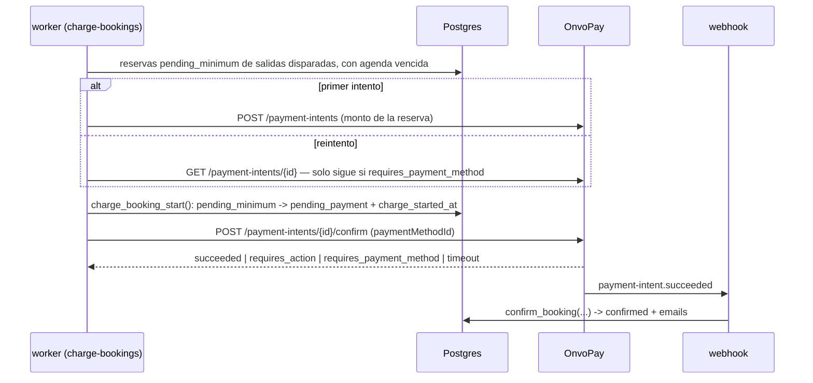
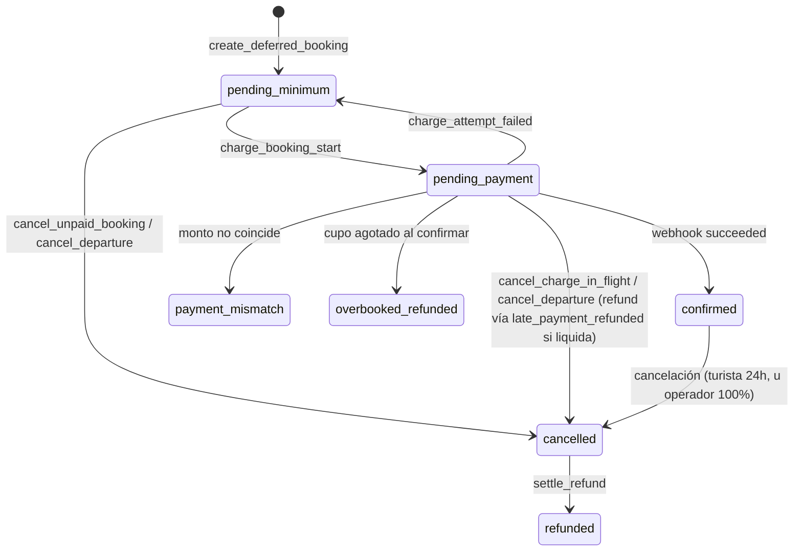

# 0029 — Cupo mínimo por salida y cobro diferido con tarjeta guardada

- **Estado**: in-review
- **Autor**: Kenneth (con Claude Code)
- **Creado**: 2026-08-13
- **Última actualización**: 2026-09-13
- **Rama**: (sin asignar — tres workstreams, ver §11)
- **PR**: (sin asignar)

> **Prerrequisito cumplido**: el spec 0028 está en `dev` (PRs #67, #68 y #69, mergeados el 2026-09-13). Las citas a archivo y línea de este spec se revalidaron contra ese código.

> **Historial de revisión.** Aprobado el 2026-08-13 con este mismo mecanismo. El 2026-09-13 se evaluó y **descartó** autorizar al reservar y capturar después (motivo en §5.1), y se volvió a este diseño con lo aprendido: la especificación OpenAPI de OnvoPay, la evidencia de sus suscripciones y los hallazgos de cuatro rondas de revisión. **Requiere re-aprobación.**

## 1. Contexto y motivación

Hoy el turista paga al reservar: el checkout crea un payment intent, el widget de OnvoPay cobra y el webhook confirma. La salida se opera con la gente que haya.

Eso no refleja el negocio. Un tour tiene un piso de participantes por debajo del cual no es rentable salir. Cuando no se llega, el operador cancela — y hoy eso significa devolver plata ya cobrada, con la fricción y la comisión de cada reembolso.

Este spec invierte el orden: el turista deja su tarjeta guardada al reservar y **no se le cobra**. El cobro se ejecuta cuando la salida junta suficiente gente. Si no la junta, no hubo cobro que devolver.

Actores: **turista** (reserva sin cargo inmediato), **staff** (configura el mínimo y decide sobre salidas flojas), **operador** (deja de perder plata bajo el piso y en comisiones).

## 2. Objetivos

- Permitir reservar guardando la tarjeta, sin cargo hasta que la salida se confirme.
- Cobrar automáticamente a todas las reservas de una salida al alcanzar el mínimo del tour, sin importar cuánto falte para la fecha.
- Dar al staff información y controles para confirmar o cancelar una salida que llega a la ventana de decisión bajo el mínimo; o cancelarla automáticamente según la configuración del tour.
- Mantener al turista informado en cada transición: reserva registrada, cobro ejecutado, salida cancelada, problema con la tarjeta.
- Garantizar que ninguna reserva quede sin cobrar, sin cancelar y sin agenda — y que **jamás se cobre dos veces**.

## 3. Fuera de alcance

- **No se guarda la tarjeta para compras futuras.** El método de pago pertenece a esa reserva; no hay "mis tarjetas" ni checkout de un clic.
- **No se autoriza el monto al reservar ni se retienen fondos** (descartado en §5.1).
- **No se cambia la política de reembolso de 24h** (`shared/constants/policies.ts`) para cancelaciones del turista. Sí se define un camino nuevo para cancelaciones **iniciadas por el operador** (§5.8).
- **No se notifica al staff por email**; la notificación es en el panel.
- **No hay lista de espera** ni cambios a la prevención de sobreventa del spec 0025.
- **SINPE Móvil queda estructuralmente excluido**, no diferido: es un pago push y nunca podrá soportar un cobro con tarjeta guardada.
- **No se implementa cobro parcial ni seña.**
- **No se migran reservas existentes** (§11).
- **No se cambia el modelo de refunds** (un refund activo por reserva) **ni la unicidad de `notifications`**. El diseño depende de ambos y los protege (§5.6, §5.7).

## 4. Historias de usuario

> Como turista, quiero reservar dejando mi tarjeta sin que me cobren todavía, para no tener plata comprometida en una salida que quizás no se realice.

- [ ] Al reservar, el turista ve que **no se le cobró** y qué monto se le cobrará al confirmarse la salida.
- [ ] Autoriza explícitamente el cargo futuro; esa autorización queda registrada con fecha y versión de términos.
- [ ] Si su tarjeta vence antes de la fecha del tour, el checkout la rechaza y le pide otra.
- [ ] Recibe un email de "reserva registrada" con el monto y los últimos 4 dígitos de la tarjeta.
- [ ] Su cupo queda reservado desde ese momento.

> Como turista, quiero que me cobren y me avisen apenas la salida se confirma.

- [ ] Al alcanzar el mínimo se cobra a todas las reservas pendientes y cada turista recibe el email de confirmación existente.
- [ ] El cobro ocurre aunque falten semanas para la fecha.
- [ ] Si la tarjeta es rechazada, recibe un email con enlace para actualizarla y su reserva sigue viva hasta el plazo de recuperación, aunque se hayan agotado los reintentos automáticos.
- [ ] Si el banco pide autenticación 3DS, recibe un enlace para completarla.
- [ ] Puede cancelar su reserva antes del cobro, sin cargo.

> Como staff, quiero enterarme de las salidas bajo el mínimo antes de la fecha, para decidir si la sostengo o la cancelo.

- [ ] Una salida que entra en la ventana bajo el mínimo aparece marcada en `/dashboard/departures` con asientos reservados vs mínimo.
- [ ] El staff puede **confirmar** (se cobra a todos) o **cancelar** (nadie es cobrado; los ya cobrados reciben reembolso total).
- [ ] En modo automático la salida se cancela sola y no aparece en la bandeja.

> Como staff, quiero configurar el mínimo y el modo de resolución por tour.

- [ ] El formulario de tours permite editar el mínimo (campo ya existente, hoy sin efecto) y elegir modo manual o automático.
- [ ] Una página de configuración permite fijar la ventana de decisión en horas, común a todos los tours.

## 5. Diseño técnico

### 5.1. Verificación de OnvoPay (2026-09-12)

Verificado contra la especificación publicada (`https://docs.onvopay.com/openapi.yaml`) y las guías (`https://docs.onvopay.com/en/llms-full.txt`). No hay proveedor nuevo, así que no aplica `external-services-vetting` completo; se documenta la capacidad:

- `POST /v1/customers` (secret key) crea el cliente; `POST /v1/payment-methods` se llama desde el navegador con la publishable key y un `customerId`. OnvoPay tokeniza y verifica la tarjeta antes de crear el objeto (`cards.invalid_card_info` si falla). El `cvv` es opcional al crearlo. `GET /v1/payment-methods/{id}` devuelve marca, últimos 4 dígitos, vencimiento y `customerId`.
- `POST /v1/payment-intents/{id}/confirm` con `paymentMethodId` cobra. Su cuerpo acepta solo `paymentMethodId`, `cvv`, `credixInstallmentMonths` y `returnUrl`: **no existe un parámetro para declarar un cobro sin el cliente presente**. Acepta tanto la secret key como la **publishable key**, que es pública: quien tenga el id de un intent vivo podría intentar confirmarlo.
- **Evidencia de que la plataforma hace este cobro**: en cada renovación de un cargo recurrente, OnvoPay "genera una intención de pago para ese período y la confirma con el método de pago indicado", sin el cliente presente y con reintentos propios (`attemptCount`, `nextPaymentAttempt`). Es el mismo par de operaciones que usa este spec. Lo que la documentación no dice es si un cobro único recibe el mismo tratamiento que una renovación; eso se le pregunta a OnvoPay (§13, Q1).
- Un intent rechazado **permanece** en `requires_payment_method` y se puede re-confirmar "indicando uno diferente". OnvoPay recomienda "exactamente un intent por pago".
- Estados de un intent: `requires_payment_method`, `requires_action`, `requires_capture`, `processing`, `succeeded`, `failed`, `refunded`, `partially_refunded`, `canceled`.
- 3DS: `confirm` devuelve `requires_action` con `nextAction.redirectToUrl`, o se resuelve con `onvo.handleNextAction({ paymentIntentId })` cargando `https://js.onvopay.com/v1/`.
- Webhooks documentados: `payment-intent.succeeded`, `payment-intent.failed` y `payment-intent.deferred`.
- `POST /v1/payment-intents/{id}/cancel` existe, pero **no documenta sobre qué estados funciona**.
- `POST /v1/payment-methods/{id}/detach` (el estado `detached` es irreversible) y `DELETE /v1/customers/{id}` existen.

**Descartado de forma definitiva: autorizar al reservar y capturar después** (`captureMethod: "manual"`). El OpenAPI dice que OnvoPay libera los fondos si no se captura "en un máximo de 30 días", pero ese es el plazo de su sistema, no el de la marca de la tarjeta. Las marcas fijan la validez de una autorización online en **unos 7 días**; los 30 días son una **autorización extendida** que el procesador tiene que pedir explícitamente (la API de OnvoPay no lo expone), restringida a rubros como hotelería, alquiler de autos y cruceros, y pensada para cuando no se conoce el monto final. Con esa validez, y midiendo la retención hasta la fecha del tour, la anticipación máxima de reserva quedaba en 5–6 días. Fuentes: documentación de Stripe sobre autorización extendida y cambios al marco de autorización de Visa (abril de 2024).

**También descartado**: modelar cada reserva como un cargo recurrente con `paymentBehavior: "allow_incomplete"`, para que el cobro lo hiciera el motor de suscripciones. Presenta una compra única como recurrente ante la marca y, si la cancelación del cargo recurrente falla, genera un segundo cobro que el modelo de reembolsos no puede reparar.

**Precondiciones a verificar en sandbox:**

- **Antes de aprobar el workstream B**, porque B ya cobra dinero real y permite reintentar a mano:
  - **(a) — bloqueante:** confirmar un intent con una tarjeta guardada **sin enviar `cvv`**, días después de guardarla. Si OnvoPay lo exige, el cobro diferido no es viable, porque el CVV no se puede guardar.
  - **(b)** re-confirmar el mismo intent con otra tarjeta después de un rechazo.
  - **(f)** que ese `confirm` emita `payment-intent.succeeded`, porque todo §5.3 depende de ese webhook.
- **Antes de aprobar el workstream C**:
  - **(c)** qué hace `cancel` sobre un intent en `requires_action`;
  - **(d)** qué ocurre al confirmar dos veces el mismo intent;
  - **(e)** que `cancel` funcione sobre `requires_payment_method` y deje el intent en `canceled`.

### 5.2. Recolección de la tarjeta, verificación y alcance PCI

El SDK embebido solo sabe cobrar un intent; **no tiene modo para guardar una tarjeta sin cobrar**. Con el flag encendido, el checkout pasa a un **formulario propio**:

1. El servidor crea el hold (`create_hold_atomic`) y un customer en OnvoPay (`POST /v1/customers`, secret key) para esta reserva.
2. El navegador tokeniza la tarjeta con `POST /v1/payment-methods`, la publishable key y ese `customerId`.
3. El servidor recibe **solo el `paymentMethodId`** y obtiene todo lo demás con `GET /v1/payment-methods/{id}`: marca, últimos 4 dígitos, vencimiento y `customerId`. **Nunca confía en datos de la tarjeta enviados por el navegador.** Rechaza el método si su `customerId` no es el customer creado para esta reserva.
4. El servidor crea la reserva con `create_deferred_booking` (§6), que la inserta en `pending_minimum` y pasa el hold a `paying` **en la misma transacción**.

Hoy el checkout escribe la reserva (`web/lib/booking/create.ts:58`), el pago (`:91`) y el paso del hold a `paying` (`:107-108`) en sentencias separadas. Replicar eso en el flujo diferido podría dejar una `pending_minimum` con el hold `active`, que vence a los 15 minutos: contaría para el mínimo sin ocupar cupo, y su cobro terminaría en `overbooked_refunded`. De ahí la función atómica.

**Consecuencia de cumplimiento, decidida y aceptada por el usuario (2026-08-13)**: se pasa de **SAQ A** (widget en iframe) a **SAQ A-EP**, aunque los datos nunca toquen nuestro servidor. Es obligación del **cliente** (es el comercio). Se suma al `pre-production-checklist`.

Reglas no negociables:

- PAN, CVV y expiración **nunca** llegan a nuestro backend, ni a logs, ni a Sentry.
- **El formulario envía el CVV al tokenizar**, para que la verificación inicial de OnvoPay no suba la tasa de rechazo. El CVV no se guarda nunca; si el cobro posterior lo exigiera, rige la precondición (a).
- **Una tarjeta, una reserva viva**: índice único parcial sobre `bookings.payment_method_id` para los estados `pending_minimum` y `pending_payment`.
- **Tarjeta que vence antes del tour**: con los datos de `GET /v1/payment-methods/{id}`, el servidor rechaza la tarjeta si su vencimiento (último día del mes indicado) es anterior a la fecha de la salida en hora de Costa Rica, y el checkout pide otra.
- **CSP** (`web/lib/security/csp.ts`, con nonces y `strict-dynamic` desde el spec 0024):
  - Hoy el SDK se inyecta con `document.createElement('script')` desde el bundle con nonce (`web/components/public/CheckoutForm/OnvoPaymentWidget.tsx:45-55`, `csp.ts:41`). La librería de 3DS (`https://js.onvopay.com/v1/`) se carga igual, **nunca** con un `<script src>` estático sin nonce.
  - `connect-src` permite `https://api.onvopay.com` (`csp.ts:17,45`), pero no `https://api.dev.onvopay.com`: hay que sumarlo para probar en sandbox desde el navegador, y exponer la base URL como env **pública** (hoy `ONVOPAY_API_BASE_URL` es server-only).
  - `frame-src https://*.onvopay.com` (`csp.ts:18,46`) ya cubre `checkout.onvopay.com`. El desafío 3DS del banco emisor puede usar dominios propios o enviar formularios que choquen con `frame-src` y `form-action 'self'` (`csp.ts:46,49`): la prueba manual de 3DS corre con la CSP en modo enforce.
- **Mandato de credencial almacenada**: el checkout muestra un texto explícito ("autorizo el cargo de $X cuando la salida se confirme") y persiste la evidencia reusando el patrón `consent_at`/`consent_version` del spec 0021. Sin eso, el riesgo de contracargo es alto.

### 5.3. El cobro diferido reusa el pipeline de dinero existente

Decisión central: **no se construye un camino de confirmación paralelo**. Todo el endurecimiento acumulado (idempotencia por evento, validación de monto, guarda de sobreventa, auditoría) vive en `confirm_booking` y se activa con el webhook. El cobro diferido solo **origina** el pago.

**Cambios obligatorios a `confirm_booking`.** La migración `…040:182` documenta que _"desde acá `v_booking.status = 'pending_payment'` (el CHECK de bookings agota los estados posibles)"_. Es un **fall-through**, no un gate positivo. Al sumar `pending_minimum` al CHECK, un webhook que llegue con la reserva en ese estado caería al camino feliz y confirmaría **sin haber pasado por el cobro**. Por eso:

- `confirm_booking` distingue dos situaciones anómalas: la reserva está en `pending_minimum`, o tiene `payment_method_id IS NOT NULL` (flujo diferido) y `charge_started_at IS NULL`. En ambas nunca pasó por `charge_booking_start`. La función **no lee el feature flag** —SQL no puede leer variables de entorno de la app—: el flujo se deduce de la propia reserva, y las del flujo inmediato tienen `payment_method_id` nulo.
- **Esas situaciones solo cambian el outcome devuelto.** Ejecutan en el mismo orden la guarda de monto (desde `…040:185`), la de sobreventa (hasta `…040:284`) y la confirmación del camino feliz. Si ninguna guarda se activa, devuelven `confirmed_unclaimed` en lugar de `confirmed`, con auditoría. Si alguna se activa, devuelven su outcome propio (`payment_mismatch` u `overbooked_refunded`).
- **La alerta la emiten los callers.** En `worker/src/reconciliation/recover.ts` el `switch` (`:62`) tiene un `default:` (`:82`) que se traga outcomes desconocidos; el webhook (`web/app/api/webhooks/onvopay/route.ts:102-122`) es una cadena de `if/else` que también los ignora. Ambos necesitan tratar `confirmed_unclaimed` de forma explícita, o la alerta no existe.
- `flag_payment_mismatch` (`…040:368`) también gatea por `pending_payment` y se extiende igual.

### 5.4. Colisión con el reconciliador

El reconciliador **no** ignora estas reservas por sí solo. `fetchStalePendingBookings` filtra por `.lt('created_at', olderThanIso)` (`worker/src/reconciliation/repository.ts:53`), no por cuándo empezó el cobro: una reserva creada hace tres semanas es "stale" en el primer ciclo (≤5 min) apenas pasa a `pending_payment`. Si el intent no está pagado, `cancel_stale_pending_booking` la cancela, marca el pago `failed` y expira el hold, destruyendo el camino de reintentos.

Correcciones requeridas:

- Nueva columna `bookings.charge_started_at`, fijada en cada intento. La consulta del reconciliador excluye las reservas con `charge_started_at IS NOT NULL`: su ciclo de vida lo posee el job de cobro. El criterio es por **presencia, no por contador**: `charge_attempts` se incrementa al fallar (§5.7), así que en el primer intento vale 0.
- **El gate va dentro de la función, no solo en la consulta.** Filtrar en `fetchStalePendingBookings` deja un TOCTOU: el reconciliador lee una reserva sin cobro, el job de cobro la toma y la pasa a `pending_payment`, y el reconciliador actúa sobre su lectura vieja. `cancel_stale_pending_booking` (`…036:281`) ya toma `FOR UPDATE` (`:293`) y gatea por estado (`:299`); se le agrega, bajo ese mismo lock, `IF v_booking.charge_started_at IS NOT NULL THEN RETURN false`. **Ninguna función que cancela una reserva `pending_payment` puede depender de que el caller haya filtrado.** Para que el dueño legítimo pueda cerrar su propio ciclo existe `cancel_charge_in_flight` (§6).
- El mapeo peligroso es `requires_payment_method → NotPaid` (`worker/src/reconciliation/onvopay.ts:41`), no `requires_action`, que ya mapea a `Pending` (`:43`).
- `recover.ts:30` toma `booking.payments[0]`. Con reintentos sobre el mismo intent (§5.6) lo normal es una sola fila por reserva, pero si hubo que crear un intent nuevo puede haber más. `reconcile-pending-payments` recorre todas las filas no terminales de la reserva, no solo la primera.

### 5.5. Capacidad, holds, disparo y unidad de trabajo

Una reserva `pending_minimum` ocupa cupo desde que se crea, reusando **tal cual** la Capa 1 del spec 0025: `create_deferred_booking` pasa el hold a `paying` en la misma transacción que crea la reserva (§5.2), `create_hold_atomic` lo cuenta y `release-expired-holds` no lo toca. `HoldStatus.Paying` pasa a significar "cupo retenido por una reserva en curso", inmediata o diferida. No se toca `create_hold_atomic`.

**El mínimo se cuenta en asientos**, sumando `pending_minimum`, `pending_payment` con `charge_started_at` (cobro en vuelo) y `confirmed` de la salida.

**El disparo es terminal.** Al alcanzar el mínimo, `charge-bookings` marca bajo lock de la instancia `minimum_charge_triggered_at`, `minimum_resolution = 'reached'`, `minimum_resolved_at` y el snapshot del mínimo y los asientos. Desde ese momento la salida queda confirmada: `resolve-minimum-window` solo selecciona salidas con `minimum_resolved_at IS NULL`, así que nunca cancela una salida disparada por más que sus cobros fallen. Si varias reservas terminan canceladas, el staff ve bajar los asientos y decide si cancela la salida a mano (§5.8).

**La unidad de trabajo del cobro es la RESERVA, no la salida.** El disparo es un marcador de _decisión tomada_, no una cola: si el worker muere a mitad del lote (SIGTERM de Railway con tope de 30 s), las reservas restantes no pueden quedar fuera de toda selección. La selección del job es por reserva:

> reservas `pending_minimum` cuya instancia tenga `minimum_charge_triggered_at IS NOT NULL` **y** (`charge_next_attempt_at IS NULL OR <= now()`).

Invariante a sostener y testear: _toda reserva de una salida disparada termina cobrada, reintentada o cancelada; **ninguna queda sin dueño en ningún estado**._

**Watchdog de cobros en vuelo.** Las reservas `pending_payment` con `charge_started_at` quedan fuera del reconciliador y su `charge_next_attempt_at` es nulo. `charge-bookings` barre las que llevan **más de 30 minutos** desde `charge_started_at` y resuelve su intent por `GET`:

- `requires_action` con `awaiting_action_until > now()`: **no hace nada**; el turista está autenticando.
- `succeeded`: confirma por el camino de `recover()`, con validación de monto.
- `requires_payment_method`: se trata como rechazo (`charge_attempt_failed`, §5.7).
- `processing`: espera al ciclo siguiente.
- `canceled` o `failed`: se trata como rechazo con el intent terminal.
- `requires_action` vencido: aplica §5.7.

Corolario: una reserva **nueva** sobre una salida ya disparada se cobra de inmediato, porque queda seleccionada por la misma regla.

### 5.6. Anti-doble-cobro: el invariante que sostiene todo

Un doble cobro **no se puede reparar** con el pipeline actual: `refunds_one_active_per_booking` (`…018:47`) admite un solo refund activo por reserva, los encolados usan `ON CONFLICT DO NOTHING`, y `cancel_booking` elige un único pago (`…042:89-93`) capando con `LEAST(p_refund, pago)` (`:100`). Con dos pagos `succeeded`, el segundo refund se descarta en silencio.

Por eso el diseño **garantiza por construcción** que haya un solo intent vivo por reserva:

- **Un intent por reserva, reutilizado en los reintentos.** Un rechazo deja el intent en `requires_payment_method`, re-confirmable según la documentación. La fila de `payments` sigue `pending` mientras el intent está vivo.
- **Verificar antes de re-confirmar**, igual que antes de crear. Todo reintento —de `charge-bookings`, del watchdog o del staff en el panel— hace `GET /v1/payment-intents/{id}` antes del `POST /confirm`:
  - solo re-confirma si el estado es `requires_payment_method`;
  - si es `succeeded`, confirma la reserva por el camino de `recover()` y **nunca** re-confirma ni crea otro intent;
  - si es `processing` o `requires_action`, no hace nada en ese ciclo.
- **"Terminal", a efectos de crear otro intent, significa solo `canceled` o `failed`.** `succeeded`, `refunded` y `partially_refunded` **nunca** habilitan un intent nuevo. Si el intent anterior sigue en `requires_payment_method` y no se puede reutilizar (precondición b), primero se llama a `POST /cancel` y se exige `GET = canceled` (precondición e); si no se logra, no se crea nada y se alerta. Es la regla espejo de la de refunds (`worker/src/refunds/handle-refund.ts:47-51`: "verificar (GET) antes que crear").
- **Índice único parcial** `payments (booking_id) WHERE status = 'pending'`.
- **Ningún intent puede existir sin su fila en `payments`.** En el primer intento, el intent se crea inmediatamente antes de `charge_booking_start`; si esta falla, **ese intent recién creado** se cancela best-effort y la reserva sigue en `pending_minimum` (patrón 0028 A1). En un reintento el intent ya existe y se conserva: `charge_booking_start` es atómica, así que su fallo no mueve la reserva.
- **Toda escritura de estado desde el worker es condicional y verifica rowcount** (`WHERE id = ? AND status = …`). Si el webhook confirmó mientras el worker interpretaba un timeout, un `UPDATE` ciego devolvería la reserva a la cola de cobro. Rowcount 0 ⇒ alerta y **no** reintentar.

### 5.7. Reintentos, 3DS y plazo de recuperación

El cobro ocurre sin el turista presente. Hay dos fallos esperables, y ambos se registran con `charge_attempt_failed` (§6).

**Rechazo.**

- La reserva vuelve a `pending_minimum`. La fila de pago sigue `pending` si el intent es re-confirmable, o pasa a `failed` si es terminal. Se incrementa `charge_attempts` y se guarda `charge_last_error`.
- Al primer fallo se fija `recovery_deadline = GREATEST(inicio de la ventana de decisión, now() + 6 h)`, nunca posterior a `starts_at`. **Hay margen si `recovery_deadline − now() ≥ 2 h`**; si no, no se envía enlace y la reserva se cancela con aviso.
- `charge_next_attempt_at = LEAST(now() + backoff, recovery_deadline)`, con backoff de 1 h, 6 h y 24 h.
- Cada fallo con margen envía el aviso con enlace para actualizar la tarjeta: `charge_failed_action_required_1`, `_2` y `_3` (§5.7, notificaciones).
- **Agotar los tres reintentos no cancela antes de `recovery_deadline`**: la reserva espera en `pending_minimum`. Si el turista actualiza la tarjeta mientras `now() < recovery_deadline`, se agenda un intento inmediato aunque el contador esté agotado, que re-confirma el mismo intent con el `payment_method_id` nuevo.
- Al vencer `recovery_deadline`, `charge-bookings` cancela con `cancel_unpaid_booking` (reserva en `pending_minimum`) o con `cancel_charge_in_flight` (cobro en vuelo), y la salida no se re-evalúa: el disparo es terminal (§5.5).

**`requires_action` (3DS).**

- La reserva queda en `pending_payment` con `awaiting_action_until`, calculado igual que `recovery_deadline` y con la misma regla de margen. Se envía `charge_requires_action` con enlace a `/booking/[token]/authenticate`, que completa la autenticación con `handleNextAction`.
- El watchdog no toca la reserva mientras `awaiting_action_until > now()` (§5.5).
- **Contingencia**, que rige salvo que la precondición (c) demuestre lo contrario: mientras exista un intent en `requires_action`, la reserva **no genera intents nuevos**.
- Vencido el plazo sin autenticación, `charge-bookings` llama a `cancel_charge_in_flight`: reserva cancelada, pago `failed`, hold liberado. Intenta además cancelar el intent en OnvoPay. Si el turista autentica tarde y el cobro liquida, el webhook entra por la rama `cancelled` de `confirm_booking`, que acepta pagos `pending` o `failed` (`…040:144-154`), y encola el refund total por `late_payment_refunded`. Si el webhook se pierde, lo detecta el barrido de §5.9. Como nunca hubo un segundo intent, no hay doble cobro posible.

**Notificaciones: la unicidad no se toca.** `notifications` tiene `UNIQUE (booking_id, kind)` (`…013:41`), que funciona como árbitro de los `ON CONFLICT` vigentes de tres funciones de dinero: `confirm_booking` (`…040:281`, `:315` y `:326`), `cancel_booking` (`…042:80`) y `settle_refund` (`…036:373`). Cambiar la unicidad **las rompería en tiempo de ejecución** sin que la migración falle, porque PL/pgSQL planifica recién al invocar: dejaría sin asentar los refunds, sin cancelar las reservas confirmadas y sin resolver la sobreventa. Por eso el aviso repetido se modela con **tres valores de `kind`** (`charge_failed_action_required_1`, `_2`, `_3`) en el CHECK que la migración ya edita. La columna existente `notifications.attempts` (`…013:33`) es el contador de reintentos de envío y no tiene relación con esto.

El enlace usa el patrón de token del spec 0011 (`booking_access_tokens`, SHA-256): **cada email emite el suyo** con `issueBookingToken` (`worker/src/notifications/booking-token.ts:20-35`; ver el comentario de `:17-18`); no existe un token persistente por reserva.

### 5.8. Cancelación: cohortes con efectos distintos

Cancelar una salida toca reservas en tres estados, con efectos **incompatibles entre sí**. `cancel_booking` decrementa `capacity_reserved`, que en una `pending_minimum` nunca se incrementó (solo lo hace `confirm_booking`, `…040:289`), y no toca `tour_holds`. Reusarlo a ciegas dejaría el contador desfasado y los holds `paying` colgados.

| Cohorte                            | Hold           | `capacity_reserved` | Pago                             | Refund                      |
| ---------------------------------- | -------------- | ------------------- | -------------------------------- | --------------------------- |
| `pending_minimum`                  | → `released`   | sin cambio          | sin fila, o `pending` → `failed` | ninguno                     |
| `pending_payment` (cobro en vuelo) | → `released`   | sin cambio          | no se toca                       | vía `late_payment_refunded` |
| `confirmed`                        | ya `converted` | −asientos           | `succeeded`                      | **total, sin política 24h** |

- En la cohorte `pending_minimum`, un intent en `requires_payment_method` no retiene fondos, pero **puede seguir siendo pagable**: `confirm` acepta la publishable key (§5.1). Marcar la fila `failed` no alcanza por sí solo; el intent queda bajo el barrido de intents no cerrados (§5.9), que lo cancela o reembolsa si liquida.
- La cohorte `pending_payment` se cancela **de inmediato y sin esperar a OnvoPay**: `cancel_departure` es SQL y no puede hacer HTTP. Si el cobro liquida después, el webhook entra por la rama `cancelled` de `confirm_booking` y dispara `late_payment_refunded` (`…040:144-179`) con refund total.
- **Las reservas no confirmadas no pasan por `cancel_booking`.** Una cancelación **iniciada por el operador** reembolsa el 100% siempre: `computeRefund` (binario 24h) es para el turista. Con la ventana de decisión en 24 h por defecto, la resolución cae justo sobre el borde de la política; sin esta regla, el operador cancela y el turista pierde la plata.
- **El turista debe poder cancelar una `pending_minimum`**, cosa que hoy es imposible: `cancel_booking` corta con `IF v_booking.status <> 'confirmed' THEN RETURN` (`…042:55`) y `web/lib/booking/cancel.ts:106` devuelve `NotCancellable`. Se agrega `cancel_unpaid_booking`, que libera el hold, pasa la fila de pago `pending` a `failed`, no invoca `computeRefund`, audita y encola el email. **Rechaza** una reserva `pending_payment` con `charge_started_at` (cobro en vuelo), y la UI le pide al turista reintentar en unos minutos.

### 5.9. Jobs del worker y protección de intents vivos

Tres jobs nuevos, self-contained (sin `@shared` en runtime), con guard `isRunning`, aislamiento por ítem y graceful shutdown, siguiendo el patrón de 0028:

- **`close-payment-intents`** (cada 5 min, workstream B): **barrido de intents no cerrados.** Selecciona las filas `payments` en `failed` de reservas canceladas del flujo diferido (`payment_method_id IS NOT NULL`) con `provider_closed_at IS NULL`, durante 7 días desde la cancelación, y consulta cada intent por `GET`:
  - `succeeded`: llama a `confirm_booking` con el monto pagado, que entra por `late_payment_refunded` y encola el refund total;
  - `requires_action` o `requires_payment_method`: reintenta `POST /cancel`;
  - `canceled` o `failed`: fija `provider_closed_at`.

  Pasados los 7 días sin cierre, alerta con nivel error. Existe porque el webhook de un cobro tardío puede perderse, y ningún otro componente mira reservas canceladas.

- **`charge-bookings`** (cada minuto, workstream C): dispara las salidas que alcanzaron el mínimo (§5.5), cobra las reservas seleccionadas, procesa reintentos, cancela las que vencen su `recovery_deadline` o `awaiting_action_until` (§5.7) y corre el watchdog de cobros en vuelo.
- **`resolve-minimum-window`** (cada 5 min, workstream C): salidas dentro de la ventana con `minimum_resolved_at IS NULL` que no alcanzaron el mínimo → cancelación automática o marca para decisión del staff. Incluye dos barridos: **rezagados** (salidas ya pasadas sin resolver, si el worker estuvo caído, cosa que ya ocurrió en producción) y **terminal** (salidas disparadas que llegan a T-0 con reservas aún `pending_minimum`, que se cancelan con aviso).

**Páginas que exponen un intent.** Las páginas de 3DS y de actualización de tarjeta **solo se muestran** si la reserva está en su estado correspondiente: `pending_payment` con `awaiting_action_until > now()` para la de 3DS, `pending_minimum` para la de tarjeta. Sobre una reserva cancelada muestran "esta reserva fue cancelada" y **nunca entregan el id del intent al navegador**.

**Baja de datos del lado de OnvoPay.** SQL no puede llamar a OnvoPay, así que el `detach` del método de pago y el `DELETE` del customer los hace **el caller antes de invocar la función SQL**: el job `apply-retention` antes de purgar o anonimizar, y la acción del panel antes de `anonymize_booking_pii_by_email`. Primero `detach` (irreversible) y después `DELETE`, porque la especificación no documenta que borrar el customer desvincule sus métodos de pago. **Antes de borrar una fila de `payments`**, el caller exige que su intent esté cerrado (`provider_closed_at` fijado, o `GET` en `canceled` o `failed`). Si se borrara con el intent vivo, una liquidación tardía respondería `payment_not_found` (`route.ts:53-56`): plata cobrada sin reserva y sin refund. Una baja a pedido sobre un cobro en vuelo espera a que se resuelva.

### 5.10. Adapter pattern

Las llamadas nuevas a OnvoPay no pueden quedar sueltas en el navegador y el worker sin romper la decisión de aislar la pasarela (`lib/payments/adapters/`, decisión 2026-05-19, con PayPal post-MVP en el horizonte). `PaymentProvider` suma `createCustomer`, `getPaymentMethod`, `confirmWithPaymentMethod`, `cancelPaymentIntent`, `getPaymentIntent`, `detachPaymentMethod` y `deleteCustomer`. La tokenización y el 3DS quedan detrás de costuras agnósticas del lado cliente (`tokenizeCard`, `handleNextAction`). El cliente de cobro del worker espeja la separación de `worker/src/refunds/` (`onvopay.ts` + `repository.ts` + `handle-charge.ts`).

### 5.11. Panel

- **Formulario de tours**: `min_participants` **ya existe y es editable** (`web/components/tours/TourBasicInfoSection.tsx:119`, validado en `web/lib/tours/types.ts:50-58` y por el CHECK `max_capacity >= min_participants` de `…004:15`); lo único que falta es que **tenga efecto**. Se agrega el toggle `auto_cancel_below_minimum`.
- **`/dashboard/settings`** (admin): ventana de decisión en horas. Primera configuración global del negocio.
- **`/dashboard/departures`**: asientos reservados vs mínimo por salida; las que requieren decisión, destacadas arriba con **Confirmar salida** y **Cancelar salida**, ambas auditadas con el actor.
- **Cobro manual (workstream B)**: un botón cobra una reserva `pending_minimum` con las mismas funciones que usa el job. Si el cobro se rechaza, la reserva vuelve a `pending_minimum` con su fila `pending`, y **Volver a cobrar** re-confirma el mismo intent tras el `GET` de §5.6. Por eso la precondición (b) se cierra antes de B.
- **Ocupación**: `capacity_reserved` solo lo mueve `confirm_booking`, así que una salida llena pero sin cobrar mostraría 0 en reportes y en la vista del guía. Hay que exponer los asientos comprometidos aparte.

## 6. Modelo de datos

Migración: `supabase/migrations/20260913000043_minimum_participants_deferred_charge.sql`.

**`tours`** — alter: `auto_cancel_below_minimum boolean NOT NULL DEFAULT false`. (`min_participants` ya existe.)

**`bookings`** — alter:

- `payment_method_id text NULL`, `customer_external_id text NULL`.
- `card_brand text NULL`, `card_last4 text NULL CHECK (card_last4 ~ '^[0-9]{4}$')`, `card_exp_month smallint NULL`, `card_exp_year smallint NULL`.
- `charge_attempts integer NOT NULL DEFAULT 0`, `charge_next_attempt_at timestamptz NULL`, `charge_started_at timestamptz NULL`, `charge_last_error text NULL` (código de rechazo, no el mensaje crudo).
- `awaiting_action_until timestamptz NULL`, `recovery_deadline timestamptz NULL`.
- Nuevo valor en el CHECK de `status`: `pending_minimum`.
- `CHECK (status <> 'pending_minimum' OR payment_method_id IS NOT NULL)`: una reserva sin tarjeta no puede retener cupo ni contar para el mínimo.
- Índice único parcial `(payment_method_id) WHERE status IN ('pending_minimum', 'pending_payment')`: una tarjeta, una reserva viva.
- `total_amount_cents` pasa a ser **inmutable tras el INSERT** (trigger): es el monto que el turista autorizó en el mandato (§5.2).

**`payments`** — alter: `provider_closed_at timestamptz NULL` (§5.9). Nuevo índice único parcial `(booking_id) WHERE status = 'pending'` (§5.6).

**`notifications`** — alter: nuevos valores en el CHECK de `kind` (`…036:43-52`): `booking_reserved`, `departure_cancelled_minimum`, `charge_failed_action_required_1`, `charge_failed_action_required_2`, `charge_failed_action_required_3` y `charge_requires_action`. **La unicidad `(booking_id, kind)` no cambia** (§5.7).

**`tour_instances`** — alter: `minimum_charge_triggered_at timestamptz NULL`, `staff_decision_required_at timestamptz NULL`, `minimum_resolved_at timestamptz NULL`, `minimum_resolved_by uuid NULL REFERENCES users(id)`, `minimum_resolution text NULL CHECK (IN ('reached','staff_confirmed','staff_cancelled','auto_cancelled'))`, y el snapshot de la decisión (`min_participants_at_trigger`, `seats_at_trigger`) para poder reconstruirla ante un reclamo.

**`business_settings`** — create, fila única: `id smallint PRIMARY KEY DEFAULT 1 CHECK (id = 1)`, `minimum_decision_window_hours integer NOT NULL DEFAULT 24 CHECK (BETWEEN 1 AND 720)`, `updated_at`, `updated_by uuid REFERENCES users(id)`. RLS: lectura admin/staff, escritura admin. Grants explícitos (spec 0027), `anon` sin acceso.

**Índices**: `bookings (tour_instance_id) WHERE status = 'pending_minimum'`; `bookings (charge_next_attempt_at) WHERE charge_next_attempt_at IS NOT NULL`; `payments (booking_id) WHERE status = 'failed' AND provider_closed_at IS NULL`; `tour_instances (starts_at) WHERE minimum_resolved_at IS NULL`.

**Funciones** (todas `SECURITY DEFINER`, `search_path=''`, `REVOKE EXECUTE FROM PUBLIC, anon, authenticated`, guard `is_public_request()`):

- `create_deferred_booking(...)` — inserta la reserva en `pending_minimum`, con los datos de la tarjeta obtenidos por el servidor y la evidencia de consentimiento, y pasa el hold `active → paying`, todo en una transacción. Deriva el monto server-side (spec 0015).
- `charge_booking_start(p_booking_id, p_external_payment_id)` — `pending_minimum → pending_payment` y fija `charge_started_at`. En el primer intento inserta la fila de `payments`; en un reintento exige que exista la fila `pending` con ese mismo `external_payment_id`. **Deriva el monto internamente** de `bookings.total_amount_cents`; no lo recibe del caller (mismo footgun que 0028 corrigió con `p_total_seats`).
- `charge_attempt_failed(p_booking_id, p_error_code, p_intent_terminal)` — `pending_payment → pending_minimum` con gate `charge_started_at IS NOT NULL`. Incrementa `charge_attempts`, fija `recovery_deadline` en el primer fallo, calcula `charge_next_attempt_at`, pasa la fila de pago a `failed` solo si el intent es terminal y encola el aviso del intento.
- `cancel_charge_in_flight(p_booking_id, p_reason)` — **la única** función que cancela una reserva `pending_payment` con `charge_started_at`. La invoca solo `charge-bookings`. Bajo `FOR UPDATE` exige ese estado y, según `p_reason`, `awaiting_action_until < now()` o `recovery_deadline < now()`. Cancela la reserva, pasa el pago `pending → failed`, libera el hold (`paying → released`), audita y encola el aviso.
- `cancel_departure(p_instance_id, p_actor_id, p_resolution)` — atómica, aplica la tabla de cohortes de §5.8.
- `cancel_unpaid_booking(p_booking_id, p_actor_id, p_reason)` — cancelación antes del cobro: libera el hold y pasa el pago `pending → failed`. El actor es nulo cuando cancela el turista por su enlace; la razón distingue "turista", "plazo vencido" y "staff".
- `confirm_booking` y `flag_payment_mismatch` — DROP + CREATE con los cambios de §5.3.
- `cancel_stale_pending_booking` — CREATE OR REPLACE partiendo de `…036:281`, con el gate por `charge_started_at` bajo el `FOR UPDATE` (§5.4).
- `anonymize_booking_pii_by_email` y `purge_unpaid_bookings` — excluyen las reservas vivas del flujo diferido (ver retención).
- **No se tocan** `cancel_booking` (`…042:27`) ni `settle_refund` (`…036:336`): siguen dependiendo de `UNIQUE (booking_id, kind)`, que no cambia.

**Retención y baja de datos (spec 0022).** Dos funciones borran reservas sin pago `succeeded`/`refunded`, y ambas alcanzarían una `pending_minimum`, dejando su hold `paying` huérfano y su tarjeta viva en OnvoPay:

- `purge_unpaid_bookings` (`…034:197`, corte de 90 días en `worker/src/jobs/retention-windows.ts:9`).
- `anonymize_booking_pii_by_email` (`…034:43`; el bloque de borrado arranca en `:93`), la baja **a pedido del titular**.

Ambas excluyen `pending_minimum` y `pending_payment` con `charge_started_at`. Para una baja a pedido sobre una reserva viva, primero se cancela con `cancel_unpaid_booking` y después se anonimiza. En todos los casos, el `detach` y el `DELETE` en OnvoPay, y la verificación de que el intent está cerrado, ocurren antes de la función SQL (§5.9).

**Artefactos que acompañan la migración** (omitirlos es un error ya cometido y documentado): `BookingStatus.PendingMinimum` en `shared/constants/enums.ts`; los `NotificationKind` nuevos; los `AuditAction` nuevos; las copias locales del worker; las claves i18n de estado en ES/EN; y la **edición a mano de `web/types/database.ts`** (nunca `pnpm db:types`, que ensancha las uniones).

## 7. Estados y transiciones

Estado nuevo: **`pending_minimum`** — tarjeta guardada, cupo ocupado, sin cobro.

**Salida**: `reached` se fija en el disparo y es terminal, igual que `staff_confirmed`, `staff_cancelled` y `auto_cancelled` (§5.5).

**`payments`**: la fila nace `pending` en el primer intento y **sigue `pending` durante los reintentos** mientras el intent es re-confirmable. Termina en `succeeded` (webhook) o en `failed` (intent terminal, plazo vencido, salida cancelada o turista que cancela). Una fila `failed` recibe `provider_closed_at` cuando el barrido comprueba que su intent está cerrado en OnvoPay. Solo con la fila anterior terminal y su intent en `canceled` o `failed` puede nacer otra.

**`tour_holds`**: `active → paying` en `create_deferred_booking`; `paying → released` desde `cancel_unpaid_booking`, `cancel_charge_in_flight` y `cancel_departure`; `paying → converted` lo sigue haciendo `confirm_booking`. Ningún camino nuevo deja un hold en `paying` sin dueño.

## 8. Casos borde y errores

- **Worker muere a mitad del lote de cobro.** Cubierto por la selección por reserva (§5.5).
- **Webhook con la reserva en `pending_minimum`, o `succeeded` sobre una reserva diferida sin `charge_started_at`.** Mismas guardas del camino feliz; outcome `confirmed_unclaimed` y alerta desde el caller (§5.3).
- **El reconciliador lee una reserva y el job de cobro la toma antes de que actúe.** Gate por `charge_started_at` dentro de `cancel_stale_pending_booking` (§5.4).
- **El worker interpreta un timeout mientras el webhook ya confirmó.** Escrituras condicionales con rowcount (§5.6).
- **El cobro liquidó pero el worker lo registró como rechazo, y el webhook se perdió.** El reintento siguiente hace `GET`, ve `succeeded` y confirma por `recover()`; nunca re-confirma (§5.6).
- **3DS abandonado.** `cancel_charge_in_flight` cancela la reserva y libera el hold al vencer el plazo; si el turista autentica tarde, `late_payment_refunded` reembolsa; si además se pierde el webhook, lo detecta `close-payment-intents` (§5.7, §5.9).
- **Alguien intenta pagar un intent de una reserva cancelada.** Las páginas nunca entregan su id; si igual liquida, el barrido lo reembolsa (§5.9).
- **Reserva nueva sobre una salida ya cobrada.** Se cobra de inmediato (§5.5).
- **Checkout abandonado antes de crear la reserva.** No existe la reserva (el `CHECK` exige tarjeta); el hold `active` vence normalmente.
- **Una tarjeta ya usada en otra reserva viva, o de otro customer.** Rechazada por el índice único parcial y por la verificación de `customerId` (§5.2).
- **Tarjeta que vence antes del tour.** Rechazada en el checkout con datos obtenidos por el servidor (§5.2).
- **Tarjeta cancelada o sin fondos al momento del cobro.** Reintentos y espera hasta `recovery_deadline`, con avisos para actualizarla (§5.7).
- **Cobro que falla con poco margen** (reserva hecha pocas horas antes, o salida confirmada tarde por el staff). Si quedan menos de 2 h hasta el plazo, se cancela con aviso (§5.7).
- **Timeout al confirmar.** No se re-confirma a ciegas: `GET` en el ciclo siguiente.
- **Todos los cobros de una salida fallan.** La salida sigue confirmada, porque el disparo es terminal; las reservas se cancelan al vencer su plazo, y el staff decide si cancela la salida (§5.5).
- **El turista cancela mientras su cobro está en vuelo.** `cancel_unpaid_booking` lo rechaza y la UI pide reintentar (§5.8).
- **Baja de datos a pedido sobre una reserva viva o con intent abierto.** Se cancela primero, se verifica que el intent esté cerrado y recién después se anonimiza (§5.9, §6).
- **El admin baja el mínimo.** Se lee en vivo: la próxima corrida puede disparar cobros. Subirlo **no** descobra una salida ya disparada.
- **Dos miembros del staff resuelven la misma salida, o el staff y el disparo automático coinciden.** `FOR UPDATE` sobre la instancia y verificación de `minimum_resolved_at IS NULL`.
- **Salida cancelada con alguien ya cobrado.** Tabla de cohortes (§5.8): refund total sin política 24h.
- **Salida disparada que llega a T-0 con reservas sin cobrar.** Barrido terminal (§5.9).
- **Worker caído por días.** Barrido de rezagados (§5.9) y alerta de liveness (§11). Sin worker no se cobra nada: es un riesgo operativo, no solo técnico.
- **`reminder_24h` agendado en el pasado.** `…040:317-326` lo agenda en `starts_at - 24h` al confirmar; si la confirmación cae dentro de esas 24 h, se omite.
- **Archivar un tour con reservas `pending_minimum`.** `web/lib/tours/archive-action.ts:72` hoy solo bloquea por `PendingPayment`/`Confirmed`: hay que incluir el estado nuevo.

## 9. Impacto en otras áreas

- **Panel**: toggle en el form de tours, `/dashboard/settings` nueva, bandeja de decisión, columnas de mínimo en departures y cobro manual (workstream B).
- **Portal**: checkout con formulario propio; éxito y detalle distinguen "reservado, sin cargo" de "cobrado"; páginas para actualizar la tarjeta y completar el 3DS, visibles solo en su estado.
- **Emails** en ES y EN: `booking_reserved`, `departure_cancelled_minimum`, el aviso de tarjeta rechazada (una plantilla para los tres `kind` de intento) y `charge_requires_action`. `booking_confirmation` se reusa para el cobro exitoso.
- **Worker**: tres jobs nuevos, reconciliador ajustado (§5.4), retención con baja en OnvoPay (§5.9).
- **Reportes**:
  - Los ingresos se cuentan por fecha de pago, así que el diferimiento **corre los ingresos al mes del cobro**.
  - Ocupación y "pasajeros confirmados" (spec 0009) mostrarían 0 en salidas llenas sin cobrar.
  - `report_refunds_summary` (última definición en `…036:395`) cuenta toda reserva `cancelled` en la tasa de cancelación: las cancelaciones por mínimo la inflarían. Hay que separarlas usando `minimum_resolution` o la acción de auditoría.
- **Auditoría**: toda decisión automática de dinero deja entrada en `audit_logs` (disparo con su snapshot, cada intento con su código de rechazo, cancelaciones por plazo, cierres del barrido). Hoy solo `confirm_booking` audita.
- **Seguridad**: superficie nueva en el navegador, alcance PCI A-EP y cambios de CSP ⇒ amerita pasada de auditoría antes del cutover.
- **i18n**: textos nuevos de panel, portal y emails en ES/EN.

## 10. Plan de tests

**Unit**: conteo de asientos (incluye cobros en vuelo); backoff y `charge_next_attempt_at = LEAST(...)` con el plazo; `recovery_deadline` y regla de margen de 2 h (dentro de la ventana, sin margen, tope en `starts_at`); selección de salidas por ventana con día CR; rechazo de tarjeta que vence antes de la salida (último día del mes, hora CR); decisión del reintento según el estado del `GET` (`requires_payment_method`, `succeeded`, `processing`, `requires_action`, `canceled`, `failed`); omisión del `reminder_24h` en el pasado.

**Integración (Supabase local)**:

- **Regresión de las funciones de dinero existentes tras migrar**: `cancel_booking` sobre una reserva confirmada, `settle_refund` de un refund acreditado y la rama de sobreventa de `confirm_booking` siguen funcionando con los `kind` nuevos.
- **`create_deferred_booking` es atómica**: si falla, no queda reserva ni hold `paying`; si prospera, la reserva está en `pending_minimum` y el hold en `paying`.
- El mínimo dispara el cobro una sola vez y la salida queda con `minimum_resolution = 'reached'`; dos corridas seguidas no cobran dos veces.
- **`resolve-minimum-window` no toca una salida disparada** aunque todos sus cobros estén en vuelo o hayan fallado.
- **Worker interrumpido a mitad del lote**: las reservas restantes se cobran en el ciclo siguiente.
- **Reintento sobre el mismo intent**: un rechazo no crea una segunda fila de `payments`; el reintento re-confirma el mismo `external_payment_id`; `charge_booking_start` que falla en un reintento conserva el intent.
- **Reintento sobre un intent que ya liquidó** (`GET = succeeded`) ⇒ confirma por `recover()` y nunca re-confirma ni crea otro intent.
- **Cambio de tarjeta con reintentos agotados y plazo vigente** ⇒ intento inmediato con el `payment_method_id` nuevo; al vencer el plazo ⇒ `cancel_unpaid_booking`.
- **Índices únicos**: una segunda fila `pending` para la misma reserva y el mismo método de pago en dos reservas vivas son rechazados.
- **Webhook sobre `pending_minimum`**, y **`succeeded` sobre una reserva diferida sin `charge_started_at`** ⇒ `confirmed_unclaimed` con las guardas de monto y sobreventa aplicadas, y alerta desde ambos callers.
- **Gate del reconciliador**: `cancel_stale_pending_booking` devuelve `false` para una reserva con `charge_started_at`, aunque se la invoque directamente.
- **Watchdog**: no toca una reserva con `awaiting_action_until` vigente; resuelve un cobro en vuelo con más de 30 minutos y sin webhook.
- **3DS vencido** ⇒ `cancel_charge_in_flight` cancela la reserva, pasa el pago a `failed` y libera el hold; un `succeeded` posterior encola refund total.
- **Barrido de intents no cerrados**: un cobro tardío sobre una reserva cancelada con el webhook perdido ⇒ el barrido encola el refund; un intent cerrado recibe `provider_closed_at`; a los 7 días sin cierre, alerta.
- **Cobro que liquida tarde sobre una fila que no es la primera** ⇒ el reconciliador lo detecta.
- **Salida cancelada con un cobro en vuelo** ⇒ reserva `cancelled` y hold `released` de inmediato; si el pago liquida después, `late_payment_refunded`.
- **Cancelación de salida con las tres cohortes** ⇒ holds liberados, `capacity_reserved` correcto, refund total solo a los cobrados; **a menos de 24 h del inicio** ⇒ refund del 100%.
- Turista cancela una `pending_minimum` ⇒ libera cupo, pago `failed`, sin refund; con cobro en vuelo ⇒ rechazado.
- **Cobro manual del panel rechazado** ⇒ la reserva vuelve a `pending_minimum` y "Volver a cobrar" re-confirma el mismo intent.
- Concurrencia: dos resoluciones de la misma salida ⇒ una sola prospera.
- **Retención y baja de datos**: `purge_unpaid_bookings` y `anonymize_booking_pii_by_email` no borran una reserva viva; no se borra una fila de pago con intent abierto; `detach` y `DELETE` ocurren antes (cliente de OnvoPay mockeado).
- **Reporte de reembolsos**: las cancelaciones por mínimo no inflan la tasa de cancelación.
- Archivado de tour con `pending_minimum` ⇒ bloqueado.

**Manual (documentado en el PR)**: precondiciones (a)–(f) de §5.1 en sandbox; flujo completo (guardar tarjeta, alcanzar mínimo, cobro real); rechazo con `4000000000000002`; 3DS con `4000000000003220` resuelto con `handleNextAction` y la **CSP en modo enforce**; pestaña de red sin PAN ni CVV hacia nuestro backend; consola limpia en ambos locales.

## 11. Plan de rollout

**Tres workstreams secuenciales**, como el spec 0028 (un PR cada uno, rebase del siguiente tras cada squash):

- **A — Configuración y modelo**: `business_settings`, toggle por tour, `/dashboard/settings`, columnas, estados y `kind` nuevos. Sin tocar dinero.
- **B — Tarjeta guardada y cobro manual**: formulario propio con verificación server-side de la tarjeta, `create_deferred_booking`, cancelación del turista, baja de datos en OnvoPay, `close-payment-intents` y cobro **disparado a mano desde el panel**, con "Volver a cobrar" sobre el mismo intent. Valida el circuito contra sandbox con un humano en el loop antes de automatizar. **Las precondiciones (a), (b) y (f), y la respuesta de OnvoPay a Q1, se cierran antes de aprobar B.**
- **C — Automatización**: `charge-bookings`, `resolve-minimum-window`, reintentos automáticos, 3DS, bandeja de decisión y emails. **Las precondiciones (c), (d) y (e) se cierran antes de aprobar C.**

Otras condiciones:

- **Feature flag** `DEFERRED_CHARGE_ENABLED`, leído solo por la aplicación. Ningún comportamiento de SQL depende de él: las funciones deducen el flujo de la propia reserva (§5.3). Activarlo **cambia el comportamiento observable desde la primera reserva**, aunque `min_participants` siga en 1: el checkout pasa a formulario propio (SAQ A-EP), el turista se va sin cargo, el cobro ocurre sin él unos minutos después y los ingresos se corren de mes. Apagarlo no revierte lo que esté en vuelo. El rollout seguro es un **tour canario** de bajo volumen.
- **Liveness del worker como requisito de la feature.** Hoy, si el worker se cae, el checkout igual cobra; con 0029, worker caído significa **cero ingresos**, asientos retenidos e intents sin cerrar, sin ninguna señal. El worker de producción estuvo caído desde el 2026-06-21 por el plan free de Railway. Se exige una alerta si no hubo ciclo de cobro en N minutos o si existe una `pending_minimum` de salida disparada con más de X minutos, y un plan de Railway que sostenga un servicio always-on **antes** de activar el flag.
- **Migración de datos**: ninguna. `pending_minimum` solo lo producen reservas nuevas.
- **Comunicación al operador**: obligatoria. Cambia cuándo entra la plata y suma una tarea diaria (revisar la bandeja). Un mínimo mal configurado retiene cobros.
- **Registro de decisiones** en `decisions.md`: cobro diferido con tarjeta guardada; alcance PCI SAQ A-EP; y el descarte de la autorización con captura, con su motivo. Más la actualización de `docs/roadmap.md` y el `pre-production-checklist` (SAQ A-EP y precondiciones de sandbox).

## 12. Métricas de éxito

- **Cancelaciones por mínimo sin reembolsos asociados**: ≥90% (hoy generarían uno por reserva).
- **Tasa de éxito del cobro diferido**: ≥95% sin intervención manual. Por debajo, el riesgo de rechazo y 3DS sin el cliente presente es material y hay que revisarlo con OnvoPay.
- **Doble cobros**: **cero**, verificable por los índices únicos y por auditoría.
- **Intents sin cerrar a los 7 días**: cero alertas del barrido.
- **Latencia entre alcanzar el mínimo y el cobro**: mediana < 2 minutos.

## 13. Preguntas abiertas

- [ ] **Q1 — ¿OnvoPay procesa un cobro único con tarjeta guardada igual que una renovación de cargo recurrente, y ese cobro exige CVV?** La documentación prueba que la plataforma cobra tarjetas guardadas sin el cliente presente, pero no dice si un payment intent común recibe el mismo tratamiento. Se cierra por dos vías: el correo a OnvoPay redactado en [`docs/onvopay-consulta-cobro-diferido.md`](../onvopay-consulta-cobro-diferido.md) y las precondiciones (a), (b) y (f) en sandbox. **Dueño**: Kenneth. **Antes de**: aprobar el workstream B.
- [ ] **Q2 — ¿La política de 24h se mide desde la salida o desde el cobro?** Con cobro diferido dejan de coincidir: una reserva cobrada el día anterior y cancelada 20 h antes no genera refund, aunque el turista reservó seis semanas atrás y no tuvo oportunidad de reconsiderar después del cargo. **Dueño**: cliente. **Antes de**: implementar B.
- [ ] **Q3 — ¿Cuál es el tiempo máximo admisible entre reserva y cobro?** Hoy lo acota el horizonte de generación de salidas (90 días). El rechazo de tarjetas vencidas cubre el caso más previsible, pero no la vigencia de una tarjeta guardada durante meses. **Dueño**: cliente. **Antes de**: implementar A.
- [ ] **Q4 — "Confirmar salida" manual: ¿cobra también a las reservas cuyos reintentos se agotaron y fueron canceladas?** Este spec asume que no: una reserva cancelada es terminal. **Dueño**: cliente. **Antes de**: implementar C.
- [ ] **Q5 — ¿El portal público muestra "faltan N personas para confirmar la salida"?** Afecta conversión y hoy no está ni dentro ni fuera de alcance. **Dueño**: cliente. **Antes de**: implementar B.
- [x] **Q6 — ¿Autorizar al reservar y capturar al alcanzar el mínimo?** **Resuelta 2026-09-13: descartada.** La validez real de una autorización online es de unos 7 días, lo que llevaba la anticipación de reserva a 5–6 días (§5.1).
- [ ] **Q7 — ¿Una salida disparada se sostiene aunque sus cobros fallen?** Este spec asume que **sí**: el disparo es terminal y el staff decide si cancela (§5.5). La alternativa, re-evaluar el mínimo tras los fallos, abre carreras entre el disparo y la cancelación automática. **Dueño**: Kenneth. **Antes de**: re-aprobar el spec.
- [ ] **Q8 — Tras agotar los reintentos, ¿la reserva espera hasta el plazo de recuperación?** Este spec asume que **sí**, para que el turista pueda actualizar la tarjeta a tiempo; la alternativa es cancelar apenas se agotan (~31 h tras el primer rechazo). **Dueño**: Kenneth. **Antes de**: re-aprobar el spec.
