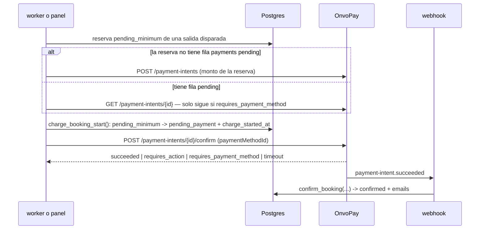
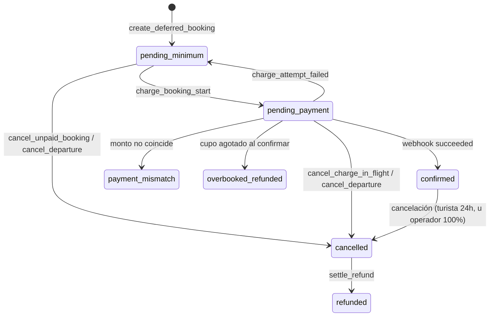

# 0029 — Cupo mínimo por salida y cobro diferido con tarjeta guardada

- **Estado**: in-review
- **Autor**: Kenneth (con Claude Code)
- **Creado**: 2026-08-13
- **Última actualización**: 2026-09-14
- **Rama**: (sin asignar — tres workstreams, ver §11)
- **PR**: (sin asignar)

> **Prerrequisito cumplido**: el spec 0028 está en `dev` (PRs #67, #68 y #69, mergeados el 2026-09-13). Las citas a archivo y línea de este spec se revalidaron contra ese código.

> **Historial de revisión.** Aprobado el 2026-08-13 con este mismo mecanismo. El 2026-09-13 se evaluó y **descartó** autorizar al reservar y capturar después (§5.1), y se volvió a este diseño con lo aprendido: la especificación OpenAPI de OnvoPay, la evidencia de sus suscripciones y seis rondas de revisión. **Requiere re-aprobación.**

## 1. Contexto y motivación

Hoy el turista paga al reservar: el checkout crea un payment intent, el widget de OnvoPay cobra y el webhook confirma. La salida se opera con la gente que haya.

Eso no refleja el negocio. Un tour tiene un piso de participantes por debajo del cual no es rentable salir. Cuando no se llega, el operador cancela — y hoy eso significa devolver plata ya cobrada, con la fricción y la comisión de cada reembolso.

Este spec invierte el orden: el turista deja su tarjeta guardada al reservar y **no se le cobra**. El cobro se ejecuta cuando la salida junta suficiente gente. Si no la junta, no hubo cobro que devolver.

Actores: **turista** (reserva sin cargo inmediato), **staff** (configura el mínimo y decide sobre salidas flojas), **operador** (deja de perder plata bajo el piso y en comisiones).

## 2. Objetivos

- Permitir reservar guardando la tarjeta, sin cargo hasta que la salida se confirme.
- Cobrar automáticamente a todas las reservas de una salida al alcanzar el mínimo del tour, sin importar cuánto falte para la fecha.
- Dar al staff información y controles para confirmar o cancelar una salida que llega a la ventana de decisión bajo el mínimo; o cancelarla automáticamente según la configuración del tour.
- Mantener al turista informado en cada transición: reserva registrada, cobro ejecutado, salida cancelada, problema con la tarjeta.
- Garantizar que ninguna reserva quede sin cobrar, sin cancelar y sin agenda — y que **jamás se cobre dos veces**.

## 3. Fuera de alcance

- **No se guarda la tarjeta para compras futuras.** El método de pago pertenece a esa reserva; no hay "mis tarjetas" ni checkout de un clic.
- **No se autoriza el monto al reservar ni se retienen fondos** (descartado en §5.1).
- **No se cambia la política de reembolso de 24h** (`shared/constants/policies.ts`) para cancelaciones del turista. Sí se define un camino nuevo para cancelaciones **iniciadas por el operador** (§5.8).
- **No se notifica al staff por email**; la notificación es en el panel.
- **No hay lista de espera** ni cambios a la prevención de sobreventa del spec 0025.
- **SINPE Móvil queda estructuralmente excluido**, no diferido: es un pago push y nunca podrá soportar un cobro con tarjeta guardada.
- **No se implementa cobro parcial ni seña.**
- **No se migran reservas existentes** (§11).
- **No se cambia el modelo de refunds** (un refund activo por reserva) **ni la unicidad de `notifications`**. El diseño depende de ambos y los protege (§5.6, §5.7).

## 4. Historias de usuario

> Como turista, quiero reservar dejando mi tarjeta sin que me cobren todavía, para no tener plata comprometida en una salida que quizás no se realice.

- [ ] Al reservar, el turista ve que **no se le cobró** y qué monto se le cobrará al confirmarse la salida.
- [ ] Autoriza explícitamente el cargo futuro; esa autorización queda registrada con fecha y versión de términos.
- [ ] Si su tarjeta vence antes de la fecha del tour, el checkout la rechaza y le pide otra.
- [ ] Recibe un email de "reserva registrada" con el monto y los últimos 4 dígitos de la tarjeta.
- [ ] Su cupo queda reservado desde ese momento.

> Como turista, quiero que me cobren y me avisen apenas la salida se confirma.

- [ ] Al alcanzar el mínimo, o cuando el staff confirma la salida, se cobra a todas las reservas pendientes y cada turista recibe el email de confirmación existente.
- [ ] El cobro ocurre aunque falten semanas para la fecha.
- [ ] Si la tarjeta es rechazada, recibe un email con enlace para actualizarla y su reserva sigue viva hasta el plazo de recuperación, aunque se hayan agotado los reintentos automáticos.
- [ ] Si el banco pide autenticación 3DS, recibe un enlace para completarla.
- [ ] Puede cancelar su reserva antes del cobro, sin cargo.

> Como staff, quiero enterarme de las salidas bajo el mínimo antes de la fecha, para decidir si la sostengo o la cancelo.

- [ ] Una salida que entra en la ventana bajo el mínimo aparece marcada en `/dashboard/departures` con asientos reservados vs mínimo.
- [ ] El staff puede **confirmar** (se cobra a todos) o **cancelar** (nadie es cobrado; los ya cobrados reciben reembolso total).
- [ ] En modo automático la salida se cancela sola y no aparece en la bandeja.

> Como staff, quiero configurar el mínimo y el modo de resolución por tour.

- [ ] El formulario de tours permite editar el mínimo (campo ya existente, hoy sin efecto) y elegir modo manual o automático.
- [ ] Una página de configuración permite fijar la ventana de decisión en horas, común a todos los tours.

## 5. Diseño técnico

### 5.1. Verificación de OnvoPay (documentación 2026-09-12, sandbox 2026-09-14)

Verificado contra la especificación publicada (`https://docs.onvopay.com/openapi.yaml`) y las guías (`https://docs.onvopay.com/en/llms-full.txt`). No hay proveedor nuevo, así que no aplica `external-services-vetting` completo; se documenta la capacidad:

- `POST /v1/customers` (secret key) crea el cliente; `POST /v1/payment-methods` se llama desde el navegador con la publishable key y un `customerId`. OnvoPay tokeniza y verifica la tarjeta (`cards.invalid_card_info` si falla); el `cvv` es opcional. `GET /v1/payment-methods/{id}` devuelve marca, últimos 4 dígitos, vencimiento y `customerId`.
- `POST /v1/payment-intents/{id}/confirm` con `paymentMethodId` cobra. Acepta solo `paymentMethodId`, `cvv`, `credixInstallmentMonths` y `returnUrl`: **no hay parámetro para declarar un cobro sin el cliente presente**. Acepta la secret key y también la **publishable key**, que es pública: quien tenga el id de un intent vivo podría intentar confirmarlo.
- **Evidencia de que la plataforma hace este cobro**: en cada renovación de un cargo recurrente, OnvoPay "genera una intención de pago para ese período y la confirma con el método de pago indicado", sin el cliente presente. La documentación no dice si un cobro único recibe el mismo tratamiento; se pregunta a OnvoPay (§13, Q1).
- Un intent rechazado **permanece** en `requires_payment_method` y se puede re-confirmar "indicando uno diferente". OnvoPay recomienda "exactamente un intent por pago".
- Estados de un intent: `requires_payment_method`, `requires_action`, `requires_capture`, `processing`, `succeeded`, `failed`, `refunded`, `partially_refunded`, `canceled`.
- 3DS: `requires_action` con `nextAction.redirectToUrl`, o `onvo.handleNextAction({ paymentIntentId })` cargando `https://js.onvopay.com/v1/`.
- Webhooks: `payment-intent.succeeded`, `payment-intent.failed` y `payment-intent.deferred`.
- `POST /v1/payment-intents/{id}/cancel` existe, pero **no documenta sobre qué estados funciona**.
- `POST /v1/payment-methods/{id}/detach` (irreversible) y `DELETE /v1/customers/{id}` existen.

**Descartado: autorizar al reservar y capturar después** (`captureMethod: "manual"`). Los "30 días" del OpenAPI son el plazo del sistema de OnvoPay; las marcas fijan la validez de una autorización online en **unos 7 días**, y los 30 días son una autorización extendida que la API de OnvoPay no expone, restringida a hotelería, alquiler de autos y cruceros. La anticipación de reserva quedaba en 5–6 días. **También descartado**: modelar cada reserva como cargo recurrente (`allow_incomplete`), que la presenta como recurrente ante la marca y arriesga un segundo cobro irreparable. Detalle y fuentes en `docs/onvopay-consulta-cobro-diferido.md`.

**Precondiciones verificadas en sandbox (2026-09-14).** Se corrieron contra `https://api.onvopay.com/v1` con llaves `onvo_test_*`: **`api.dev.onvopay.com` devuelve 503**, así que el modo de prueba vive en el mismo host de producción y lo determina la llave, no el dominio.

- **(a) CVV — resuelta, y a favor.** `POST /payment-intents/{id}/confirm` con `paymentMethodId` y **sin `cvv`** devolvió `succeeded`. Un cobro con tarjeta guardada no exige CVV. Era la precondición bloqueante.
- **(b) Reintento sobre el mismo intent — confirmado.** Un rechazo (`4000000000000002`) dejó el intent en `requires_payment_method`, y re-confirmarlo con otra tarjeta devolvió `succeeded`.
- **(c) Cancelar en `requires_action` — funciona.** Un intent en 3DS quedó `canceled`.
- **(d) Confirmar dos veces — seguro.** La segunda confirmación devolvió `400` con _"Payment Intent cannot be confirmed anymore as it is already in status succeeded"_, y el intent conservó **un solo charge**.
- **(e) Cancelar en `requires_payment_method` — funciona** (`canceled`).
- **Privacidad**: `detach` dejó el método en `detached`, `DELETE /customers/{id}` devolvió 200 y el `GET` posterior falla. La tokenización con la **publishable key** y el `GET /v1/payment-methods/{id}` con marca, últimos 4 dígitos, vencimiento y `customerId` también quedaron verificados.
- **(f) Webhook del `confirm` server-side**: **pendiente**, necesita una URL pública (ngrok) y el worker corriendo.

**Lo que el sandbox no puede responder**, y sigue dependiendo de OnvoPay o de datos de producción: si estos cobros se marcan como credencial almacenada ante el emisor, la tasa real de rechazo y de 3DS, el efecto de no enviar señales antifraude (§9), y la vigencia de una tarjeta guardada durante semanas, que se prueba dejando pasar el tiempo con el mismo `paymentMethodId`.

### 5.2. Recolección de la tarjeta, verificación y alcance PCI

El SDK embebido solo sabe cobrar un intent; **no puede guardar una tarjeta sin cobrar**. Con el flag encendido, el checkout pasa a un **formulario propio**:

1. El servidor crea el hold (`create_hold_atomic`) y un customer en OnvoPay (`POST /v1/customers`, secret key), y **guarda su id en el hold** (`tour_holds.customer_external_id`), del lado del servidor.
2. El navegador tokeniza la tarjeta con la publishable key y ese `customerId`.
3. El servidor recibe **solo el `paymentMethodId`** y obtiene todo lo demás con `GET /v1/payment-methods/{id}`. **Nunca confía en datos de la tarjeta enviados por el navegador.** Rechaza el método si su `customerId` no coincide con el guardado en el hold.
4. `create_deferred_booking` (§6) crea la reserva en `pending_minimum` y pasa el hold a `paying` **en la misma transacción**.

Hoy el checkout escribe la reserva (`web/lib/booking/create.ts:58`), el pago (`:91`) y el paso del hold a `paying` (`:107-108`) en sentencias separadas. Replicarlo podría dejar una `pending_minimum` con el hold `active`, que vence a los 15 minutos: contaría para el mínimo sin ocupar cupo. De ahí la función atómica.

**Checkout abandonado**: cuando un hold con `customer_external_id` vence o se libera sin reserva, `close-payment-intents` borra el customer en OnvoPay (§5.9). `release-expired-holds` no puede hacerlo: es un `UPDATE` masivo sin HTTP. Sin esto quedarían datos del turista en el proveedor sin ninguna reserva que los justifique (spec 0022).

**Consecuencia de cumplimiento, decidida y aceptada por el usuario (2026-08-13)**: se pasa de **SAQ A** a **SAQ A-EP**, aunque los datos nunca toquen nuestro servidor. Es obligación del **cliente** (el comercio). Se suma al `pre-production-checklist`.

Reglas no negociables:

- PAN, CVV y expiración **nunca** llegan a nuestro backend, ni a logs, ni a Sentry.
- **El formulario envía el CVV al tokenizar**, para no subir la tasa de rechazo de la verificación inicial. El CVV no se guarda nunca; si el cobro lo exigiera, rige la precondición (a).
- **Una tarjeta, una reserva viva**: índice único parcial sobre `bookings.payment_method_id` en `pending_minimum` y `pending_payment`.
- **Tarjeta que vence antes del tour**: rechazada si su vencimiento (último día del mes) es anterior a la fecha de la salida en hora de Costa Rica, con los datos del `GET`.
- **La página de actualización de tarjeta aplica las mismas reglas**: `GET`, `customerId` igual al de la reserva, vencimiento e índice único. Además hace `detach` del método reemplazado.
- **CSP** (`web/lib/security/csp.ts`, con nonces y `strict-dynamic` desde el spec 0024):
  - El SDK se inyecta hoy con `document.createElement('script')` desde el bundle con nonce (`web/components/public/CheckoutForm/OnvoPaymentWidget.tsx:45-55`, `csp.ts:41`). La librería de 3DS se carga igual, **nunca** con un `<script src>` estático sin nonce.
  - `connect-src` ya permite `https://api.onvopay.com` (`csp.ts:17,45`), que es **también el host de sandbox**: el modo lo define la llave, no el dominio (`api.dev.onvopay.com` devuelve 503). Solo falta exponer la base URL como env **pública** para el formulario.
  - `frame-src https://*.onvopay.com` (`csp.ts:18,46`) cubre `checkout.onvopay.com`. El desafío 3DS del emisor puede chocar con `frame-src` y `form-action 'self'` (`csp.ts:46,49`): la prueba de 3DS corre con la CSP en modo enforce.
- **Mandato de credencial almacenada**: texto explícito en el checkout ("autorizo el cargo de $X cuando la salida se confirme") y evidencia con `consent_at`/`consent_version` (spec 0021).

### 5.3. El cobro diferido reusa el pipeline de dinero existente

Decisión central: **no se construye un camino de confirmación paralelo**. Todo el endurecimiento acumulado (idempotencia por evento, validación de monto, guarda de sobreventa, auditoría) vive en `confirm_booking` y se activa con el webhook. El cobro diferido solo **origina** el pago.

**Cambios obligatorios a `confirm_booking`.** La migración `…040:182` documenta que _"desde acá `v_booking.status = 'pending_payment'` (el CHECK de bookings agota los estados posibles)"_. Es un **fall-through**, no un gate positivo: al sumar `pending_minimum` al CHECK, un webhook con la reserva en ese estado confirmaría **sin haber pasado por el cobro**. Por eso:

- `confirm_booking` detecta dos situaciones anómalas: la reserva está en `pending_minimum`, o tiene `payment_method_id IS NOT NULL` (flujo diferido) y `charge_started_at IS NULL`. La función **no lee el feature flag** —SQL no ve las variables de entorno—: el flujo se deduce de la reserva.
- **Esas situaciones solo cambian el outcome.** Ejecutan en el mismo orden la guarda de monto (desde `…040:185`), la de sobreventa (hasta `…040:284`) y la confirmación. Sin guarda activada devuelven `confirmed_unclaimed`, con auditoría; con una guarda activada, su outcome propio.
- **La alerta la emiten los callers.** `worker/src/reconciliation/recover.ts` tiene un `switch` (`:62`) cuyo `default:` (`:82`) se traga outcomes desconocidos, y el webhook (`web/app/api/webhooks/onvopay/route.ts:102-122`) es una cadena de `if/else` que también los ignora. Ambos tratan `confirmed_unclaimed` explícitamente.
- `flag_payment_mismatch` (`…040:368`) también gatea por `pending_payment` y se extiende igual.

### 5.4. Colisión con el reconciliador

`fetchStalePendingBookings` filtra por `.lt('created_at', olderThanIso)` (`worker/src/reconciliation/repository.ts:53`): una reserva creada hace tres semanas es "stale" en el primer ciclo apenas pasa a `pending_payment`, y `cancel_stale_pending_booking` la cancelaría destruyendo el camino de reintentos.

- Nueva columna `bookings.charge_started_at`, fijada en cada intento. El reconciliador excluye las reservas que la tienen: su ciclo lo posee el worker de cobro. El criterio es por **presencia, no por contador**, porque `charge_attempts` vale 0 en el primer intento.
- **El gate va dentro de la función.** Filtrar solo en la consulta deja un TOCTOU. `cancel_stale_pending_booking` (`…036:281`) ya toma `FOR UPDATE` (`:293`) y gatea por estado (`:299`); bajo ese lock se agrega `IF v_booking.charge_started_at IS NOT NULL THEN RETURN false`. **Ninguna función que cancela una `pending_payment` depende de que el caller haya filtrado.** Para que el dueño legítimo cierre su propio ciclo existe `cancel_charge_in_flight` (§6); la otra única vía es `cancel_departure`, para la cohorte de cobros en vuelo de §5.8.
- El mapeo peligroso es `requires_payment_method → NotPaid` (`worker/src/reconciliation/onvopay.ts:41`), no `requires_action` (`:43`).
- `recover.ts:30` toma `booking.payments[0]`. Si alguna vez hubo que crear un intent nuevo, puede haber más de una fila; `reconcile-pending-payments` recorre todas las no terminales.

### 5.5. Capacidad, holds, disparo y unidad de trabajo

Una reserva `pending_minimum` ocupa cupo desde que se crea, reusando **tal cual** la Capa 1 del spec 0025: el hold queda en `paying` (§5.2), `create_hold_atomic` lo cuenta y `release-expired-holds` no lo toca. No se modifica `create_hold_atomic`.

**El mínimo se cuenta en asientos**: `pending_minimum` + `pending_payment` con `charge_started_at` + `confirmed`.

**Disparo.** Una salida está **disparada** cuando `minimum_charge_triggered_at IS NOT NULL`, sin importar cómo se disparó. Hay dos formas, ambas bajo lock de la instancia y con snapshot del mínimo y los asientos:

- **Automática**: `charge-bookings` detecta el mínimo alcanzado y fija `minimum_charge_triggered_at`, `minimum_resolution = 'reached'` y `minimum_resolved_at`.
- **Manual**: "Confirmar salida" llama a `confirm_departure`, que fija `minimum_charge_triggered_at`, `minimum_resolution = 'staff_confirmed'`, `minimum_resolved_at` y `minimum_resolved_by`. Sin esto, una salida confirmada a mano saldría con todas sus reservas sin cobrar.

**El disparo es terminal.** `resolve-minimum-window` solo selecciona salidas con `minimum_resolved_at IS NULL`: nunca cancela una salida disparada, aunque sus cobros fallen. Las reservas cuyo cobro falla reciben el aviso para reintentar con otra tarjeta (§5.7) hasta su plazo; el staff ve bajar los asientos y decide si cancela la salida (§5.8). Decidido por el usuario (Q7).

**La unidad de trabajo del cobro es la RESERVA, no la salida.** Si el worker muere a mitad del lote, ninguna reserva puede quedar fuera de toda selección:

> reservas `pending_minimum` de una salida disparada, con `charge_attempts = 0` **o** `charge_next_attempt_at <= now()`, y `now() < recovery_deadline` si hubo un fallo.

Sin margen o con los reintentos agotados, `charge_next_attempt_at` queda nulo y la reserva **no se selecciona**: una tarjeta rechazada no se re-confirma cada minuto, patrón que las marcas penalizan. Actualizar la tarjeta lo fija en `now()`.

Invariante a sostener y testear: _toda reserva de una salida disparada termina cobrada, reintentada o cancelada; **ninguna queda sin dueño en ningún estado**._ Una reserva **nueva** sobre una salida ya disparada se cobra de inmediato.

**Watchdog de cobros en vuelo** (job `watch-charges`, §5.9). Barre las `pending_payment` con `charge_started_at` de hace más de 30 minutos y resuelve cada intent por `GET`:

| Estado del intent                                     | Acción                                                                                                                               |
| ----------------------------------------------------- | ------------------------------------------------------------------------------------------------------------------------------------ |
| `requires_action` con `awaiting_action_until > now()` | Nada: el turista está autenticando                                                                                                   |
| `requires_action` con `awaiting_action_until` nulo    | `charge_requires_action`: registra el plazo y envía el enlace                                                                        |
| `requires_action` con el plazo vencido                | `cancel_charge_in_flight` (§5.7)                                                                                                     |
| `succeeded`                                           | Confirma por el camino de `recover()`, con validación de monto                                                                       |
| `requires_payment_method`                             | `charge_attempt_failed`, intent re-confirmable                                                                                       |
| `canceled` o `failed`                                 | `charge_attempt_failed`, intent terminal                                                                                             |
| `processing`                                          | Espera; con más de 24 h desde `charge_started_at`, alerta de nivel error y nunca cancela, porque el dinero puede estar en movimiento |

**Orden de evaluación del watchdog**: primero el `GET`. `succeeded` confirma, y `processing` espera y alerta aunque el plazo haya vencido; recién en los demás casos, al vencer el plazo, cancelar tiene precedencia sobre intentar.

### 5.6. Anti-doble-cobro: el invariante que sostiene todo

Un doble cobro **no se puede reparar**: `refunds_one_active_per_booking` (`…018:47`) admite un solo refund activo por reserva, y `cancel_booking` elige un único pago (`…042:89-93`) capando con `LEAST` (`:100`). Por eso el diseño **garantiza por construcción** un solo intent vivo por reserva:

- **El discriminador es la fila `pending` de `payments`.** Si la reserva no tiene ninguna —nunca hubo, o la anterior es terminal—, se crea un intent nuevo. Si tiene una, se reutiliza ese intent. La fila sigue `pending` mientras el intent es re-confirmable.
- **Verificar antes de re-confirmar.** Todo reintento (worker, watchdog o panel) hace `GET` antes del `POST /confirm`: solo re-confirma sobre `requires_payment_method`; con `succeeded` confirma por `recover()` y **nunca** re-confirma ni crea otro; con `processing` o `requires_action` no hace nada en ese ciclo.
- **"Terminal", a efectos de crear otro intent, significa solo `canceled` o `failed`.** `succeeded`, `refunded` y `partially_refunded` **nunca** habilitan uno nuevo. Si el anterior sigue en `requires_payment_method` y no se puede reutilizar, primero `POST /cancel` y se exige `GET = canceled`; si no, no se crea nada y se alerta. Es la regla espejo de refunds (`worker/src/refunds/handle-refund.ts:47-51`).
- **Índice único parcial** `payments (booking_id) WHERE status = 'pending'`.
- **Ningún intent sin su fila.** Cuando se crea un intent nuevo, se crea justo antes de `charge_booking_start`; si esta falla, ese intent recién creado se cancela best-effort (patrón 0028 A1). Un intent reutilizado se conserva: `charge_booking_start` es atómica y su fallo no mueve la reserva.
- **El código HTTP no dice el resultado** (verificado en sandbox, §5.1). Un rechazo devuelve `201` con `status: requires_payment_method`, y confirmar un intent ya cobrado devuelve `400` con _"already in status succeeded"_. El worker decide siempre por `status`, trata ese `400` como **ya cobrado** —nunca como rechazo— y relee con `GET`.
- **Escrituras condicionales con rowcount** (`WHERE id = ? AND status = …`). Rowcount 0 ⇒ alerta y **no** reintentar.

### 5.7. Reintentos, 3DS y plazo de recuperación

Los fallos se registran con dos funciones condicionales, ambas con gate `status = 'pending_payment' AND charge_started_at IS NOT NULL`.

**Rechazo — `charge_attempt_failed`.**

- La reserva vuelve a `pending_minimum`; la fila de pago sigue `pending` si el intent es re-confirmable, o pasa a `failed` si es terminal. Se incrementa `charge_attempts` y se guarda `charge_last_error`.
- En el primer fallo fija `recovery_deadline = GREATEST(inicio de la ventana de decisión, now() + 6 h)`, nunca posterior a `starts_at`.
- **Hay margen si `recovery_deadline − now() ≥ 2 h`.** Con margen, agenda `charge_next_attempt_at = LEAST(now() + backoff, recovery_deadline)` (backoff de 1 h, 6 h y 24 h). Sin margen, no agenda reintentos automáticos y la reserva espera la cancelación en `recovery_deadline`.
- **En ambos casos encola el aviso** con enlace para actualizar la tarjeta, válido hasta `recovery_deadline`: `charge_failed_action_required_1`, `_2` o `_3`. Decidido por el usuario (Q7): todo cobro fallido se notifica para que el turista reintente.
- **Agotar los tres reintentos no cancela antes de `recovery_deadline`** (Q8). Tras el tercero, `charge_next_attempt_at` queda nulo. Si el turista actualiza la tarjeta mientras `now() < recovery_deadline`, se agenda un intento inmediato.
- **Al vencer `recovery_deadline`, cancelar tiene precedencia sobre intentar.** `watch-charges` cancela con `cancel_unpaid_booking` (reserva en `pending_minimum`) o con `cancel_charge_in_flight` (cobro en vuelo).

**3DS — `charge_requires_action`.**

- La reserva queda en `pending_payment` con `awaiting_action_until`, calculado como `recovery_deadline`. **Nunca queda nulo** tras esta llamada: sin margen se fija igual y el enlace se envía igual, así el watchdog cancela al vencer y no vuelve a entrar por "plazo nulo". Encola `charge_requires_action` con enlace a `/booking/[token]/authenticate`, que completa la autenticación con `handleNextAction`.
- **Cancelación confirmada**: el sandbox demostró que `cancel` sobre `requires_action` deja el intent en `canceled` (§5.1), así que al vencer el plazo se cancela de verdad y el turista ya no puede autenticarlo tarde. Igual rige la regla de §5.6: no se crea un intent nuevo hasta ver el anterior `canceled`.
- Vencido el plazo, `watch-charges` llama a `cancel_charge_in_flight` (reserva cancelada, pago `failed`, hold liberado) e intenta cancelar el intent. Si el turista autentica tarde y el cobro liquida, la rama `cancelled` de `confirm_booking` acepta pagos `pending` o `failed` (`…040:144-154`) y encola el refund total por `late_payment_refunded`. Si el webhook se pierde, lo detecta `close-payment-intents` (§5.9).

**Notificaciones: la unicidad no se toca.** `UNIQUE (booking_id, kind)` (`…013:41`) es el árbitro de los `ON CONFLICT` vigentes de `confirm_booking` (`…040:281`, `:315` y `:326`), `cancel_booking` (`…042:80`) y `settle_refund` (`…036:373`). Cambiarla las rompería **en tiempo de ejecución** sin que la migración falle. El aviso repetido usa tres valores de `kind` en el CHECK que la migración ya edita. `notifications.attempts` (`…013:33`) es otra cosa: el contador de reintentos de envío.

Los enlaces usan el patrón de token del spec 0011: **cada email emite el suyo** con `issueBookingToken` (`worker/src/notifications/booking-token.ts:20-35`; ver `:17-18`).

### 5.8. Cancelación: cohortes con efectos distintos

`cancel_booking` decrementa `capacity_reserved`, que en una `pending_minimum` nunca se incrementó (solo lo hace `confirm_booking`, `…040:289`), y no toca `tour_holds`. Reusarlo a ciegas dejaría el contador desfasado y holds `paying` colgados.

| Cohorte                            | Hold           | `capacity_reserved` | Pago                             | Refund                      |
| ---------------------------------- | -------------- | ------------------- | -------------------------------- | --------------------------- |
| `pending_minimum`                  | → `released`   | sin cambio          | sin fila, o `pending` → `failed` | ninguno                     |
| `pending_payment` (cobro en vuelo) | → `released`   | sin cambio          | `pending` → `failed`             | vía `late_payment_refunded` |
| `confirmed`                        | ya `converted` | −asientos           | `succeeded`                      | **total, sin política 24h** |

- **Toda cancelación del flujo diferido deja el pago en `failed`**, con `failed_at`. No queda ninguna fila `pending` sobre una reserva cancelada, así que todo intent potencialmente vivo entra al barrido de §5.9. Un intent en `requires_payment_method` no retiene fondos, pero **puede seguir siendo pagable** con la publishable key (§5.1).
- La cohorte `pending_payment` se cancela **de inmediato**: `cancel_departure` es SQL y no puede hacer HTTP. Si el cobro liquida después, `late_payment_refunded` (`…040:144-179`) encola el refund total, porque acepta pagos `failed` (`:147`).
- **Las reservas no confirmadas no pasan por `cancel_booking`.** Una cancelación **iniciada por el operador** reembolsa el 100% siempre: `computeRefund` (binario 24h) es para el turista, y la ventana de decisión por defecto cae justo sobre su borde.
- **El turista puede cancelar una `pending_minimum`**, cosa que hoy es imposible: `cancel_booking` corta con `IF v_booking.status <> 'confirmed' THEN RETURN` (`…042:55`) y `web/lib/booking/cancel.ts:106` devuelve `NotCancellable`. `cancel_unpaid_booking` libera el hold, pasa el pago a `failed`, audita y encola el email. **Rechaza** un cobro en vuelo, y la UI pide reintentar en unos minutos.

### 5.9. Jobs del worker y protección de intents vivos

Cuatro jobs nuevos, self-contained (sin `@shared` en runtime), con guard `isRunning`, aislamiento por ítem y graceful shutdown (patrón 0028):

- **`watch-charges`** (cada minuto, **workstream B**): el watchdog de §5.5 y la aplicación de plazos de §5.7. Existe desde B porque el cobro manual del panel ya puede terminar en 3DS, timeout o webhook perdido, y no puede quedar sin dueño. Incluye la **red terminal de `pending_minimum`**: alerta en el panel toda reserva `pending_minimum` cuya salida entra en la ventana de decisión sin haberse cobrado, y al llegar a `starts_at` la cancela con `cancel_unpaid_booking` (razón `departure_started`) y aviso, **esté o no disparada la salida**. En C, `resolve-minimum-window` y el barrido terminal actúan antes; esta regla queda como red.
- **`close-payment-intents`** (cada 5 min, **workstream B**): **barrido de intents no cerrados.** Selecciona las filas `failed` con `provider_closed_at IS NULL` de reservas canceladas del flujo diferido (`payment_method_id IS NOT NULL`), durante 7 días desde `payments.failed_at`. Una fila `pending` sobre una reserva cancelada no debería existir (§5.8); si aparece, entra igual y alerta. Por cada intent hace `GET`:
  - `succeeded`: llama a `confirm_booking` con el monto pagado y `p_event_id = external_payment_id`, la misma clave que usa el webhook (`web/lib/payments/adapters/onvopay.ts:117-119`), así un webhook tardío devuelve `already_processed`. El outcome esperado es `late_payment_refunded`; un `ignored` alerta de inmediato con nivel error.
  - `requires_action` o `requires_payment_method`: reintenta `POST /cancel`.
  - `canceled` o `failed`: fija `provider_closed_at`.

  A los 7 días sin cierre, alerta con nivel error. El panel permite entonces registrar `provider_closed_at` a mano, con auditoría y actor, tras verificar el intent en el dashboard de OnvoPay; es la única otra forma de liberar la exclusión de retención (§6).

  El mismo job **limpia los customers de checkouts abandonados**: selecciona holds `expired` o `released` con `customer_external_id`, sin reserva y con `customer_cleaned_at IS NULL`; hace `detach` del método de pago que exista y `DELETE` del customer, y fija `customer_cleaned_at`. Un fallo se reintenta en el ciclo siguiente.

- **`charge-bookings`** (cada minuto, workstream C): disparo automático, cobro de las reservas seleccionadas (§5.5) y reintentos agendados.
- **`resolve-minimum-window`** (cada 5 min, workstream C): salidas en la ventana con `minimum_resolved_at IS NULL` que no alcanzaron el mínimo → cancelación automática o marca para decisión del staff. Barre también **rezagados** (salidas ya pasadas sin resolver, si el worker estuvo caído) y el **barrido terminal** (salidas disparadas que llegan a T-0 con reservas `pending_minimum`, que se cancelan con aviso).

**Páginas que exponen un intent.** Las páginas de 3DS y de actualización de tarjeta solo se muestran en su estado: `pending_payment` con `awaiting_action_until > now()`, o `pending_minimum`. Sobre una reserva cancelada muestran "esta reserva fue cancelada" y **nunca entregan el id del intent**.

**Baja de datos del lado de OnvoPay.** SQL no puede llamar a OnvoPay: el `detach` del método de pago y después el `DELETE` del customer los hace **el caller antes de la función SQL** (`apply-retention` y la acción del panel). La protección de filas de pago con intent abierto **vive en SQL**, no en el caller (§6, retención).

### 5.10. Adapter pattern

Las llamadas nuevas a OnvoPay no pueden quedar sueltas sin romper la decisión de aislar la pasarela (`lib/payments/adapters/`, decisión 2026-05-19, PayPal post-MVP). `PaymentProvider` suma `createCustomer`, `getPaymentMethod`, `confirmWithPaymentMethod`, `cancelPaymentIntent`, `getPaymentIntent`, `detachPaymentMethod` y `deleteCustomer`. La tokenización y el 3DS quedan detrás de costuras del lado cliente (`tokenizeCard`, `handleNextAction`). El cliente de cobro del worker espeja `worker/src/refunds/` (`onvopay.ts` + `repository.ts` + `handle-charge.ts`).

### 5.11. Panel

- **Formulario de tours**: `min_participants` **ya existe y es editable** (`web/components/tours/TourBasicInfoSection.tsx:119`, validado en `web/lib/tours/types.ts:50-58` y por el CHECK de `…004:15`); falta que **tenga efecto**. Se agrega el toggle `auto_cancel_below_minimum`.
- **`/dashboard/settings`** (admin): ventana de decisión en horas.
- **`/dashboard/departures`**: asientos reservados vs mínimo; las salidas que requieren decisión, destacadas arriba con **Confirmar salida** (`confirm_departure`) y **Cancelar salida** (`cancel_departure`), auditadas con el actor.
- **Cobro manual (workstream B)**: un botón cobra una reserva `pending_minimum` con las mismas funciones del worker. Tras un rechazo, **Volver a cobrar** re-confirma el mismo intent después del `GET` de §5.6.
- **Ocupación**: `capacity_reserved` solo lo mueve `confirm_booking`, así que los asientos comprometidos se exponen aparte en reportes y en la vista del guía.

## 6. Modelo de datos

Migración: `supabase/migrations/20260913000043_minimum_participants_deferred_charge.sql`.

**`tours`**: `auto_cancel_below_minimum boolean NOT NULL DEFAULT false`. (`min_participants` ya existe.)

**`tour_holds`**: `customer_external_id text NULL`, el customer creado en el checkout (§5.2), y `customer_cleaned_at timestamptz NULL`, la marca de limpieza en OnvoPay (§5.9).

**`bookings`**:

- `payment_method_id text NULL`, `customer_external_id text NULL`, `card_brand text NULL`, `card_last4 text NULL CHECK (card_last4 ~ '^[0-9]{4}$')`, `card_exp_month smallint NULL`, `card_exp_year smallint NULL`.
- `charge_attempts integer NOT NULL DEFAULT 0`, `charge_next_attempt_at timestamptz NULL`, `charge_started_at timestamptz NULL`, `charge_last_error text NULL` (código, no el mensaje crudo).
- `awaiting_action_until timestamptz NULL`, `recovery_deadline timestamptz NULL`.
- CHECK de `status` con `pending_minimum`, y `CHECK (status <> 'pending_minimum' OR payment_method_id IS NOT NULL)`.
- Índice único parcial `(payment_method_id) WHERE status IN ('pending_minimum', 'pending_payment')`.
- `total_amount_cents` **inmutable tras el INSERT** (trigger): es el monto del mandato (§5.2).

**`payments`**: `failed_at timestamptz NULL` (lo fija toda función que pasa una fila a `failed`) y `provider_closed_at timestamptz NULL`. Índice único parcial `(booking_id) WHERE status = 'pending'`; índice `(booking_id) WHERE status = 'failed' AND provider_closed_at IS NULL`.

**`notifications`**: nuevos valores en el CHECK de `kind` (`…036:43-52`): `booking_reserved`, `departure_cancelled_minimum`, `charge_failed_action_required_1`, `_2`, `_3` y `charge_requires_action`. **La unicidad `(booking_id, kind)` no cambia.**

**`tour_instances`**: `minimum_charge_triggered_at`, `staff_decision_required_at`, `minimum_resolved_at` (`timestamptz NULL`), `minimum_resolved_by uuid NULL REFERENCES users(id)`, `minimum_resolution text NULL CHECK (IN ('reached','staff_confirmed','staff_cancelled','auto_cancelled'))`, y el snapshot `min_participants_at_trigger`, `seats_at_trigger`.

**`business_settings`** (fila única): `id smallint PRIMARY KEY DEFAULT 1 CHECK (id = 1)`, `minimum_decision_window_hours integer NOT NULL DEFAULT 24 CHECK (BETWEEN 1 AND 720)`, `updated_at`, `updated_by`. RLS: lectura admin/staff, escritura admin; grants explícitos (spec 0027).

**Otros índices**: `bookings (tour_instance_id) WHERE status = 'pending_minimum'`; `bookings (charge_next_attempt_at) WHERE charge_next_attempt_at IS NOT NULL`; `tour_instances (starts_at) WHERE minimum_resolved_at IS NULL`.

**Funciones** (todas `SECURITY DEFINER`, `search_path=''`, `REVOKE EXECUTE FROM PUBLIC, anon, authenticated`, guard `is_public_request()`):

- `create_deferred_booking(...)` — inserta la reserva en `pending_minimum`, con los datos de tarjeta obtenidos por el servidor, el customer del hold y la evidencia de consentimiento, y pasa el hold `active → paying`, en una transacción. Monto server-side (spec 0015).
- `charge_booking_start(p_booking_id, p_external_payment_id)` — `pending_minimum → pending_payment` y fija `charge_started_at`. **Si la reserva no tiene fila `pending`** (primer intento, o anterior terminal) inserta una; si la tiene, exige ese mismo `external_payment_id`. Deriva el monto de `bookings.total_amount_cents`.
- `charge_attempt_failed(p_booking_id, p_error_code, p_intent_terminal)` — §5.7. Con `p_intent_terminal = true` fija también `provider_closed_at`, porque el `GET` ya comprobó el cierre.
- `charge_requires_action(p_booking_id)` — fija `awaiting_action_until` con la regla de margen y encola `charge_requires_action` (§5.7).
- `cancel_charge_in_flight(p_booking_id, p_reason)` — junto con `cancel_departure` para la cohorte de cobros en vuelo de §5.8, **la única** que cancela una `pending_payment` con `charge_started_at`; la invoca solo `watch-charges`. Bajo `FOR UPDATE` exige, según la razón, `awaiting_action_until < now()` o `recovery_deadline < now()`. Cancela, pago `pending → failed`, hold `paying → released`, audita y avisa.
- `cancel_unpaid_booking(p_booking_id, p_actor_id, p_reason)` — cancela una `pending_minimum`: hold liberado, pago `pending → failed`. Actor nulo si cancela el turista.
- `confirm_departure(p_instance_id, p_actor_id)` — disparo manual (§5.5).
- `cancel_departure(p_instance_id, p_actor_id, p_resolution)` — atómica, aplica §5.8.
- `confirm_booking` y `flag_payment_mismatch` — DROP + CREATE con los cambios de §5.3.
- `cancel_stale_pending_booking` — CREATE OR REPLACE desde `…036:281`, con el gate de §5.4.
- `anonymize_booking_pii_by_email` y `purge_unpaid_bookings` — ver retención.
- **No se tocan** `cancel_booking` (`…042:27`) ni `settle_refund` (`…036:336`).

**Retención y baja de datos (spec 0022).** `purge_unpaid_bookings` (`…034:197`, corte de 90 días en `worker/src/jobs/retention-windows.ts:9`) y `anonymize_booking_pii_by_email` (`…034:43`, borrado desde `:93`) borran reservas sin pago `succeeded`/`refunded`. Ambas excluyen **en SQL**:

- reservas `pending_minimum`, o `pending_payment` con `charge_started_at`;
- reservas con alguna fila de `payments` en `pending`, o en `failed` con `provider_closed_at IS NULL`.

Borrar una fila con el intent abierto haría que una liquidación tardía respondiera `payment_not_found` (`route.ts:53-56`): plata sin reserva ni refund. Una baja a pedido sobre una reserva viva la cancela primero y espera el cierre del intent.

**Artefactos**: `BookingStatus.PendingMinimum`; los `NotificationKind` y `AuditAction` nuevos; copias locales del worker; i18n ES/EN; y la **edición a mano de `web/types/database.ts`** (nunca `pnpm db:types`).

## 7. Estados y transiciones

Estado nuevo: **`pending_minimum`** — tarjeta guardada, cupo ocupado, sin cobro.

**Salida**: `reached` (automático) y `staff_confirmed` (`confirm_departure`) fijan el disparo; ambos, igual que `staff_cancelled` y `auto_cancelled`, son terminales.

**`payments`**: la fila nace `pending` y **sigue `pending` durante los reintentos** mientras el intent es re-confirmable. Termina en `succeeded` (webhook) o en `failed` con `failed_at` (intent terminal o cualquier cancelación). Recibe `provider_closed_at` cuando el barrido comprueba el cierre en OnvoPay. Solo sin fila `pending` puede nacer otra.

**`tour_holds`**: `active → paying` en `create_deferred_booking`; `paying → released` en las tres cancelaciones; `paying → converted` en `confirm_booking`. Un hold `active` con customer y sin reserva vence y dispara la limpieza en OnvoPay (§5.2).

## 8. Casos borde y errores

- **Worker muere a mitad del lote.** Selección por reserva (§5.5).
- **El staff confirma una salida bajo el mínimo.** `confirm_departure` la dispara y sus reservas se cobran en el ciclo siguiente (§5.5).
- **Webhook sobre `pending_minimum`, o `succeeded` sobre una reserva diferida sin `charge_started_at`.** Mismas guardas; outcome `confirmed_unclaimed` con alerta (§5.3).
- **El reconciliador y el worker de cobro compiten por una reserva.** Gate dentro de `cancel_stale_pending_booking` (§5.4).
- **El cobro liquidó pero se registró como rechazo, y el webhook se perdió.** El siguiente reintento hace `GET`, ve `succeeded` y confirma; nunca re-confirma (§5.6).
- **Reintento con el intent anterior terminal.** No hay fila `pending`: nace un intent nuevo (§5.6).
- **3DS con plazo nulo** (el worker murió antes de registrarlo). `watch-charges` lo registra y envía el enlace (§5.5).
- **3DS abandonado.** `cancel_charge_in_flight` al vencer; si liquida tarde, `late_payment_refunded`; si además se pierde el webhook, `close-payment-intents` (§5.7, §5.9).
- **Intent en `processing` por más de 24 h.** Alerta de nivel error; nunca se cancela solo (§5.5).
- **Salida cancelada con un cobro en vuelo y webhook perdido.** El pago quedó `failed` y el barrido lo detecta y reembolsa (§5.8, §5.9).
- **Alguien intenta pagar un intent de una reserva cancelada.** Las páginas nunca entregan su id; si igual liquida, el barrido lo reembolsa.
- **Barrido y webhook llegan ambos por el mismo cobro tardío.** El segundo recibe `already_processed` por el `p_event_id` compartido (§5.9).
- **Checkout abandonado.** No hay reserva; el hold vence y el worker borra el customer en OnvoPay (§5.2).
- **`paymentMethodId` de otro customer, o tarjeta ya usada en otra reserva viva.** Rechazado, en el checkout y en la actualización de tarjeta (§5.2).
- **Tarjeta que vence antes del tour.** Rechazada con datos obtenidos por el servidor (§5.2).
- **Rechazo con poco margen.** Sin reintentos automáticos; el aviso con enlace sale igual y la reserva se cancela en `recovery_deadline` (§5.7).
- **Todos los cobros de una salida fallan.** La salida sigue disparada; las reservas se cancelan al vencer su plazo y el staff decide (§5.5, Q7).
- **El turista cancela con un cobro en vuelo.** Rechazado; la UI pide reintentar (§5.8).
- **Purga o baja de datos con un intent abierto.** Excluida en SQL (§6).
- **El admin baja el mínimo.** Se lee en vivo y puede disparar cobros; subirlo **no** descobra una salida disparada.
- **Dos acciones sobre la misma salida a la vez** (dos miembros del staff, o el staff y el disparo automático). `FOR UPDATE` sobre la instancia y verificación de `minimum_resolved_at IS NULL`.
- **Salida cancelada con alguien ya cobrado.** Refund total sin política 24h (§5.8).
- **Salida disparada que llega a T-0 con reservas sin cobrar.** Barrido terminal (§5.9).
- **Worker caído por días.** Barrido de rezagados y alerta de liveness (§11). Sin worker no se cobra: es un riesgo operativo.
- **`reminder_24h` en el pasado.** `…040:317-326` lo agenda en `starts_at - 24h`; si la confirmación cae dentro de esas 24 h, se omite.
- **Archivar un tour con reservas `pending_minimum`.** `web/lib/tours/archive-action.ts:72` hoy solo bloquea por `PendingPayment`/`Confirmed`: hay que incluir el estado nuevo **desde el workstream B**, o el archivado cancela las salidas y deja esas reservas vivas.
- **Reserva `pending_minimum` que nadie cobra en el workstream B.** La red terminal de `watch-charges` la cancela al llegar a `starts_at` (§5.9).

## 9. Impacto en otras áreas

- **Panel**: toggle de tours, `/dashboard/settings`, bandeja de decisión, columnas de mínimo y cobro manual.
- **Portal**: formulario de tarjeta propio; éxito y detalle distinguen "reservado, sin cargo" de "cobrado"; páginas de actualización de tarjeta y de 3DS, visibles solo en su estado.
- **Emails** (ES y EN): `booking_reserved`, `departure_cancelled_minimum`, el aviso de tarjeta rechazada (una plantilla para sus tres `kind`) y `charge_requires_action`. `booking_confirmation` se reusa para el cobro exitoso.
- **Worker**: cuatro jobs nuevos, reconciliador ajustado (§5.4), limpieza de customers de checkouts abandonados, retención con baja en OnvoPay.
- **Reportes**: los ingresos se corren al mes del cobro; ocupación y "pasajeros confirmados" (spec 0009) necesitan los asientos comprometidos; `report_refunds_summary` (`…036:395`) cuenta toda `cancelled` en la tasa de cancelación, así que las cancelaciones por mínimo se separan con `minimum_resolution` o la auditoría.
- **Auditoría**: toda decisión de dinero deja entrada en `audit_logs` (disparo con snapshot, intentos con código, cancelaciones por plazo, cierres del barrido).
- **Seguridad**: superficie nueva en el navegador, SAQ A-EP y cambios de CSP ⇒ pasada de auditoría antes del cutover.

## 10. Plan de tests

**Unit**: conteo de asientos (con cobros en vuelo); `recovery_deadline`, regla de margen de 2 h y `charge_next_attempt_at = LEAST(...)`; precedencia de cancelar sobre intentar al vencer el plazo; selección por ventana con día CR; tarjeta que vence antes de la salida (último día del mes, hora CR); decisión del watchdog por cada estado del `GET`, incluidos `requires_action` con plazo nulo y `processing` de más de 24 h; discriminador de intent nuevo por fila `pending`; omisión del `reminder_24h` en el pasado.

**Integración (Supabase local)**:

- **Regresión de funciones de dinero tras migrar**: `cancel_booking`, `settle_refund` y la rama de sobreventa de `confirm_booking` siguen funcionando.
- **`create_deferred_booking` atómica**; y verificación de `customerId` contra el hold, en el checkout y en la actualización de tarjeta.
- **Disparo automático** una sola vez, con `reached`; **`confirm_departure`** sobre una salida bajo el mínimo ⇒ sus reservas se cobran en el ciclo siguiente.
- **`resolve-minimum-window` no toca una salida disparada**, aunque todos sus cobros hayan fallado.
- **Worker interrumpido a mitad del lote** ⇒ las reservas restantes se cobran después.
- **Reintento sobre el mismo intent** sin segunda fila; **reintento con el intent anterior terminal** ⇒ nace una fila `pending` nueva; **reintento sobre un intent `succeeded`** ⇒ confirma por `recover()`.
- **Cambio de tarjeta con reintentos agotados y plazo vigente** ⇒ intento inmediato; **al vencer el plazo** ⇒ cancelación.
- **Índices únicos**: segunda fila `pending` y misma tarjeta en dos reservas vivas, rechazadas.
- **`confirmed_unclaimed`** con las guardas aplicadas y alerta desde ambos callers.
- **Gate del reconciliador**: `cancel_stale_pending_booking` devuelve `false` con `charge_started_at`.
- **`watch-charges`**: respeta el 3DS vigente; registra el plazo nulo; resuelve un cobro manual del panel que terminó en timeout; alerta en `processing` > 24 h.
- **3DS vencido** ⇒ reserva cancelada, pago `failed`, hold liberado; un `succeeded` posterior encola refund total.
- **Salida cancelada con cobro en vuelo y webhook perdido** ⇒ el pago queda `failed` y `close-payment-intents` encola el refund.
- **Barrido y webhook sobre el mismo cobro tardío** ⇒ un solo refund y sin alerta falsa.
- **Rechazo sin margen** ⇒ sin reintentos automáticos, con aviso y enlace; cancelación en el plazo.
- **Selección de `charge-bookings`**: una reserva sin margen o con los reintentos agotados no se selecciona.
- **`cancel_departure` cancela un cobro en vuelo antes de su plazo**, sin pasar por `cancel_charge_in_flight`.
- **3DS sin margen** ⇒ plazo fijado igual; cancelación al vencer, sin loop del watchdog.
- **Red terminal en B**: `pending_minimum` sin cobrar al llegar a `starts_at` ⇒ cancelada, hold liberado y aviso; archivar un tour con solo reservas `pending_minimum` ⇒ bloqueado.
- **`provider_closed_at`**: lo fija `charge_attempt_failed` con intent terminal, y el registro manual del panel queda auditado.
- **Limpieza de customers**: un `DELETE` fallido se reintenta y `customer_cleaned_at` evita repetirlo.
- **Cancelación de salida con las tres cohortes**, y **a menos de 24 h** ⇒ refund del 100% a los cobrados.
- **Turista cancela** una `pending_minimum` ⇒ cupo liberado, pago `failed`; con cobro en vuelo ⇒ rechazado.
- **Cobro manual rechazado** ⇒ "Volver a cobrar" re-confirma el mismo intent.
- **Retención**: `purge_unpaid_bookings` y `anonymize_booking_pii_by_email` no borran una reserva viva ni una fila `failed` sin `provider_closed_at`, **llamadas directamente, sin mocks del caller**.
- **Hold vencido con customer y sin reserva** ⇒ `detach` y `DELETE` en OnvoPay (mockeado).
- **Reporte de reembolsos** sin tasa de cancelación inflada; archivado de tour con `pending_minimum` bloqueado; dos resoluciones concurrentes de una salida ⇒ una sola prospera.

**Manual (en el PR)**: precondiciones (a)–(f) en sandbox; flujo completo; rechazo con `4000000000000002`; 3DS con `4000000000003220` y la **CSP en modo enforce**; pestaña de red sin PAN ni CVV hacia el backend; consola limpia en ambos locales.

## 11. Plan de rollout

**Tres workstreams secuenciales**, como el spec 0028 (un PR cada uno, rebase del siguiente tras cada squash):

- **A — Configuración y modelo, sin tocar dinero**: migración de esquema (columnas, estados, `kind`, índices, `business_settings`), toggle por tour y `/dashboard/settings`.
- **B — Tarjeta guardada, cobro manual y red de seguridad completa**: todo lo que un cobro real necesita para no quedar sin dueño.
  - Funciones: `create_deferred_booking`, `charge_booking_start`, `charge_attempt_failed`, `charge_requires_action`, `cancel_charge_in_flight`, `cancel_unpaid_booking`, los cambios a `confirm_booking` y `flag_payment_mismatch`, el gate de `cancel_stale_pending_booking` y las exclusiones de retención.
  - Jobs: `watch-charges` (con la red terminal de `pending_minimum`) y `close-payment-intents` (con la limpieza de customers).
  - Bloqueo de archivado por `pending_minimum` (`web/lib/tours/archive-action.ts:72`).
  - UI: formulario de tarjeta con verificación server-side, actualización de tarjeta, página de 3DS, cancelación del turista y cobro manual con "Volver a cobrar".
  - Emails: `booking_reserved`, avisos de tarjeta rechazada y `charge_requires_action`.
  - **(a), (b), (c) y (e) ya están verificadas (§5.1); antes de aprobar B queda solo la (f).**
- **C — Automatización**: `confirm_departure`, `cancel_departure`, `charge-bookings`, `resolve-minimum-window`, bandeja de decisión y `departure_cancelled_minimum`. La precondición (d) ya está verificada (§5.1).

Otras condiciones:

- **Feature flag** `DEFERRED_CHARGE_ENABLED`, leído solo por la app; SQL deduce el flujo de la reserva (§5.3). Activarlo **cambia el comportamiento observable desde la primera reserva**: formulario propio (SAQ A-EP), turista sin cargo, cobro sin él e ingresos corridos de mes. Apagarlo no revierte lo que esté en vuelo. Rollout con un **tour canario**.
- **Liveness del worker como requisito.** Con 0029, worker caído significa **cero ingresos**, asientos retenidos e intents sin cerrar. El de producción estuvo caído desde el 2026-06-21 por el plan free de Railway. Se exige alerta si no hubo ciclo de `watch-charges` en N minutos, y un plan de Railway always-on **antes** de activar el flag.
- **Migración de datos**: ninguna.
- **Comunicación al operador**: obligatoria. Cambia cuándo entra la plata y suma una tarea diaria.
- **Registro de decisiones** en `decisions.md` (cobro diferido con tarjeta guardada; SAQ A-EP; descarte de la autorización con captura), más `docs/roadmap.md` y el `pre-production-checklist`.

## 12. Métricas de éxito

- **Cancelaciones por mínimo sin reembolsos asociados**: ≥90%.
- **Tasa de éxito del cobro diferido**: ≥95% sin intervención manual. Por debajo, el riesgo de rechazo y 3DS sin el cliente presente es material y hay que revisarlo con OnvoPay.
- **Doble cobros**: **cero**, verificable por los índices únicos y la auditoría.
- **Intents sin cerrar a los 7 días**: cero alertas del barrido.
- **Latencia entre el disparo y el cobro**: mediana < 2 minutos.

## 13. Preguntas abiertas

- [ ] **Q1 — ¿OnvoPay marca estos cobros como credencial almacenada ante el emisor?** La parte bloqueante quedó resuelta en sandbox el 2026-09-14: el cobro con tarjeta guardada **no exige CVV** (§5.1). Lo que queda no se puede medir por nuestra cuenta: si el cobro se marca como credencial almacenada, la tasa real de rechazo y de 3DS, y el efecto de no enviar señales antifraude. Se persigue con el correo de [`docs/onvopay-consulta-cobro-diferido.md`](../onvopay-consulta-cobro-diferido.md). **Dueño**: Kenneth. **Antes de**: aprobar el workstream C; ya **no bloquea B**.
- [ ] **Q2 — ¿La política de 24h se mide desde la salida o desde el cobro?** Con cobro diferido dejan de coincidir: una reserva cobrada el día anterior y cancelada 20 h antes no genera refund, aunque el turista reservó semanas atrás. **Dueño**: cliente. **Antes de**: implementar B.
- [ ] **Q3 — ¿Cuál es el tiempo máximo admisible entre reserva y cobro?** Hoy lo acota el horizonte de 90 días de generación de salidas; el rechazo de tarjetas vencidas no cubre la vigencia de una tarjeta guardada durante meses. **Dueño**: cliente. **Antes de**: implementar A.
- [ ] **Q4 — "Confirmar salida": ¿cobra también a reservas ya canceladas por plazo vencido?** Se asume que no: una reserva cancelada es terminal. **Dueño**: cliente. **Antes de**: implementar C.
- [ ] **Q5 — ¿El portal muestra "faltan N personas para confirmar la salida"?** **Dueño**: cliente. **Antes de**: implementar B.
- [x] **Q6 — ¿Autorizar al reservar y capturar al alcanzar el mínimo?** **Resuelta 2026-09-13: descartada** (§5.1).
- [x] **Q7 — ¿Una salida disparada se sostiene aunque sus cobros fallen?** **Resuelta por el usuario (2026-09-13):** sí, el staff decide si la cancela, y a todo cobro fallido se le envía un aviso para que el turista reintente con otra tarjeta (§5.5, §5.7).
- [x] **Q8 — Tras agotar los reintentos, ¿la reserva espera hasta el plazo de recuperación?** **Resuelta por el usuario (2026-09-13):** sí, espera hasta `recovery_deadline` para que el turista pueda cambiar la tarjeta (§5.7).
