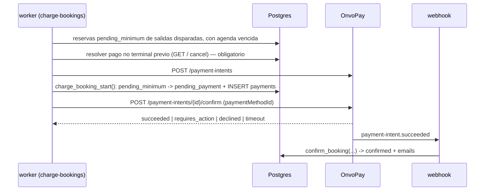
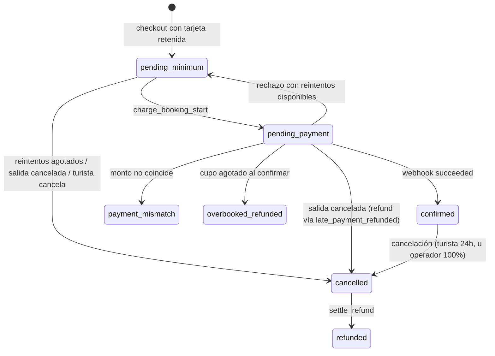

# 0029 — Cupo mínimo por salida y cobro diferido con tarjeta retenida

- **Estado**: approved
- **Autor**: Kenneth (con Claude Code)
- **Creado**: 2026-08-13
- **Última actualización**: 2026-08-13
- **Rama**: (sin asignar — tres workstreams, ver §11)
- **PR**: (sin asignar)

> **Prerrequisito bloqueante**: modifica `confirm_booking`, el checkout, el webhook y los jobs del worker — todos reescritos por el spec 0028, hoy en tres PRs sin mergear (#67 → #68 → #69, migraciones `…040`–`…042`). **0029 no arranca hasta que 0028 esté en `dev`.**

## 1. Contexto y motivación

Hoy el turista paga al reservar: el checkout crea un payment intent, el widget de OnvoPay cobra y el webhook confirma. La salida se opera con la gente que haya.

Eso no refleja el negocio. Un tour tiene un piso de participantes por debajo del cual no es rentable salir. Cuando no se llega, el operador cancela — y hoy eso significa devolver plata ya cobrada, con la fricción y la comisión de cada reembolso.

Este spec invierte el orden: el turista deja su tarjeta retenida al reservar y **no se le cobra**. El cobro se ejecuta cuando la salida junta suficiente gente. Si no la junta, no hubo cobro que devolver.

Actores: **turista** (reserva sin cargo inmediato), **staff** (configura el mínimo y decide sobre salidas flojas), **operador** (deja de perder plata bajo el piso y en comisiones).

## 2. Objetivos

- Permitir reservar reteniendo la tarjeta, sin cargo hasta que la salida se confirme.
- Cobrar automáticamente a todas las reservas de una salida al alcanzar el mínimo del tour, sin importar cuánto falte para la fecha.
- Dar al staff información y controles para confirmar o cancelar una salida que llega a la ventana de decisión bajo el mínimo; o cancelarla automáticamente según configuración del tour.
- Mantener al turista informado en cada transición: reserva registrada, cobro ejecutado, salida cancelada, problema con la tarjeta.
- Garantizar que ninguna reserva quede sin cobrar, sin cancelar y sin agenda — y que **jamás se cobre dos veces**.

## 3. Fuera de alcance

- **No se guarda la tarjeta para compras futuras.** El método de pago pertenece a esa reserva; no hay "mis tarjetas" ni checkout de un clic.
- **No se cambia la política de reembolso de 24h** (`shared/constants/policies.ts`) para cancelaciones del turista. Sí se define un camino nuevo para cancelaciones **iniciadas por el operador** (§5.8).
- **No se notifica al staff por email**; la notificación es en el panel.
- **No hay lista de espera** ni cambios a la prevención de sobreventa del spec 0025.
- **SINPE Móvil queda estructuralmente excluido**, no diferido: es un pago push y nunca podrá soportar cobro con credencial retenida.
- **No se implementa cobro parcial ni seña.**
- **No se migran reservas existentes** (§11).
- **No se cambia el modelo de refunds** (un refund activo por reserva). El diseño depende de ese invariante y lo protege (§5.6).

## 4. Historias de usuario

> Como turista, quiero reservar dejando mi tarjeta sin que me cobren todavía, para no tener plata comprometida en una salida que quizás no se realice.

- [ ] Al reservar, el turista ve que **no se le cobró** y qué monto se le cobrará al confirmarse la salida.
- [ ] Autoriza explícitamente el cargo futuro; esa autorización queda registrada con fecha y versión de términos.
- [ ] Recibe un email de "reserva registrada" con el monto y los últimos 4 dígitos de la tarjeta retenida.
- [ ] Su cupo queda reservado desde ese momento.

> Como turista, quiero que me cobren y me avisen apenas la salida se confirma.

- [ ] Al alcanzar el mínimo se cobra a todas las reservas pendientes y cada turista recibe el email de confirmación existente.
- [ ] El cobro ocurre aunque falten semanas para la fecha.
- [ ] Si la tarjeta es rechazada, recibe un email con enlace para actualizarla y su reserva sigue viva durante la ventana de recuperación.
- [ ] Puede cancelar su reserva antes del cobro, sin cargo.

> Como staff, quiero enterarme de las salidas bajo el mínimo antes de la fecha, para decidir si la sostengo o la cancelo.

- [ ] Una salida que entra en la ventana bajo el mínimo aparece marcada en `/dashboard/departures` con asientos reservados vs mínimo.
- [ ] El staff puede **confirmar** (se cobra a todos) o **cancelar** (nadie es cobrado; los ya cobrados reciben reembolso total).
- [ ] En modo automático la salida se cancela sola y no aparece en la bandeja.

> Como staff, quiero configurar el mínimo y el modo de resolución por tour.

- [ ] El formulario de tours permite editar el mínimo (campo ya existente, hoy sin efecto) y elegir modo manual o automático.
- [ ] Una página de configuración permite fijar la ventana de decisión en horas, común a todos los tours.

## 5. Diseño técnico

### 5.1. Verificación de OnvoPay (2026-08-13)

Verificado contra `docs.onvopay.com/en/llms-full.txt`. No hay proveedor nuevo, así que no aplica `external-services-vetting` completo; sí se documenta la capacidad:

- `POST /v1/payment-methods` tokeniza y adjunta la tarjeta a un `customer`. OnvoPay verifica la tarjeta antes de crear el objeto (`cards.invalid_card_info` si falla).
- `POST /v1/payment-intents/{id}/confirm` con `paymentMethodId` cobra desde el servidor. Es el mecanismo de sus suscripciones.
- La doc indica crear el payment method **client-side con la publishable key**: _"Do not pass untokenized card data through your server"_.

Descartado: `captureMethod: "manual"` + capture posterior — la doc lo limita a integraciones 100% API (no disponible con el SDK embebido) y una autorización expira en días, no semanas.

**Precondiciones a verificar en sandbox antes del workstream C** (§13): vigencia del payment method a semanas de distancia, comportamiento off-session/MIT, y existencia real de `POST /payment-intents/{id}/cancel` — de la que depende la regla anti-doble-cobro de §5.6. Esa última es la misma P1 que el spec 0028 dejó abierta.

### 5.2. Recolección de la tarjeta y alcance PCI

El SDK embebido solo sabe cobrar un intent; **no tiene modo para guardar tarjeta sin cobrar**. El checkout pasa a un **formulario propio** que llama `POST /v1/payment-methods` desde el navegador con la publishable key. El servidor recibe solo `paymentMethodId`, `customerId`, marca y últimos 4 dígitos.

**Consecuencia de cumplimiento, decidida y aceptada por el usuario (2026-08-13)**: se pasa de **SAQ A** (widget en iframe) a **SAQ A-EP**, aunque los datos nunca toquen nuestro servidor. Es obligación del **cliente** (es el comercio). Se suma al `pre-production-checklist`.

Reglas no negociables:

- PAN, CVV y expiración **nunca** llegan a nuestro backend, ni a logs, ni a Sentry. Viven en un componente cliente que solo hace `fetch` a OnvoPay.
- Se persisten solo `payment_method_id`, `customer_external_id`, `card_brand`, `card_last4`.
- La CSP (`web/lib/security/csp.ts`) hoy permite `https://api.onvopay.com` en `connect-src` pero **no** `https://api.dev.onvopay.com`: hay que sumarlo para poder probar en sandbox desde el navegador, y exponer la base URL como env **pública** (hoy `ONVOPAY_API_BASE_URL` es server-only).
- **Mandato de credencial almacenada**: el checkout muestra un texto explícito ("autorizo el cargo de $X cuando la salida se confirme") y persiste la evidencia reusando el patrón `consent_at`/`consent_version` del spec 0021. Sin eso, el riesgo de contracargo es alto.

### 5.3. El cobro diferido reusa el pipeline de dinero existente

Decisión central: **no se construye un camino de confirmación paralelo**. Todo el endurecimiento acumulado (idempotencia por evento, validación de monto, guarda de sobreventa, auditoría) vive en `confirm_booking` y se activa con el webhook. El cobro diferido solo **origina** el pago.

**Cambios obligatorios a `confirm_booking`** (contra lo que decía la versión anterior de este spec, que afirmaba que no se modificaba): la migración `…040:182` documenta la invariante _"desde acá `v_booking.status = 'pending_payment'` (el CHECK agota los estados posibles)"_. Es un **fall-through**, no un gate positivo. Al sumar `pending_minimum` al CHECK, un webhook que llegue con la reserva aún en `pending_minimum` caería al camino feliz y confirmaría **sin haber pasado por el cobro**. Por lo tanto:

- `confirm_booking` lleva una **rama explícita** para `pending_minimum`, con outcome propio (`confirmed_unclaimed`) y auditoría: confirma (el dinero entró de verdad) pero deja traza de que llegó por un camino no previsto. La **alerta la emiten los callers**, no la función SQL: el handler del webhook y `recover.ts` necesitan un `case` explícito para ese outcome, porque su `switch` actual tiene un `default` que se traga en silencio los outcomes desconocidos ("otro actor resolvió en paralelo") — sin ese `case`, la alerta no existe.
- `flag_payment_mismatch` (`…040:368`) también gatea por `pending_payment`: hay que extenderlo o el mismatch de un cobro diferido se pierde.

### 5.4. Colisión con el reconciliador (corrección de diseño)

El reconciliador **no** ignora estas reservas por sí solo. `fetchStalePendingBookings` filtra por `.lt('created_at', olderThanIso)` (`worker/src/reconciliation/repository.ts:53`), no por cuándo empezó el cobro: una reserva creada hace tres semanas es "stale" en el primer ciclo (≤5 min) apenas pasa a `pending_payment`. Si el intent no está pagado, `cancel_stale_pending_booking` la cancela, marca el pago `failed` y expira el hold — destruyendo el camino de reintentos. `alertIfStuck` mide contra el mismo campo y dispararía Sentry en cada ciclo.

Correcciones requeridas:

- Nueva columna `bookings.charge_started_at`; el reconciliador filtra por `COALESCE(charge_started_at, created_at)`.
- Regla explícita, por **presencia y no por contador**: toda reserva con `charge_started_at IS NOT NULL` queda fuera del barrido de cancelación del reconciliador — su ciclo de vida lo posee el job de cobro. Usar `charge_attempts > 0` sería un error: el contador se incrementa al **fallar** (§5.7), así que durante el primer intento vale 0 y la reserva quedaría expuesta justo en el intento que más se declina. Su fila de `payments` queda `pending` **a propósito**: es lo que fuerza al próximo intento a chocar contra el índice único parcial y resolver el intent viejo por GET (§5.6). No "limpiar" esa fila borrándola.
- El mapeo peligroso es `requires_payment_method → NotPaid` (`worker/src/reconciliation/onvopay.ts:41`), no `requires_action` (que ya mapea a `Pending`, `:43`).
- `recover.ts:30` toma `booking.payments[0]` asumiendo "0 o 1 fila de pago". Con reintentos hay **una fila por intento**: hace falta un barrido de filas `payments` no terminales que no sean la última, o un cobro anterior que liquidó tarde queda invisible para siempre. **Dueño**: el propio `reconcile-pending-payments`, en su ciclo de 5 minutos, extendido para recorrer todas las filas no terminales de la reserva y no solo `payments[0]`. Con test propio en §10.

### 5.5. Capacidad, holds y unidad de trabajo

Una reserva `pending_minimum` ocupa cupo desde que se crea, reusando **tal cual** la Capa 1 del spec 0025: el hold pasa a `paying`, `create_hold_atomic` lo cuenta y `release-expired-holds` no lo toca. `HoldStatus.Paying` pasa a significar "cupo retenido por una reserva en curso", inmediata o diferida. No se toca `create_hold_atomic`.

**La unidad de trabajo del cobro es la RESERVA, no la salida.** `tour_instances.minimum_charge_triggered_at` es un marcador de _decisión tomada_, no una cola de trabajo: si el worker muere a mitad del lote (SIGTERM de Railway con tope de 30 s), las reservas restantes quedarían fuera de toda selección — cupo retenido, sin cobro y sin alerta. La selección del job es por reserva:

> reservas `pending_minimum` cuya instancia tenga `minimum_charge_triggered_at IS NOT NULL` **y** (`charge_next_attempt_at IS NULL OR <= now()`).

Invariante a sostener y testear: _toda reserva de una salida disparada termina cobrada, reintentada o cancelada; **ninguna queda sin dueño en ningún estado**._

El invariante cubre dos estados, no uno. Al sacar del reconciliador a las reservas con `charge_started_at` (§5.4), la cohorte `pending_payment` quedaría sin watchdog: su `charge_next_attempt_at` es NULL, así que tampoco la selecciona la regla de arriba, y esperaría para siempre un webhook que quizá nunca llegue. Por eso **`charge-bookings` barre también las reservas `pending_payment` cuyo `charge_started_at` supere el umbral**: resuelve su intent por `GET` (§5.6) y decide confirmar, reintentar o cancelar.

Corolario: una reserva **nueva** sobre una salida ya disparada se cobra de inmediato (queda seleccionada por la misma regla), sin esperar a nada.

El mínimo se cuenta en **asientos**, sumando `pending_minimum` + `confirmed` de la salida.

### 5.6. Anti-doble-cobro: el invariante que sostiene todo

Un doble cobro **no se puede reparar** con el pipeline actual: `refunds_one_active_per_booking` (migración `…018:47`) admite un solo refund activo por reserva, los tres encolados usan `ON CONFLICT DO NOTHING`, y `cancel_booking` elige un único pago (`…042:89-93`) capando con `LEAST(p_refund, pago)`. Con dos pagos `succeeded` el segundo refund se descarta en silencio y el operador queda con plata que el sistema no sabe devolver.

Por eso el diseño **garantiza por constraint** que haya a lo sumo un pago vivo por reserva, en vez de rediseñar refunds (que sería una migración del tamaño de 0028):

- **Índice único parcial** `payments (booking_id) WHERE status = 'pending'`.
- **Regla obligatoria antes de crear cualquier intent nuevo**: resolver la última fila `payments` no terminal — `GET /v1/payment-intents/:id`; si no es terminal, `POST /v1/payment-intents/:id/cancel` y verificar. Si no se puede resolver, **no se crea nada** y se alerta. Es la regla espejo de la de refunds (`worker/src/refunds/handle-refund.ts:47-51`, "verificar antes que crear").
- **El vencimiento de la ventana 3DS cancela el intent en OnvoPay**, no solo mueve estado local. Sin esto: el turista abre el email viejo a la hora 13, completa el 3DS del intent #1 y se le cobra dos veces.
- **Ningún intent puede existir sin su fila en `payments`.** El invariante se ancla en esas filas, así que un intent huérfano sería invisible para la regla de arriba. El intent se crea inmediatamente antes de `charge_booking_start` y, si esta falla —incluida la violación del índice único parcial, que con el índice nuevo pasa a ser un caso frecuente— el intent se cancela best-effort y la reserva vuelve a `pending_minimum` (patrón 0028 A1). Un intent creado sin fila jamás se confirma.
- **Toda escritura de estado desde el worker es condicional y verifica rowcount** (`WHERE id = ? AND status = 'pending_payment'`). Cero escrituras ciegas: si el webhook confirmó mientras el worker interpretaba un timeout, un `UPDATE` ciego devolvería la reserva a la cola de cobro y la cobraría de nuevo. Rowcount 0 ⇒ alerta y **no** reintentar.

### 5.7. Reintentos y 3DS

El cobro es _off-session_. La doc de OnvoPay no expone flags MIT, así que hay dos fallos esperables:

- **Rechazo**: la reserva vuelve a `pending_minimum`, el pago queda `failed`, se incrementa `charge_attempts` y se agenda `charge_next_attempt_at` con backoff 1h / 6h / 24h (3 reintentos). Al primer rechazo se envía `charge_failed_action_required` con enlace para cargar otra tarjeta. Agotados los reintentos, o al llegar a la ventana, la reserva se cancela, libera cupo y la salida se re-evalúa.
- **`requires_action` (3DS)**: la reserva queda `pending_payment` con `awaiting_action_until = now() + 12h` y se envía el enlace de autenticación. Vencida la ventana: se **cancela el intent** (§5.6) y se trata como rechazo.

`notifications` tiene UNIQUE `(booking_id, kind)` con `ON CONFLICT DO NOTHING`, así que `charge_failed_action_required` se enviaría **una sola vez por reserva** aunque haya tres reintentos. No se resuelve metiendo el número de intento en el `kind`: `notifications.kind` es un CHECK enumerado cerrado (`…036:43-52`) y un kind variable no entra. Se agrega una columna `attempt smallint NOT NULL DEFAULT 0` y la unicidad pasa a `(booking_id, kind, attempt)`, que mantiene el enum cerrado y la idempotencia por intento.

El enlace usa el mismo patrón de token de acceso a la reserva del spec 0011 (`booking_access_tokens`, SHA-256): **cada email emite el suyo** vía `issueBookingToken` (`worker/src/notifications/booking-token.ts:20-31`) — no existe un token persistente por reserva. La página vive bajo `/booking/[token]` y reemplaza el `payment_method_id`.

### 5.8. Cancelación: cohortes con efectos distintos

Cancelar una salida toca reservas en tres estados, con efectos **incompatibles entre sí**. `cancel_booking` decrementa `capacity_reserved` (que en una `pending_minimum` nunca se incrementó, porque solo lo hace `confirm_booking`, `…040:289`) y no toca `tour_holds`. Reusarlo a ciegas dejaría el contador negativo y los holds `paying` colgados para siempre.

| Cohorte                            | Hold           | `capacity_reserved` | Pago                            | Refund                      |
| ---------------------------------- | -------------- | ------------------- | ------------------------------- | --------------------------- |
| `pending_minimum`                  | → `released`   | sin cambio          | sin fila o `failed`             | ninguno                     |
| `pending_payment` (cobro en vuelo) | → `released`   | sin cambio          | no se toca (`pending`/`failed`) | vía `late_payment_refunded` |
| `confirmed`                        | ya `converted` | −asientos           | `succeeded`                     | **total, sin política 24h** |

La cohorte `pending_payment` se cancela **de inmediato y sin esperar a OnvoPay**: la reserva pasa a `cancelled`, el hold a `released`, y el `payments` queda como esté. **No se consulta a OnvoPay dentro de `cancel_departure`** — es una función SQL y no puede hacer HTTP; pretenderlo la volvería no atómica o no implementable. Si el cobro liquida después, el webhook entra por la rama `cancelled` de `confirm_booking` y dispara `late_payment_refunded` (`…040:120-179`), que exige justamente un pago `pending`/`failed` y encola el refund total: ese es el mecanismo previsto, no una excepción. La cancelación del intent en OnvoPay la hace el worker después, best-effort, por el camino de §5.6.

**Las reservas no confirmadas no pasan por `cancel_booking`.** Y una cancelación **iniciada por el operador** reembolsa el 100% siempre: `computeRefund` (binario 24h) es para cancelaciones del turista. Con la ventana de decisión en 24h por defecto, la resolución cae justo sobre el borde de la política — sin esta regla, el operador cancela y el turista pierde la plata.

**El turista debe poder cancelar una `pending_minimum`**, cosa que hoy es imposible: `cancel_booking` corta con `IF v_booking.status <> 'confirmed' THEN RETURN` (`…042:55`) y `web/lib/booking/cancel.ts:105` devuelve `NotCancellable`. Se agrega una RPC propia que libera el hold, no invoca `computeRefund`, audita y encola el email.

### 5.9. Jobs del worker

Dos jobs nuevos, self-contained (sin `@shared` en runtime), con guard `isRunning`, aislamiento por ítem y graceful shutdown, siguiendo el patrón de 0028:

- **`charge-bookings`** (cada minuto): dispara salidas que alcanzaron el mínimo (marca `minimum_charge_triggered_at` bajo lock) y cobra las reservas seleccionadas según §5.5, incluidos reintentos.
- **`resolve-minimum-window`** (cada 5 min): salidas dentro de la ventana que no alcanzaron el mínimo → cancelación automática o marca para decisión del staff. Incluye dos barridos que el diseño anterior omitía: (a) **rezagados** — salidas ya pasadas sin resolver (si el worker estuvo caído, cosa que ya ocurrió en producción); (b) **terminal** — salidas disparadas que llegan a T-0 con reservas aún `pending_minimum`, que se cancelan con aviso en vez de quedar vivas para siempre.

### 5.10. Adapter pattern

Las llamadas nuevas a OnvoPay no pueden colgar sueltas del navegador y del worker sin romper la decisión de aislar la pasarela (`lib/payments/adapters/`, decisión 2026-05-19, con PayPal post-MVP en el horizonte). Se extiende `PaymentProvider` con `confirmWithPaymentMethod`, `cancelPaymentIntent` y `getPaymentIntent`, se pone la tokenización detrás de una costura agnóstica (`tokenizeCard`), y el cliente de cobro del worker espeja la separación de `worker/src/refunds/` (`onvopay.ts` + `repository.ts` + `handle-charge.ts`).

### 5.11. Panel

- **Formulario de tours**: el campo `min_participants` **ya existe y es editable** (`TourBasicInfoSection.tsx:119`, validado en `lib/tours/types.ts:50-58` con el CHECK `max_capacity >= min_participants` de `…004:15`); lo único que falta es que **tenga efecto**. Se agrega el toggle `auto_cancel_below_minimum`.
- **`/dashboard/settings`** (admin): ventana de decisión en horas. Primera configuración global del negocio.
- **`/dashboard/departures`**: asientos reservados vs mínimo por salida; las que requieren decisión, destacadas arriba con **Confirmar salida** y **Cancelar salida**. Ambas auditadas con el actor.
- **Ocupación**: `capacity_reserved` solo lo mueve `confirm_booking`, así que una salida llena pero sin cobrar mostrará 0 en reportes y en la vista del guía. Hay que exponer los asientos comprometidos aparte.

## 6. Modelo de datos

Migración: `supabase/migrations/20260813000043_minimum_participants_deferred_charge.sql`.

**`tours`** — alter: `auto_cancel_below_minimum boolean NOT NULL DEFAULT false`. (`min_participants` ya existe; sin cambio de schema.)

**`bookings`** — alter:

- `payment_method_id text NULL`, `customer_external_id text NULL`.
- `card_brand text NULL`, `card_last4 text NULL CHECK (card_last4 ~ '^[0-9]{4}$')`.
- `charge_attempts integer NOT NULL DEFAULT 0`, `charge_next_attempt_at timestamptz NULL`, `charge_started_at timestamptz NULL`, `charge_last_error text NULL` (código de rechazo, no el mensaje crudo).
- `awaiting_action_until timestamptz NULL`.
- Nuevo valor en el CHECK de `status`: `pending_minimum`.
- `CHECK (status <> 'pending_minimum' OR payment_method_id IS NOT NULL)` — una reserva sin tarjeta no puede quedar reteniendo cupo ni contar para el mínimo.
- `total_amount_cents` pasa a ser **inmutable tras el INSERT** (trigger): es el monto que el turista autorizó explícitamente en el mandato de credencial almacenada (§5.2).

**`tour_instances`** — alter: `minimum_charge_triggered_at timestamptz NULL`, `staff_decision_required_at timestamptz NULL`, `minimum_resolved_at timestamptz NULL`, `minimum_resolved_by uuid NULL REFERENCES users(id)`, `minimum_resolution text NULL CHECK (IN ('reached','staff_confirmed','staff_cancelled','auto_cancelled'))`, y el snapshot de la decisión (`min_participants_at_trigger`, `seats_at_trigger`) para poder reconstruirla ante un reclamo.

**`business_settings`** — create, fila única: `id smallint PRIMARY KEY DEFAULT 1 CHECK (id = 1)`, `minimum_decision_window_hours integer NOT NULL DEFAULT 24 CHECK (BETWEEN 1 AND 720)`, `updated_at`, `updated_by uuid REFERENCES users(id)`. RLS: lectura admin/staff, escritura admin. Grants explícitos (spec 0027), `anon` sin acceso.

**`payments`** — nuevo índice único parcial `(booking_id) WHERE status = 'pending'` (§5.6).

**Otros índices**: `bookings (tour_instance_id) WHERE status = 'pending_minimum'`; `bookings (charge_next_attempt_at) WHERE charge_next_attempt_at IS NOT NULL`; `tour_instances (starts_at) WHERE minimum_resolved_at IS NULL`.

**Funciones** (todas `SECURITY DEFINER`, `search_path=''`, `REVOKE EXECUTE FROM PUBLIC, anon, authenticated`, guard `is_public_request()`):

- `charge_booking_start(p_booking_id, p_external_payment_id)` — mueve `pending_minimum → pending_payment`, setea `charge_started_at` e inserta `payments`. **Deriva el monto internamente** de `bookings.total_amount_cents`; no lo recibe del caller (mismo footgun que 0028 corrigió con `p_total_seats`).
- `cancel_departure(p_instance_id, p_actor_id, p_resolution)` — atómica, aplica la tabla de cohortes de §5.8.
- `cancel_unpaid_booking(p_booking_id, p_actor_id, p_reason)` — cancelación antes del cobro. Lleva actor y razón como el resto de las funciones de dinero (el actor es NULL cuando cancela el turista por su magic link, y la razón distingue "turista" de "reintentos agotados").
- `confirm_booking` y `flag_payment_mismatch` — DROP + CREATE con la rama de `pending_minimum` (§5.3).

**Retención (spec 0022)**: `purge_unpaid_bookings` (`…034:197-238`, `UNPAID_BOOKING_RETENTION_DAYS = 90`) borra reservas sin pago `succeeded`. Una `pending_minimum` de más de 90 días entraría en la purga y **dejaría el hold `paying` huérfano reteniendo cupo de forma permanente**. Debe excluirse, y hay que definir el TTL máximo de una reserva sin cobrar (§13). Además la anonimización debe limpiar `payment_method_id`, `customer_external_id`, `card_brand`, `card_last4`, y **hacer detach del payment method y del customer en OnvoPay** — anonimizar nuestra DB no borra los datos del lado del proveedor.

**Artefactos que acompañan la migración** (omitirlos es un error ya cometido y documentado): `BookingStatus.PendingMinimum` en `shared/constants/enums.ts`, los `NotificationKind` nuevos en el CHECK de `notifications.kind` (`…036:43-52`), los `AuditAction` nuevos, las copias locales del worker, las claves i18n de estado en ES/EN, y la **edición a mano de `web/types/database.ts`** (nunca `pnpm db:types`, que ensancha las uniones).

## 7. Estados y transiciones

Estado nuevo: **`pending_minimum`** — tarjeta retenida, cupo ocupado, sin cobro.

Resolución de la salida: `reached` | `staff_confirmed` | `staff_cancelled` | `auto_cancelled`, todas terminales.

**`payments`** (el diseño depende de estas transiciones tanto como de las de `bookings`): un intent cancelado o vencido pasa a `failed` **antes** de crear el siguiente — si queda `pending`, el reintento choca contra el índice único parcial de §5.6 y no puede avanzar. Un intento devuelto a `pending_minimum` por rechazo deja su fila en `failed`; la fila solo permanece `pending` mientras el intent sigue vivo y no resuelto.

**`tour_holds`**: `paying → released` desde `cancel_unpaid_booking` y desde `cancel_departure` (cohortes 1 y 2 de §5.8); `paying → converted` lo sigue haciendo `confirm_booking`. Ningún camino nuevo deja un hold en `paying` sin dueño.

## 8. Casos borde y errores

- **Worker muere a mitad del lote de cobro.** Cubierto por la selección por reserva (§5.5); ninguna queda sin agenda.
- **Webhook llega con la reserva en `pending_minimum`.** Rama explícita en `confirm_booking`, outcome `confirmed_unclaimed`, audit y alerta (§5.3).
- **El worker interpreta timeout mientras el webhook ya confirmó.** Escrituras condicionales con rowcount (§5.6); rowcount 0 ⇒ alerta, no reintento.
- **3DS abandonado y retomado tarde.** El intent viejo se cancela al vencer la ventana; sin eso hay doble cobro (§5.6).
- **Reserva nueva sobre una salida ya cobrada.** Se cobra de inmediato (§5.5).
- **Checkout abandonado tras crear la reserva.** El `CHECK` de `payment_method_id` impide que exista una `pending_minimum` sin tarjeta; el hold sigue el camino normal de expiración.
- **La tarjeta se vence entre la reserva y el cobro.** Camino de reintentos con email de actualización. Es el caso más probable con mucha anticipación.
- **El admin baja el mínimo.** Se lee en vivo: la próxima corrida puede disparar cobros. Subirlo **no** descobra una salida ya cobrada. El mínimo y el conteo del disparo quedan persistidos (§6).
- **Dos miembros del staff resuelven la misma salida.** `FOR UPDATE` sobre la instancia + verificación de `minimum_resolved_at IS NULL`.
- **Salida cancelada con alguien ya cobrado.** Tabla de cohortes (§5.8): refund total sin política 24h.
- **Todos los cobros de una salida fallan.** Vuelve bajo el mínimo y la re-evalúa el job; pasada la ventana, se cancela según el modo del tour.
- **Salida disparada que llega a T-0 con reservas sin cobrar.** Barrido terminal (§5.9).
- **Worker caído por días.** Barrido de rezagados (§5.9) + alerta de liveness (§11). Sin worker no se cobra nada: es un riesgo operativo, no solo técnico.
- **`reminder_24h` agendado en el pasado.** `…040:317-326` lo agenda en `starts_at - 24h` al confirmar; con cobro diferido la confirmación puede caer dentro de las 24h ⇒ se omite el recordatorio.
- **Archivar un tour con reservas `pending_minimum`.** `web/lib/tours/archive-action.ts:72` hoy solo bloquea por `pending_payment`/`confirmed`: hay que incluir el estado nuevo o quedan reservas vivas con tarjeta retenida en instancias canceladas.
- **Timeout al confirmar.** No se re-confirma a ciegas: `GET` en el ciclo siguiente antes de decidir (espejo de `ambiguous-timeout` de 0028).

## 9. Impacto en otras áreas

- **Panel**: toggle en el form de tours, `/dashboard/settings` nueva, bandeja de decisión y columnas de mínimo en departures.
- **Portal**: checkout de widget a formulario propio; éxito y detalle deben distinguir "reservado, sin cargo" de "cobrado"; página de actualización de tarjeta.
- **Emails**: tres plantillas nuevas (`booking_reserved`, `departure_cancelled_minimum`, `charge_failed_action_required`) ES/EN. `booking_confirmation` se reusa para el cobro exitoso.
- **Worker**: dos jobs nuevos, reconciliador ajustado (§5.4), retención ampliada.
- **Reportes**: los ingresos se cuentan por fecha de pago ⇒ el diferimiento **corre los ingresos al mes del cobro**. Además ocupación y "pasajeros confirmados" (spec 0009) mostrarán 0 en salidas llenas sin cobrar.
- **Auditoría**: toda decisión automática de dinero deja entrada en `audit_logs` (disparo del mínimo con su snapshot, cada intento y su código de rechazo, agotamiento de reintentos, vencimiento de 3DS). Hoy solo `confirm_booking` audita.
- **Seguridad**: superficie nueva en el navegador y alcance PCI A-EP ⇒ amerita pasada de auditoría antes del cutover.
- **i18n**: textos nuevos de panel, portal y emails en ES/EN.

## 10. Plan de tests

**Unit**: conteo de asientos comprometidos; backoff 1h/6h/24h y agotamiento (con el rigor de off-by-one de 0028); selección de salidas por ventana con bordes y día CR; mapeo de respuestas de OnvoPay (`succeeded`/`requires_action`/rechazo/timeout); omisión del `reminder_24h` en el pasado.

**Integración (Supabase local)**:

- Reserva con tarjeta retenida: `pending_minimum`, ocupa cupo, sin `payments`.
- El mínimo dispara el cobro una sola vez; dos corridas seguidas no cobran dos veces.
- **Worker interrumpido a mitad del lote**: las reservas restantes se cobran en el ciclo siguiente.
- **Anti-doble-cobro**: intent previo no terminal ⇒ no se crea uno nuevo; el índice único parcial rechaza el segundo `pending`.
- **Webhook sobre una reserva `pending_minimum`** ⇒ outcome `confirmed_unclaimed` + audit + alerta desde el caller (no un `default` silencioso).
- **Cobro que liquida tarde sobre una fila `payments` que no es la última** ⇒ el reconciliador lo detecta y encola el refund; no queda invisible.
- **Salida cancelada con un cobro en vuelo** ⇒ reserva `cancelled` y hold `released` de inmediato; si el pago liquida después, entra por `late_payment_refunded` con refund total.
- **Intent creado y `charge_booking_start` falla** (incluida la violación del índice único) ⇒ el intent se cancela best-effort y nunca se confirma.
- **Reconciliador**: no cancela una reserva recién movida a `pending_payment` con `charge_attempts > 0` ni una con `awaiting_action_until` vigente.
- Rechazo ⇒ vuelve a `pending_minimum`, agenda reintento, encola email; agotados ⇒ cancela y libera cupo.
- Ventana sin mínimo, modo manual ⇒ pendiente de decisión, nadie cobrado. Modo automático ⇒ salida y reservas canceladas con notificaciones.
- **Cancelación de salida con las tres cohortes** ⇒ holds liberados, `capacity_reserved` correcto, refund total solo a los cobrados.
- **Cancelación de salida a menos de 24h del inicio** ⇒ refund del **100%**, que es justo donde `computeRefund` devolvería 0 y donde cae la ventana de decisión por defecto. Borde obligatorio para lógica de dinero.
- **Watchdog de la cohorte `pending_payment` diferida**: reserva con `charge_started_at` viejo y sin webhook ⇒ `charge-bookings` la resuelve; no queda huérfana ni la cancela el reconciliador.
- Turista cancela una `pending_minimum` ⇒ libera cupo, sin refund.
- Concurrencia: dos resoluciones de la misma salida ⇒ una sola prospera.
- Retención: `purge_unpaid_bookings` **no** borra `pending_minimum`; la anonimización limpia los identificadores de pago.
- Archivado de tour con `pending_minimum` ⇒ bloqueado.

**Manual (documentado en el PR)**: flujo completo contra sandbox (guardar tarjeta, alcanzar mínimo, cobro real, rechazo con `4000000000000002`); verificar en la pestaña de red que ni PAN ni CVV salen hacia nuestro backend; consola sin errores en ambos locales.

## 11. Plan de rollout

**Tres workstreams secuenciales**, como el spec 0028 (un PR cada uno, rebase del siguiente tras cada squash):

- **A — Configuración y modelo**: `business_settings`, toggle por tour, `/dashboard/settings`, columnas y estados nuevos. Sin tocar dinero.
- **B — Tarjeta retenida y cobro manual**: formulario propio, `pending_minimum`, y cobro **disparado a mano desde el panel**. Valida el circuito server-side contra sandbox con un humano en el loop, antes de automatizar.
- **C — Automatización**: `charge-bookings`, `resolve-minimum-window`, reintentos/3DS, bandeja de decisión y emails. **La verificación en sandbox de §13-Q1 debe cerrarse antes de aprobar C**, no antes de mergear.

Otras condiciones:

- **Feature flag** `DEFERRED_CHARGE_ENABLED`. **Corrección respecto de la versión anterior de este spec**: activarlo con `min_participants = 1` **sí cambia el comportamiento observable** — el checkout ya es formulario propio (SAQ A-EP), el turista se va sin cargo, el cobro pasa a ser off-session ~1 minuto después (perfil de rechazo y 3DS distinto al on-session) y los ingresos se corren de mes. Apagar el flag no revierte lo que esté en vuelo. El rollout seguro es un **tour canario** de bajo volumen, no "mismo comportamiento".
- **Liveness del worker como requisito de la feature, no como infraestructura ajena.** Hoy, si el worker se cae, el checkout igual cobra; con 0029, worker caído = **cero ingresos** y asientos retenidos, sin ninguna señal. El worker de producción estuvo caído desde 2026-06-21 por el plan free de Railway. Se exige: alerta si no hubo ciclo de cobro en N minutos o si existe una `pending_minimum` de salida disparada con más de X minutos, y plan de Railway que sostenga un servicio always-on **antes** de activar el flag.
- **Migración de datos**: ninguna. `pending_minimum` solo lo producen reservas nuevas.
- **Comunicación al operador**: obligatoria. Cambia cuándo entra la plata y suma una tarea diaria (revisar la bandeja). Un mínimo mal configurado retiene cobros.
- **Registro de decisiones**: este spec introduce dos decisiones estructurales (cobro diferido con credencial retenida; cambio de alcance PCI a SAQ A-EP) que van a `decisions.md`, más la actualización de `docs/roadmap.md` (la feature no está en el plan actual, que va por el Checkpoint 7).

## 12. Métricas de éxito

- **Cancelaciones por mínimo sin reembolsos asociados**: ≥90% (hoy generarían uno por reserva).
- **Tasa de éxito del cobro diferido**: ≥95% sin intervención manual. Por debajo, el riesgo off-session/3DS es material y hay que renegociar con OnvoPay.
- **Doble cobros**: **cero**, verificable por el índice único y por auditoría.
- **Latencia entre alcanzar el mínimo y el cobro**: mediana < 2 minutos.

## 13. Preguntas abiertas

- [ ] **Q1 — ¿OnvoPay aplica flags de credencial almacenada (MIT/off-session) al confirmar con `paymentMethodId`, cuánto vale un payment method a semanas de distancia, y existe realmente `POST /payment-intents/{id}/cancel`?** Es el riesgo número uno: de esto dependen la tasa de rechazo, la de 3DS y la regla anti-doble-cobro. Consulta redactada en [`docs/onvopay-consulta-cobro-diferido.md`](../onvopay-consulta-cobro-diferido.md), con las preguntas a soporte y las verificaciones a hacer en sandbox por separado. **Dueño**: Kenneth (soporte de OnvoPay + prueba en sandbox). **Antes de**: aprobar el workstream C.
- [ ] **Q2 — ¿La política de 24h se mide desde la salida o desde el cobro?** Con cobro diferido dejan de coincidir: una reserva cobrada el día anterior y cancelada 20h antes no genera refund, aunque el turista reservó seis semanas atrás y no tuvo oportunidad de reconsiderar después del cargo. **Dueño**: cliente. **Antes de**: implementar B.
- [ ] **Q3 — ¿Cuál es el tiempo máximo admisible entre reserva y cobro?** Impacta la vigencia del payment method, la retención de 90 días y el horizonte de generación de instancias. **Dueño**: cliente. **Antes de**: implementar A (define el TTL de `pending_minimum`).
- [ ] **Q4 — "Confirmar salida" manual: ¿cobra también a las reservas cuyos reintentos ya se agotaron y fueron canceladas?** Este spec asume que no (una reserva cancelada es terminal). **Dueño**: cliente. **Antes de**: implementar C.
- [ ] **Q5 — ¿El portal público muestra "faltan N personas para confirmar la salida"?** Afecta conversión y hoy no está ni en alcance ni fuera de alcance. **Dueño**: cliente. **Antes de**: implementar B.
